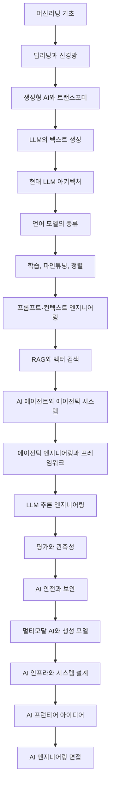

    

# AI 엔지니어링 코스

[English](README.md) | **한국어**

**AI 엔지니어링을 처음부터 단계별로 배울 수 있는 무료 완전 학습 과정입니다. 머신러닝, 신경망, 트랜스포머부터 LLM, 파인튜닝, RAG, AI 에이전트, LLM 추론, 평가, AI 안전성, AI 시스템 설계까지 다룹니다. 모든 레슨에는 상세한 블로그 글이 있고, 많은 레슨에는 영상도 함께 제공됩니다.**

> 이 AI 엔지니어링 코스는 다음 역할을 목표로 하는 분들에게 도움이 됩니다.
>
> - AI 엔지니어
> - 생성형 AI 엔지니어
> - LLM 엔지니어
> - 에이전틱 AI 엔지니어
> - AI 에이전트 엔지니어
> - Forward Deployed Engineer
> - AI 솔루션 아키텍트
> - AI 플랫폼 엔지니어
> - Applied AI 엔지니어
> - 머신러닝 엔지니어
> - MLOps 엔지니어
> - LLMOps 엔지니어

---

### [Outcome School](https://outcomeschool.com) **창립자** Amit Shekhar가 작성하고 관리합니다

### Amit Shekhar 팔로우

- [X/Twitter](https://twitter.com/amitiitbhu)
- [LinkedIn](https://www.linkedin.com/in/amit-shekhar-iitbhu)
- [GitHub](https://github.com/amitshekhariitbhu)

### Outcome School 팔로우

- [YouTube](https://youtube.com/@OutcomeSchool)
- [X/Twitter](https://x.com/outcome_school)
- [LinkedIn](https://www.linkedin.com/company/outcomeschool)
- [GitHub](https://github.com/OutcomeSchool)

## Outcome School에서 가르치는 과정

- [AI and Machine Learning](https://outcomeschool.com/program/ai-and-machine-learning)

---

> **참고: 이 AI 엔지니어링 코스는 새로운 주제에 대한 블로그와 영상을 계속 추가하면서 확장될 예정입니다. 계속 학습하세요.**

---

## 목차

- [이 AI 엔지니어링 코스 소개](#이-ai-엔지니어링-코스-소개)
- [AI 엔지니어링이란?](#ai-엔지니어링이란)
- [이 코스는 누구를 위한 것인가?](#이-코스는-누구를-위한-것인가)
- [이 코스에서 무엇을 배우는가?](#이-코스에서-무엇을-배우는가)
- [선수 지식](#선수-지식)
- [이 코스를 활용하는 방법](#이-코스를-활용하는-방법)
- [AI 엔지니어링 커리큘럼 한눈에 보기](#ai-엔지니어링-커리큘럼-한눈에-보기)
- [AI 엔지니어링 학습 경로](#ai-엔지니어링-학습-경로)
- [모듈 0: 반드시 알아야 할 것](#모듈-0-반드시-알아야-할-것)
- [모듈 1: 머신러닝 기초](#모듈-1-머신러닝-기초)
- [모듈 2: 딥러닝과 신경망](#모듈-2-딥러닝과-신경망)
- [모듈 3: 생성형 AI와 트랜스포머 아키텍처](#모듈-3-생성형-ai와-트랜스포머-아키텍처)
- [모듈 4: LLM이 텍스트를 생성하는 방식](#모듈-4-llm이-텍스트를-생성하는-방식)
- [모듈 5: 현대 LLM 아키텍처](#모듈-5-현대-llm-아키텍처)
- [모듈 6: 언어 모델의 종류](#모듈-6-언어-모델의-종류)
- [모듈 7: 학습, 파인튜닝, 정렬](#모듈-7-학습-파인튜닝-정렬)
- [모듈 8: 프롬프트 엔지니어링과 컨텍스트 엔지니어링](#모듈-8-프롬프트-엔지니어링과-컨텍스트-엔지니어링)
- [모듈 9: 벡터 검색과 검색 증강 생성(RAG)](#모듈-9-벡터-검색과-검색-증강-생성rag)
- [모듈 10: AI 에이전트와 에이전틱 시스템](#모듈-10-ai-에이전트와-에이전틱-시스템)
- [모듈 11: 에이전틱 엔지니어링과 에이전트 프레임워크](#모듈-11-에이전틱-엔지니어링과-에이전트-프레임워크)
- [모듈 12: LLM 추론 엔지니어링](#모듈-12-llm-추론-엔지니어링)
- [모듈 13: 평가와 관측성](#모듈-13-평가와-관측성)
- [모듈 14: AI 안전과 보안](#모듈-14-ai-안전과-보안)
- [모듈 15: 멀티모달 AI와 생성 모델](#모듈-15-멀티모달-ai와-생성-모델)
- [모듈 16: AI 인프라, 배포, 시스템 설계](#모듈-16-ai-인프라-배포-시스템-설계)
- [모듈 17: AI의 프런티어 아이디어](#모듈-17-ai의-프런티어-아이디어)
- [모듈 18: AI 엔지니어링 면접 준비](#모듈-18-ai-엔지니어링-면접-준비)
- [AI 엔지니어링 핵심 개념 용어집](#ai-엔지니어링-핵심-개념-용어집)
- [AI 엔지니어링 코스 FAQ](#ai-엔지니어링-코스-faq)
- [라이선스](#라이선스)

## 이 AI 엔지니어링 코스 소개

**이 AI 엔지니어링 코스는 AI 엔지니어링을 처음부터 배울 수 있도록 구성한 무료 단계별 커리큘럼입니다. 18개 모듈과 146개 이상의 심층 레슨으로 구성되며, 각 레슨은 하나의 개념을 쉬운 말과 예시, 다이어그램, 필요한 경우 수학을 이용해 상세히 설명하는 블로그 글입니다.**

쉽게 말해, 제가 AI 엔지니어링을 처음 공부할 때 있었으면 좋았을 과정입니다. 머신러닝의 기초에서 시작해 트랜스포머의 내부 동작, LLM의 텍스트 생성 방식, LLM 파인튜닝과 정렬, RAG 시스템과 AI 에이전트 구축, 프로덕션에서 LLM을 빠르고 저렴하게 서빙하는 방법, 평가와 보안, 마지막으로 완전한 AI 시스템을 처음부터 끝까지 설계하는 방법으로 점차 확장합니다.

이 과정의 모든 레슨은 다음 원칙을 따릅니다.

- **무료로 읽을 수 있습니다.** 회원가입도, 유료벽도 없습니다.
- **초보자를 위해 작성되었습니다.** 불필요한 전문용어와 사전 가정을 최소화합니다.
- **상세합니다.** “왜 필요한가”에서 시작해 “어떻게 단계별로 동작하는가”, “실무에서 어디에 쓰이는가”까지 다룹니다.
- **순서가 있습니다.** 각 레슨은 앞선 레슨의 내용을 바탕으로 이어집니다.

## AI 엔지니어링이란?

**AI 엔지니어링은 AI 모델, 특히 대규모 언어 모델(LLM)을 기반으로 실제 애플리케이션과 시스템을 구축하는 분야입니다.**

AI 엔지니어가 항상 모델을 처음부터 학습시키는 것은 아닙니다. 대신 모델 내부의 작동 원리를 이해하고, 적절한 모델을 선택하며, 알맞은 컨텍스트를 제공하고, 도구와 데이터에 연결하고, 빠르고 저렴하게 실행하고, 성능을 측정하고, 안전성을 확보해 실제 사용자에게 전달할 수 있어야 합니다.

간단히 표현하면 다음과 같습니다.

**AI 엔지니어링 = 모델 이해 + 모델 위에 제품 구축 + 프로덕션에서 모델 운영**

이 코스에서 바로 이러한 내용을 배웁니다.

## 이 코스는 누구를 위한 것인가?

이 AI 엔지니어링 코스는 다음과 같은 분들을 위한 과정입니다.

- AI 엔지니어링으로 전환하려는 **소프트웨어 엔지니어**
- AI 기반 제품을 만들고 싶은 **백엔드·모바일·프런트엔드 개발자**
- LLM, RAG, AI 에이전트를 더 깊게 배우고 싶은 **머신러닝 엔지니어와 데이터 사이언티스트**
- AI 분야에서 커리어를 시작하려는 **학생과 신입 개발자**
- 현대 AI 시스템의 구축 방식을 이해하고 싶은 **엔지니어링 매니저와 테크 리드**
- **AI 엔지니어 면접을 준비하는 모든 사람**

## 이 코스에서 무엇을 배우는가?

- **머신러닝 기초:** 지도·비지도·강화학습, 손실 함수, 정규화, 정밀도와 재현율
- **딥러닝:** 경사하강법, 역전파, 크로스엔트로피, 드롭아웃, 정규화, RNN, PyTorch, TensorFlow
- **트랜스포머 아키텍처:** 토큰화, BPE, 임베딩, 셀프 어텐션, Q·K·V 수학, 멀티헤드 어텐션, 인과 마스킹, RoPE, 피드포워드 네트워크
- **LLM의 텍스트 생성:** temperature, top-k/top-p 샘플링, 토큰 스트리밍, lost-in-the-middle 문제
- **현대 LLM 아키텍처:** MoE, GQA, 슬라이딩 윈도 어텐션, attention sink, Flash Attention, DeepSeek-V4
- **언어 모델 종류:** SLM, Large Reasoning Model, Recursive Language Model, Diffusion Language Model, System One Model
- **파인튜닝과 정렬:** 파인튜닝, LoRA, prefix tuning, 지식 증류, continual learning, RLHF, InstructGPT, PPO, DPO, GRPO
- **프롬프트·컨텍스트 엔지니어링:** Chain-of-Thought, prompt chaining, prompt caching, context compaction
- **RAG와 벡터 검색:** 벡터 DB, ANN 검색, semantic search, hybrid search, reranker, ColBERT, chunking, HyDE, 캐싱, Agentic RAG, GraphRAG, Vectorless RAG
- **AI 에이전트:** function calling, agent loop, ReAct, Plan-and-Execute, Reflection, 메모리, MCP, Agent Skills, 멀티 에이전트, SubAgent, orchestration, computer-use agent
- **에이전틱 엔지니어링:** harness engineering, loop engineering, graph engineering, LangChain, LangGraph, Claude Code, Cursor
- **LLM 추론 엔지니어링:** prefill/decode, KV cache, paged attention, continuous batching, speculative decoding, Medusa, EAGLE, 양자화, GGUF, llama.cpp, vLLM, SGLang, TensorRT-LLM
- **평가와 관측성:** LLM 평가, LLM-as-a-Judge, AI 에이전트 평가, 에이전트 관측성
- **AI 안전과 보안:** guardrail, prompt injection, watermarking
- **멀티모달 AI와 생성 모델:** Vision Transformer, 이미지 임베딩, diffusion model, GAN, VAE
- **AI 인프라와 시스템 설계:** GPU, TPU, LPU, 클라우드 vs 온디바이스 배포, LLM 라우팅, 실시간 음성 AI 에이전트 설계
- **AI 프런티어:** JEPA, world model, recursive self-improvement
- **AI 엔지니어링 면접 준비**

## 선수 지식

- **기본적인 프로그래밍 지식**, 가능하면 Python. 대부분의 코드 예시는 Python으로 작성됩니다.
- **고등학교 수준의 수학.** 필요한 선형대수, 미적분, 확률은 각 레슨 안에서 단계별로 설명합니다.
- **호기심.** 이것이면 충분합니다.

AI나 머신러닝에 대한 사전 배경지식은 필요하지 않습니다.

## 이 코스를 활용하는 방법

이 코스는 AI 사전 지식이 없어도 제시된 순서를 따라갈 수 있도록 설계되었습니다.

- 모듈을 순서대로 학습하세요. 각 모듈은 앞선 모듈을 기반으로 합니다.
- 각 모듈 안에서도 레슨을 순서대로 읽으세요.
- 시간이 부족하더라도 모듈 1과 모듈 2는 건너뛰지 않는 것을 권장합니다. 이후 AI 엔지니어링의 많은 내용이 이 기초 위에 구축됩니다.
- 이미 아는 주제라면 해당 레슨의 “다룰 내용” 목록을 읽어보세요. 모든 항목을 설명할 수 있다면 다음 레슨으로 넘어가도 됩니다.
- 각 모듈을 마친 뒤 친구에게 자신의 말로 설명해 보세요. 설명할 수 있다면 제대로 익힌 것입니다.

이제 시작해봅시다.

## AI 엔지니어링 커리큘럼 한눈에 보기

| 모듈 | 주제 | 레슨 |
| --- | --- | ---: |
| 0 | [반드시 알아야 할 것](#모듈-0-반드시-알아야-할-것) | 1 |
| 1 | [머신러닝 기초](#모듈-1-머신러닝-기초) | 9 |
| 2 | [딥러닝과 신경망](#모듈-2-딥러닝과-신경망) | 10 |
| 3 | [생성형 AI와 트랜스포머 아키텍처](#모듈-3-생성형-ai와-트랜스포머-아키텍처) | 15 |
| 4 | [LLM이 텍스트를 생성하는 방식](#모듈-4-llm이-텍스트를-생성하는-방식) | 4 |
| 5 | [현대 LLM 아키텍처](#모듈-5-현대-llm-아키텍처) | 7 |
| 6 | [언어 모델의 종류](#모듈-6-언어-모델의-종류) | 5 |
| 7 | [학습, 파인튜닝, 정렬](#모듈-7-학습-파인튜닝-정렬) | 11 |
| 8 | [프롬프트·컨텍스트 엔지니어링](#모듈-8-프롬프트-엔지니어링과-컨텍스트-엔지니어링) | 5 |
| 9 | [벡터 검색과 RAG](#모듈-9-벡터-검색과-검색-증강-생성rag) | 13 |
| 10 | [AI 에이전트와 에이전틱 시스템](#모듈-10-ai-에이전트와-에이전틱-시스템) | 16 |
| 11 | [에이전틱 엔지니어링과 프레임워크](#모듈-11-에이전틱-엔지니어링과-에이전트-프레임워크) | 8 |
| 12 | [LLM 추론 엔지니어링](#모듈-12-llm-추론-엔지니어링) | 17 |
| 13 | [평가와 관측성](#모듈-13-평가와-관측성) | 4 |
| 14 | [AI 안전과 보안](#모듈-14-ai-안전과-보안) | 3 |
| 15 | [멀티모달 AI와 생성 모델](#모듈-15-멀티모달-ai와-생성-모델) | 6 |
| 16 | [AI 인프라, 배포, 시스템 설계](#모듈-16-ai-인프라-배포-시스템-설계) | 10 |
| 17 | [AI 프런티어 아이디어](#모듈-17-ai의-프런티어-아이디어) | 3 |
| 18 | [AI 엔지니어링 면접 준비](#모듈-18-ai-엔지니어링-면접-준비) | 1 |

## AI 엔지니어링 학습 경로

---

## 모듈 0: 반드시 알아야 할 것

세부 내용을 배우기 전에 AI 엔지니어링 대화에서 반복해서 등장하는 여섯 가지 용어를 먼저 알아야 합니다.

- **LLM**
- **RAG**
- **MCP**
- **Agent**
- **Fine-tuning**
- **Quantization**

한 영상에서 여섯 개념을 모두 익힐 수 있습니다: [AI Engineering Explained: LLM, RAG, MCP, Agent, Fine-Tuning, Quantization](https://www.youtube.com/watch?v=lnfWvX66FUk)

이제 큰 그림을 알게 되었습니다. 다음 모듈부터 각 개념을 하나씩 깊이 있게 다룹니다.

---

## 모듈 1: 머신러닝 기초

이 모듈에서는 머신러닝이 무엇인지, 기계가 학습하는 다양한 방식과 이후 모든 모듈에서 계속 사용할 기본 용어를 배웁니다.

모듈을 마치면 모델이 데이터로부터 어떻게 학습하는지, 성능을 어떻게 측정하는지, 과적합을 어떻게 막는지 이해하게 됩니다.

**이 모듈의 레슨:**

1. [머신러닝이란?](https://outcomeschool.com/blog/machine-learning)
2. [지도학습 vs 비지도학습](https://outcomeschool.com/blog/supervised-vs-unsupervised-learning)
3. [선형 회귀 vs 로지스틱 회귀](https://outcomeschool.com/blog/linear-regression-vs-logistic-regression)
4. [머신러닝의 특성 공학(Feature Engineering)이란?](https://outcomeschool.com/blog/feature-engineering)
5. [정밀도(Precision) vs 재현율(Recall)](https://outcomeschool.com/blog/precision-vs-recall)
6. [L1·L2 손실 함수란?](https://outcomeschool.com/blog/l1-and-l2-loss-functions)
7. [머신러닝 정규화란? L1 vs L2](https://outcomeschool.com/blog/regularization-in-machine-learning)
8. [강화학습이란?](https://outcomeschool.com/blog/reinforcement-learning)
9. [대조 학습(Contrastive Learning)이란? 단계별 동작 원리](https://outcomeschool.com/blog/contrastive-learning)

---

### 1.1 머신러닝이란?

이 글에서는 머신러닝이 무엇인지 배웁니다.

시작하기: [머신러닝이란?](https://outcomeschool.com/blog/machine-learning)

### 1.2 지도학습 vs 비지도학습

머신러닝에서 지도학습과 비지도학습을 비교합니다.

다음 내용을 다룹니다.

- 지도학습
- 비지도학습
- 지도학습과 비지도학습의 차이

시작하기: [지도학습 vs 비지도학습](https://outcomeschool.com/blog/supervised-vs-unsupervised-learning)

### 1.3 선형 회귀 vs 로지스틱 회귀

머신러닝의 선형 회귀와 로지스틱 회귀를 비교합니다.

다음 내용을 다룹니다.

- 선형 회귀
- 로지스틱 회귀
- 선형 회귀와 로지스틱 회귀의 차이

시작하기: [선형 회귀 vs 로지스틱 회귀](https://outcomeschool.com/blog/linear-regression-vs-logistic-regression)

### 1.4 머신러닝의 특성 공학이란?

머신러닝을 위한 특성 공학(Feature Engineering)을 배웁니다.

시작하기: [머신러닝의 특성 공학이란?](https://outcomeschool.com/blog/feature-engineering)

영상 보기: [Feature Engineering in Machine Learning](https://www.youtube.com/watch?v=QLlywrWuXag)

영상 보기: [One-hot Encoding in Machine Learning](https://www.youtube.com/watch?v=6AmedU5i9go)

### 1.5 정밀도 vs 재현율

예/아니오 형태의 판단을 내리는 시스템의 품질을 측정하는 두 지표인 정밀도(Precision)와 재현율(Recall)을 배웁니다. 둘의 차이와 언제 어떤 지표를 써야 하는지, 가능한 네 가지 결과, 두 지표 사이의 trade-off, 그리고 오류 비용이 어떤 지표를 더 중시해야 하는지를 어떻게 결정하는지 살펴봅니다.

다음 내용을 다룹니다.

- 해결하려는 문제
- 가능한 네 가지 결과
- 정밀도란?
- 재현율이란?
- 정밀도 vs 재현율
- 언제 어떤 지표를 사용할까?
- 공식 빠른 복습
- 요약

시작하기: [정밀도 vs 재현율](https://outcomeschool.com/blog/precision-vs-recall)

### 1.6 L1·L2 손실 함수란?

L1과 L2 손실 함수를 배웁니다.

- L1 손실 함수
- L2 손실 함수
- L1과 L2 중 무엇을 선택할까?

시작하기: [L1·L2 손실 함수란?](https://outcomeschool.com/blog/l1-and-l2-loss-functions)

### 1.7 머신러닝 정규화란? L1 vs L2

머신러닝의 정규화(Regularization)를 배웁니다.

- 과적합이란?
- L1 정규화 또는 Lasso 정규화
- L2 정규화 또는 Ridge 정규화

시작하기: [머신러닝 정규화란? L1 vs L2](https://outcomeschool.com/blog/regularization-in-machine-learning)

### 1.8 강화학습이란?

에이전트가 환경과 상호작용하면서 행동에 대한 보상이나 패널티를 받아 의사결정을 학습하는 머신러닝 분야인 강화학습을 배웁니다.

다음 내용을 다룹니다.

- 큰 그림
- 강화학습이란?
- 간단한 실생활 비유
- RL의 구성 요소
- 강화학습 루프
- 강화학습 vs 지도학습 vs 비지도학습
- 에피소드, return, discount factor
- 탐험 vs 활용
- 대표적인 RL 알고리즘 계열
- 강화학습은 어디에 쓰이는가?
- 강화학습이 어려운 이유
- 빠른 요약

시작하기: [강화학습이란?](https://outcomeschool.com/blog/reinforcement-learning)

### 1.9 대조 학습이란? 단계별 동작 원리

대조 학습(Contrastive Learning)이 무엇인지, 단계별로 어떻게 동작하고 실무에서 어디에 사용되는지 배웁니다.

다음 내용을 다룹니다.

- 대조 학습이란?
- 왜 대조 학습이 필요한가?
- 핵심 아이디어
- positive pair와 negative pair
- 단계별 동작 방식
- 사용하는 손실 함수
- 대표적인 대조 학습 방법
- 실제 사용 사례

시작하기: [대조 학습이란? 단계별 동작 원리](https://outcomeschool.com/blog/contrastive-learning)

**모듈 1 영상 및 추가 자료:**

- [Feature Engineering in Machine Learning](https://www.youtube.com/watch?v=QLlywrWuXag) (영상)
- [One-hot Encoding in Machine Learning](https://www.youtube.com/watch?v=6AmedU5i9go) (영상)

---

## 모듈 2: 딥러닝과 신경망

이 모듈에서는 신경망이 실제로 어떻게 학습하는지 배웁니다. 경사하강법과 역전파의 수학을 단계별로 이해하고, 학습을 안정적으로 만드는 기법도 살펴봅니다.

모듈을 마치면 forward pass에서 가중치 업데이트까지 신경망 학습 과정을 설명할 수 있고, normalization과 dropout이 왜 중요한지도 이해하게 됩니다.

**이 모듈의 레슨:**

1. [인공신경망의 Bias란?](https://outcomeschool.com/blog/bias-in-artificial-neural-network)
2. [경사하강법은 어떻게 동작하는가?](https://outcomeschool.com/blog/math-behind-gradient-descent)
3. [역전파는 어떻게 동작하는가? 수학으로 단계별 설명](https://outcomeschool.com/blog/math-behind-backpropagation)
4. [Cross-Entropy Loss란?](https://outcomeschool.com/blog/math-behind-cross-entropy-loss)
5. [신경망의 Dropout이란 무엇이며 어떻게 동작하는가?](https://outcomeschool.com/blog/dropout-in-neural-networks)
6. [Batch Normalization vs Layer Normalization](https://outcomeschool.com/blog/batch-normalization-vs-layer-normalization)
7. [RMSNorm이란? Root Mean Square Layer Normalization 설명](https://outcomeschool.com/blog/rmsnorm-root-mean-square-layer-normalization)
8. [순환 신경망(RNN)이란?](https://outcomeschool.com/blog/recurrent-neural-network)
9. [PyTorch는 어떻게 동작하는가?](https://outcomeschool.com/blog/how-does-pytorch-work)
10. [머신러닝 라이브러리 TensorFlow는 어떻게 동작하는가?](https://outcomeschool.com/blog/how-does-the-machine-learning-library-tensorflow-work)

---

### 2.1 인공신경망의 Bias란?

이 글에서는 인공신경망의 Bias가 무엇인지 배웁니다.

시작하기: [인공신경망의 Bias란?](https://outcomeschool.com/blog/bias-in-artificial-neural-network)

### 2.2 경사하강법은 어떻게 동작하는가?

단계별 수치 예제를 통해 경사하강법의 수학을 배웁니다.

다음 내용을 다룹니다.

- 큰 그림
- Loss Function이란?
- Gradient Descent란?
- 경사하강법의 직관
- 경사하강법의 수학
- 단계별 수치 예제
- 여러 파라미터를 가진 경사하강법
- Learning Rate의 역할
- 경사하강법의 종류
- Python에서의 경사하강법
- 전체 흐름 연결하기

시작하기: [경사하강법은 어떻게 동작하는가?](https://outcomeschool.com/blog/math-behind-gradient-descent)

영상 보기: [Epoch, Batch, Batch Size, Iteration](https://www.youtube.com/watch?v=NFLlXE-6vno)

### 2.3 역전파는 어떻게 동작하는가? 수학으로 단계별 설명

신경망 역전파의 수학을 배웁니다.

다음 내용을 다룹니다.

- 역전파란?
- 미적분의 Chain Rule
- Forward Pass
- Loss 계산
- Backward Pass(역전파)
- 단계별 수치 예제
- 경사하강법을 이용한 가중치 업데이트
- Python에서의 역전파

시작하기: [역전파는 어떻게 동작하는가? 수학으로 단계별 설명](https://outcomeschool.com/blog/math-behind-backpropagation)

### 2.4 Cross-Entropy Loss란?

단계별 수치 예제를 이용해 Cross-Entropy Loss의 수학을 배웁니다.

다음 내용을 다룹니다.

- 큰 그림
- Cross-Entropy란?
- Cross-Entropy Loss 공식
- 음의 로그를 취하는 이유
- Binary Cross-Entropy Loss
- Categorical Cross-Entropy Loss
- 단계별 수치 예제
- 언어 모델의 Cross-Entropy Loss
- Cross-Entropy Loss의 Gradient
- 빠른 요약

시작하기: [Cross-Entropy Loss란?](https://outcomeschool.com/blog/math-behind-cross-entropy-loss)

영상 보기: [Softmax Activation Function in Machine Learning](https://www.youtube.com/watch?v=2Zx6x01WwWM)

### 2.5 신경망의 Dropout이란 무엇이며 어떻게 동작하는가?

신경망의 Dropout이 무엇인지, 어떤 문제를 해결하는지, 간단한 예제로 단계별 동작 방식을 이해하고 어디에 사용되는지 살펴봅니다.

다음 내용을 다룹니다.

- Dropout이란?
- 과적합 문제
- Dropout이 필요한 이유
- Dropout의 동작 방식
- 단계별 예제
- 학습 시점 vs 테스트 시점의 Dropout
- 코드에서의 Dropout
- Dropout 변형
- Dropout의 장점
- Dropout의 사용처

시작하기: [신경망의 Dropout이란 무엇이며 어떻게 동작하는가?](https://outcomeschool.com/blog/dropout-in-neural-networks)

### 2.6 Batch Normalization vs Layer Normalization

Batch Normalization과 Layer Normalization을 배우고, 둘의 차이와 각각 언제 사용하는지 살펴봅니다.

다음 내용을 다룹니다.

- Normalization이란?
- Normalization이 필요한 이유
- Batch Normalization이란?
- Layer Normalization이란?
- Batch Normalization vs Layer Normalization
- 언제 무엇을 사용할까?

시작하기: [Batch Normalization vs Layer Normalization](https://outcomeschool.com/blog/batch-normalization-vs-layer-normalization)

### 2.7 RMSNorm이란? Root Mean Square Layer Normalization 설명

[L​​ayer Normalization](https://outcomeschool.com/blog/batch-normalization-vs-layer-normalization)보다 빠르고 단순한 대안이며 Llama, Mistral, Gemma, Qwen, PaLM, DeepSeek 등 많은 현대 LLM에서 사용하는 RMSNorm을 배웁니다.

다음 내용을 다룹니다.

- 깊은 신경망에서 normalization이 필요한 이유
- Layer Normalization(LayerNorm) 빠른 복습
- RMSNorm이 무엇이고 어떻게 동작하는가
- 구체적인 수치 예제로 보는 RMSNorm의 수학
- LayerNorm vs RMSNorm의 핵심 차이
- 현대 LLM이 RMSNorm을 선호하는 이유
- 코드 예제
- Transformer에서 RMSNorm의 위치
- 빠른 요약

시작하기: [RMSNorm이란? Root Mean Square Layer Normalization 설명](https://outcomeschool.com/blog/rmsnorm-root-mean-square-layer-normalization)

### 2.8 순환 신경망(RNN)이란?

순환 신경망(Recurrent Neural Network)을 배웁니다.

시작하기: [순환 신경망(RNN)이란?](https://outcomeschool.com/blog/recurrent-neural-network)

### 2.9 PyTorch는 어떻게 동작하는가?

PyTorch의 동작 원리를 배웁니다. Tensor가 무엇인지, computation graph와 autograd가 함께 모델을 학습하는 방식, GPU를 사용하는 이유와 PyTorch가 실무에서 널리 쓰이는 이유도 살펴봅니다.

다음 내용을 다룹니다.

- PyTorch란?
- Tensor란?
- PyTorch가 해결하는 문제
- Computation Graph란?
- Autograd란?
- 완전한 학습 예제
- GPU란 무엇이며 PyTorch는 왜 GPU를 사용하는가?
- PyTorch가 인기 있는 이유

시작하기: [PyTorch는 어떻게 동작하는가?](https://outcomeschool.com/blog/how-does-pytorch-work)

### 2.10 머신러닝 라이브러리 TensorFlow는 어떻게 동작하는가?

머신러닝 라이브러리 TensorFlow의 동작 방식을 배웁니다.

시작하기: [머신러닝 라이브러리 TensorFlow는 어떻게 동작하는가?](https://outcomeschool.com/blog/how-does-the-machine-learning-library-tensorflow-work)

**모듈 2 영상 및 추가 자료:**

- [Epoch, Batch, Batch Size, Iteration](https://www.youtube.com/watch?v=NFLlXE-6vno) (영상)

---

## 모듈 3: 생성형 AI와 트랜스포머 아키텍처

이 모듈에서는 생성형 AI가 무엇인지, 그리고 모든 현대 LLM의 핵심 아키텍처인 Transformer가 내부에서 어떻게 동작하는지 배웁니다. 토큰에서 임베딩, 어텐션까지 한 단계씩 살펴봅니다.

모듈을 마치면 Transformer 구조를 직접 그려 설명하고 Q, K, V의 수학을 포함해 각 블록의 역할을 이해할 수 있습니다.

**이 모듈의 레슨:**

1. [생성형 AI란?](https://outcomeschool.com/blog/what-is-generative-ai)
2. [Autoregressive Model이란?](https://outcomeschool.com/blog/autoregressive-models)
3. [LLM의 Byte Pair Encoding(BPE)이란?](https://outcomeschool.com/blog/bpe-in-llms)
4. [Embedding이란?](https://outcomeschool.com/blog/what-are-embeddings)
5. [RNN과 Transformer는 어떻게 다른가?](https://outcomeschool.com/blog/how-do-rnns-and-transformers-differ)
6. [Transformer 아키텍처는 어떻게 동작하는가?](https://outcomeschool.com/blog/decoding-transformer-architecture)
7. [Transformer의 Encoder vs Decoder](https://outcomeschool.com/blog/encoder-vs-decoder-in-transformers)
8. [Transformer의 Self Attention이란 무엇이며 어떻게 동작하는가?](https://outcomeschool.com/blog/self-attention-in-transformers)
9. [Attention은 어떻게 동작하는가? Q, K, V의 수학](https://outcomeschool.com/blog/math-behind-attention-qkv)
10. [왜 Attention을 √dₖ로 스케일링하는가?](https://outcomeschool.com/blog/scaling-dot-product-attention)
11. [Attention의 Causal Masking이란 무엇이며 LLM에 왜 필요한가?](https://outcomeschool.com/blog/causal-masking-in-attention)
12. [Transformer의 Multi-Head Attention이란?](https://outcomeschool.com/blog/multi-head-attention-in-transformers)
13. [Transformer의 Cross Attention이란?](https://outcomeschool.com/blog/cross-attention-in-transformers)
14. [RoPE(Rotary Position Embedding)란?](https://outcomeschool.com/blog/math-behind-rope-rotary-position-embedding)
15. [LLM의 Feed-Forward Network란 무엇이며 어떤 역할을 하는가?](https://outcomeschool.com/blog/feed-forward-networks-in-llms)

---

### 3.1 생성형 AI란?

생성형 AI의 의미와 기존 AI와의 차이, 대규모 예시로부터 학습해 새로운 콘텐츠를 만드는 방식, 일상적인 활용 사례와 한계를 배웁니다.

다음 내용을 다룹니다.

- 생성형 AI란?
- Generative + AI의 의미
- 여기서 “생성한다”는 뜻
- 기존 AI와 생성형 AI의 차이
- 생성형 AI의 학습 방식
- 새로운 결과를 만드는 과정
- 생성 가능한 콘텐츠
- 생성형 AI에서 모델이란?
- 전체 동작 흐름
- 일상에서의 활용
- 알아야 할 한계
- 요약

시작하기: [생성형 AI란?](https://outcomeschool.com/blog/what-is-generative-ai)

### 3.2 Autoregressive Model이란?

과거의 결과를 바탕으로 다음 단계를 예측하며 한 조각씩 생성하는 Autoregressive Model을 배웁니다.

- Autoregressive Model이란?
- 확률의 Chain Rule
- 생성 루프
- 단계별 수치 예제
- GPT 계열 모델이 autoregressive인 이유
- Causal Masking이 필요한 이유
- KV Cache와의 관계
- Autoregressive vs Non-Autoregressive 생성
- 대표적인 Autoregressive Model
- 장단점
- 빠른 요약

시작하기: [Autoregressive Model이란?](https://outcomeschool.com/blog/autoregressive-models)

### 3.3 LLM의 Byte Pair Encoding(BPE)이란?

현대 LLM이 텍스트를 처리하기 전에 작은 단위로 나누는 대표적인 토큰화 알고리즘인 **BPE(Byte Pair Encoding)**를 배웁니다.

- Tokenization이란?
- 텍스트를 토큰으로 나누는 문제
- BPE란?
- BPE의 단계별 동작
- 새로운 텍스트를 BPE로 토큰화하는 방법
- 현대 LLM이 BPE를 사용하는 이유

시작하기: [LLM의 BPE란?](https://outcomeschool.com/blog/bpe-in-llms)

영상 보기: [Tokenization in Large Language Models (LLMs)](https://www.youtube.com/watch?v=sK2s9I84EVI)

### 3.4 Embedding이란?

검색, 추천, 챗봇 등 현대 AI의 핵심 개념인 Embedding을 배웁니다. 의미를 숫자로 표현해 비슷한 항목끼리 가까이 배치하는 방식과 거리 측정, 실제 활용을 살펴봅니다.

- 컴퓨터가 의미를 직접 비교할 수 없는 문제
- Embedding이란?
- 두 숫자로 보는 간단한 예제
- 왜 더 많은 차원이 필요한가?
- 가까움을 어떻게 측정하는가?
- Embedding은 어디에서 오는가?
- 유명한 단어 연산 예제
- 단어 이외의 Embedding
- 주요 활용처
- 주의할 점
- 요약

시작하기: [Embedding이란?](https://outcomeschool.com/blog/what-are-embeddings)

영상 보기: [Embeddings in Machine Learning](https://www.youtube.com/watch?v=LedXW6xl21s)

### 3.5 RNN과 Transformer는 어떻게 다른가?

문장 같은 시퀀스를 처리하는 두 대표 방식인 RNN과 Transformer를 비교합니다. RNN이 순차적으로 읽는 이유, Transformer가 전체를 한 번에 처리할 수 있는 이유, 각각 언제 적합한지 배웁니다.

- 두 구조의 공통 목적
- RNN이란?
- RNN의 문제점
- Transformer란?
- 한 줄로 보는 핵심 차이
- RNN vs Transformer
- 차이 표
- 언제 무엇을 사용할까?
- 요약

시작하기: [RNN과 Transformer는 어떻게 다른가?](https://outcomeschool.com/blog/how-do-rnns-and-transformers-differ)

### 3.6 Transformer 아키텍처는 어떻게 동작하는가?

Transformer 아키텍처를 구성 요소별로 분해해 각 요소의 역할, 상호작용, 현대 LLM의 기반이 된 이유를 이해합니다.

- Transformer가 필요했던 이유
- 아키텍처의 두 절반
- Tokenization, Embedding, Positional Encoding
- Attention과 Multi-Head Attention
- Feed-Forward Network, Residual Connection, Layer Normalization
- Encoder와 Decoder의 동작
- 전체 데이터 흐름
- Transformer의 세 가지 변형
- Transformer가 강력한 이유

시작하기: [Transformer 아키텍처는 어떻게 동작하는가?](https://outcomeschool.com/blog/decoding-transformer-architecture)

### 3.7 Transformer의 Encoder vs Decoder

현대 언어 AI의 두 핵심 블록인 Encoder와 Decoder를 비교합니다. 양방향으로 읽는 구조와 과거 방향만 보는 구조의 차이, Transformer의 세 가지 유형과 사용 시점을 배웁니다.

- Transformer란?
- Token
- Encoder란?
- Decoder란?
- 가장 중요한 차이
- Transformer의 세 가지 유형
- 차이 표
- 언제 무엇을 사용할까?
- 요약

시작하기: [Transformer의 Encoder vs Decoder](https://outcomeschool.com/blog/encoder-vs-decoder-in-transformers)

### 3.8 Transformer의 Self Attention이란 무엇이며 어떻게 동작하는가?

BERT와 GPT 같은 현대 LLM의 핵심인 Self Attention의 개념과 단계별 동작을 배웁니다.

- Self Attention이란?
- 필요한 이유
- Query, Key, Value 벡터
- 단계별 동작
- 간단한 예제
- Self Attention이 잘 동작하는 이유
- Multi-Head Self Attention
- 사용처

시작하기: [Self Attention이란?](https://outcomeschool.com/blog/self-attention-in-transformers)

### 3.9 Attention은 어떻게 동작하는가? Q, K, V의 수학

단계별 수치 예제로 Query(Q), Key(K), Value(V)를 포함한 Attention의 수학을 배웁니다.

- Attention 공식
- 단어에서 벡터로 변환
- Q, K, V 행렬 생성
- Attention Score 계산(Q × Kᵀ)
- Score 스케일링
- Softmax 적용
- 최종 출력 계산(Attention Weight × V)
- 전체 과정 연결

시작하기: [Q, K, V의 수학](https://outcomeschool.com/blog/math-behind-attention-qkv)

영상 보기: [Softmax Activation Function in Machine Learning](https://www.youtube.com/watch?v=2Zx6x01WwWM)

### 3.10 왜 Attention을 √dₖ로 스케일링하는가?

Transformer의 dot-product attention을 √dₖ로 나누는 이유를 수학과 수치 예제로 배웁니다.

- Attention 공식 복습
- 스케일링하지 않을 때의 문제
- dₖ가 커지면 dot product가 커지는 이유
- Dot Product 분산 이해
- 분산이 dₖ가 되는 과정
- 큰 값이 Softmax에 미치는 영향
- √dₖ가 적절한 이유
- 실제 수치 예제
- 전체 과정 연결

시작하기: [왜 Attention을 √dₖ로 스케일링하는가?](https://outcomeschool.com/blog/scaling-dot-product-attention)

### 3.11 Attention의 Causal Masking이란 무엇이며 LLM에 왜 필요한가?

**Causal Masking**의 역할과 구현을 배웁니다.

- Causal Masking이 없을 때
- Causal Masking을 적용했을 때
- 구현 방법
- Causal Mask Matrix

시작하기: [Causal Masking이란?](https://outcomeschool.com/blog/causal-masking-in-attention)

### 3.12 Transformer의 Multi-Head Attention이란?

여러 attention head가 서로 다른 관계를 병렬로 학습하는 Multi-Head Attention의 개념과 단계별 동작을 배웁니다.

- Multi-Head Attention이란?
- Self Attention 복습
- 필요한 이유
- 단계별 동작
- 간단한 예제
- 사용처
- 장점

시작하기: [Multi-Head Attention이란?](https://outcomeschool.com/blog/multi-head-attention-in-transformers)

### 3.13 Transformer의 Cross Attention이란?

Cross Attention의 개념과 동작, Self Attention과의 차이, 실제 사용처를 배웁니다.

- Cross Attention이란?
- 필요한 이유
- Cross Attention의 Query, Key, Value
- Self Attention vs Cross Attention
- 단계별 동작
- 간단한 예제
- 사용처
- 중요성

시작하기: [Cross Attention이란?](https://outcomeschool.com/blog/cross-attention-in-transformers)

### 3.14 RoPE(Rotary Position Embedding)란?

현대 LLM에서 널리 사용하는 Rotary Position Embedding(RoPE)의 수학과 위치 정보를 표현하는 방식을 배웁니다.

- 큰 그림
- Transformer에 위치 정보가 필요한 이유
- 기존 접근법과 문제점
- RoPE의 핵심 아이디어
- 2D Rotation 수학
- Q와 K에 RoPE를 적용하는 방법
- Dot Product가 상대 위치를 포착하는 이유
- 작은 수치 예제
- 실제 활용
- 빠른 요약

시작하기: [RoPE의 수학](https://outcomeschool.com/blog/math-behind-rope-rotary-position-embedding)

### 3.15 LLM의 Feed-Forward Network란 무엇이며 어떤 역할을 하는가?

Transformer 내부의 Feed-Forward Network(FFN)가 무엇인지, 각 Transformer layer에 왜 필요한지, 모델의 표현력을 어떻게 높이는지 배웁니다.

- Feed-Forward Network란?
- 실생활 비유
- Transformer에서 FFN의 위치
- 단계별 동작
- Expand-then-Contract 패턴
- 확장 후 축소하는 이유
- ReLU와 Activation Function
- FFN이 실제로 학습하는 것
- 전체 모델에서 FFN이 차지하는 비중
- Mixture of Experts의 FFN
- FFN이 중요한 이유

시작하기: [LLM의 Feed-Forward Network란?](https://outcomeschool.com/blog/feed-forward-networks-in-llms)

**모듈 3 영상 및 추가 자료:**

- [Softmax Activation Function in Machine Learning](https://www.youtube.com/watch?v=2Zx6x01WwWM) (영상)
- [Inside ChatGPT: What Happens After You Hit Enter](https://outcomeschool.substack.com/p/inside-chatgpt-what-happens-after) (읽기)
- [Tokenization in Large Language Models (LLMs)](https://www.youtube.com/watch?v=sK2s9I84EVI) (영상)
- [Embeddings in Machine Learning](https://www.youtube.com/watch?v=LedXW6xl21s) (영상)
- [Positional Embeddings in LLMs](https://outcomeschool.substack.com/p/positional-embeddings-in-llms) (읽기)

---

## 모듈 4: LLM이 텍스트를 생성하는 방식

이 모듈에서는 LLM이 다음 토큰을 선택하는 방식, 창의성을 조절하는 방법, 출력이 토큰 단위로 사용자에게 전달되는 과정, 그리고 컨텍스트 윈도우가 실패하는 지점을 배웁니다.

모듈을 마치면 프롬프트 입력부터 최종 응답까지 무슨 일이 일어나는지, 어떤 설정이 출력에 영향을 주는지 이해할 수 있습니다.

**이 모듈의 레슨:**

1. [Temperature는 LLM 출력을 어떻게 제어하는가?](https://outcomeschool.com/blog/how-does-temperature-control-llm-output)
2. [Top-k와 Top-p Sampling은 어떻게 동작하는가?](https://outcomeschool.com/blog/how-do-top-k-and-top-p-sampling-work)
3. [Token Streaming은 어떻게 동작하는가?](https://outcomeschool.com/blog/how-does-token-streaming-work)
4. [LLM의 Lost in the Middle 문제와 해결 방법](https://outcomeschool.com/blog/lost-in-the-middle-problem-in-llms)

---

### 4.1 Temperature는 LLM 출력을 어떻게 제어하는가?

Temperature가 예측 가능하고 안정적인 답변과 창의적이고 다양한 답변 사이를 어떻게 조절하는지 배웁니다. LLM이 다음 토큰을 하나씩 고르는 과정과 점수가 확률로 바뀌는 과정, Temperature가 확률을 어떻게 바꾸는지 살펴봅니다.

- LLM에서 Temperature란?
- LLM이 다음 토큰을 고르는 방식
- Score에서 Probability로
- Temperature가 개입하는 지점
- 수치 예제
- 낮은 Temperature
- 높은 Temperature
- Temperature = 1과 0
- 왜 Temperature라고 부르는가?
- 사용 사례별 적절한 값
- 흔한 실수

시작하기: [Temperature는 LLM 출력을 어떻게 제어하는가?](https://outcomeschool.com/blog/how-does-temperature-control-llm-output)

### 4.2 Top-k와 Top-p Sampling은 어떻게 동작하는가?

LLM이 다음 토큰을 선택할 때 사용하는 대표적인 두 샘플링 방식인 Top-k와 Top-p를 배웁니다.

- 다음 토큰 선택 과정
- 항상 최고 확률 토큰만 고를 때의 문제
- 모든 토큰에서 무작위 선택할 때의 문제
- Top-k Sampling이란?
- 단계별 Top-k 예제
- Top-k의 한계
- Top-p Sampling이란?
- 단계별 Top-p 예제
- Top-k vs Top-p
- Temperature와 함께 사용하는 방법
- 언제 무엇을 사용할까?

시작하기: [Top-k와 Top-p Sampling](https://outcomeschool.com/blog/how-do-top-k-and-top-p-sampling-work)

### 4.3 Token Streaming은 어떻게 동작하는가?

Token Streaming이 왜 필요한지, 서버와 브라우저가 어떻게 통신하는지, ChatGPT와 Claude 같은 실제 시스템에서 어떻게 사용되는지 배웁니다.

- Token Streaming이란?
- LLM 텍스트 생성 복습
- Streaming이 필요한 이유
- SSE란?
- HTTP 연결을 열어두는 방식
- Streaming 메시지 형식
- 서버에서 화면까지 전체 흐름
- 스트림을 끝내는 [DONE] 마커
- SSE vs WebSocket
- 실제 Token Streaming

시작하기: [Token Streaming은 어떻게 동작하는가?](https://outcomeschool.com/blog/how-does-token-streaming-work)

### 4.4 LLM의 Lost in the Middle 문제와 해결 방법

긴 입력에서 모델이 시작과 끝은 잘 활용하지만 중간 정보를 놓치는 Lost in the Middle 문제를 배웁니다.

- Context Window란?
- Lost in the Middle 문제
- 예제로 이해하기
- U자형 성능 곡선
- 발생 원인
- 실제 시스템에 미치는 영향
- 직접 테스트하는 방법
- 해결 방법
- 기억할 핵심 포인트

시작하기: [Lost in the Middle 문제와 해결 방법](https://outcomeschool.com/blog/lost-in-the-middle-problem-in-llms)

영상 보기: [Why is the context window limited in LLMs?](https://www.youtube.com/watch?v=CGIhxIaOg3M)

**모듈 4 영상 및 추가 자료:**

- [Why is the context window limited in LLMs?](https://www.youtube.com/watch?v=CGIhxIaOg3M) (영상)

---

## 모듈 5: 현대 LLM 아키텍처

이 모듈에서는 기본 Transformer 위에 현대 LLM이 추가한 개선 사항을 배웁니다. 모델을 더 크게 만들면서도 더 빠르게 실행하고 더 긴 입력을 처리하는 방법을 살펴보고, 마지막에는 실제 모델에서 이러한 아이디어가 어떻게 결합되는지 확인합니다.

**이 모듈의 레슨:**

1. [LLM 아키텍처의 진화](https://outcomeschool.com/blog/evolution-of-llm-architecture)
2. [Mixture of Experts(MoE)란 무엇이며 어떻게 동작하는가?](https://outcomeschool.com/blog/mixture-of-experts)
3. [Grouped Query Attention(GQA)이란 무엇이며 LLM은 왜 사용하는가?](https://outcomeschool.com/blog/grouped-query-attention)
4. [Sliding Window Attention은 어떻게 동작하는가?](https://outcomeschool.com/blog/how-does-sliding-window-attention-work)
5. [Attention Sink는 어떻게 동작하는가?](https://outcomeschool.com/blog/how-do-attention-sinks-work)
6. [Flash Attention이란 무엇이며 왜 빠른가?](https://outcomeschool.com/blog/decoding-flash-attention)
7. [DeepSeek-V4란 무엇이며 어떻게 동작하는가?](https://outcomeschool.com/blog/decoding-deepseek-v4)

---

### 5.1 LLM 아키텍처의 진화

대규모 언어 모델의 설계가 단순한 순차 처리 모델에서 오늘날의 거대한 AI 모델까지 어떻게 발전했는지 단계별로 배웁니다.

- LLM 아키텍처란?
- 1단계: 한 단어씩 읽기(RNN)
- 2단계: Attention
- 3단계: Transformer
- 4단계: Scaling
- 5단계: Mixture of Experts(MoE)
- 6단계: 새로운 방향
- 진화 과정 요약

시작하기: [LLM 아키텍처의 진화](https://outcomeschool.com/blog/evolution-of-llm-architecture)

### 5.2 Mixture of Experts(MoE)란 무엇이며 어떻게 동작하는가?

Expert의 의미, Router가 Expert를 선택하는 방식, MoE가 대형 모델을 더 빠르고 저렴하게 실행하게 하는 이유를 배웁니다.

- MoE가 필요했던 이유
- “Expert”의 실제 의미
- Router와 Expert 선택
- Transformer 안에서 MoE의 위치
- Sparse Activation과 계산량 절감
- Expert 간 Load Balancing
- MoE의 장점과 과제
- 현대 LLM에서 널리 쓰이는 이유

시작하기: [Mixture of Experts(MoE)](https://outcomeschool.com/blog/mixture-of-experts)

### 5.3 Grouped Query Attention(GQA)이란?

GQA와 Multi-Head Attention(MHA)의 차이를 배웁니다.

- 큰 그림
- MHA 복습
- MHA의 문제
- Multi-Query Attention(MQA)이란?
- Grouped-Query Attention(GQA)이란?
- GQA 동작 방식
- MHA와 MQA를 일반화한 GQA
- GQA vs MHA vs MQA
- 실제 사용 사례
- 용어 정리
- Uptraining: MHA를 GQA로 변환
- 빠른 요약

시작하기: [Grouped Query Attention(GQA)](https://outcomeschool.com/blog/grouped-query-attention)

### 5.4 Sliding Window Attention은 어떻게 동작하는가?

긴 텍스트에서 일반 Attention의 계산 비용이 커지는 문제와 Sliding Window Attention이 이를 줄이는 방식을 배웁니다.

- Attention 복습
- 일반 Attention의 문제
- Sliding Window Attention이란?
- 단계별 예제
- 먼 거리 정보가 전달되는 방법
- 일반 Attention과 비교
- 사용처
- 장점과 trade-off

시작하기: [Sliding Window Attention](https://outcomeschool.com/blog/how-does-sliding-window-attention-work)

### 5.5 Attention Sink는 어떻게 동작하는가?

긴 대화를 streaming할 때 생기는 문제, 첫 토큰들이 Attention Sink가 되는 이유, StreamingLLM이 이를 이용하는 방식을 배웁니다.

- LLM이란?
- Attention이란?
- 긴 대화 Streaming의 문제
- 단순한 해결책이 실패하는 이유
- Attention Sink란?
- 첫 토큰이 Sink가 되는 이유
- 단계별 수치 예제
- 코드 수준의 해결 방식
- StreamingLLM과 현대 Attention Sink
- 중요성

시작하기: [Attention Sink](https://outcomeschool.com/blog/how-do-attention-sinks-work)

### 5.6 Flash Attention이란 무엇이며 왜 빠른가?

표준 Attention이 느린 이유와 GPU 메모리를 효율적으로 이용하는 Flash Attention의 핵심 아이디어를 배웁니다.

- 표준 Attention 복습
- 표준 Attention이 느린 이유
- GPU 메모리 구조(HBM vs SRAM)
- Flash Attention의 핵심 아이디어
- Tiling
- 전체 행렬 없이 Softmax를 계산하는 Online Softmax
- Backward Pass의 Recomputation
- Flash Attention 2
- Flash Attention 3
- 장점과 영향

시작하기: [Flash Attention](https://outcomeschool.com/blog/decoding-flash-attention)

### 5.7 DeepSeek-V4란 무엇이며 어떻게 동작하는가?

백만 토큰 컨텍스트를 기본 지원하면서 추론 비용을 크게 낮추는 오픈 MoE 언어 모델 계열인 DeepSeek-V4의 아키텍처를 살펴봅니다.

- 큰 그림
- DeepSeek-V4-Pro와 DeepSeek-V4-Flash
- CSA와 HCA를 이용한 Hybrid Attention
- Manifold-Constrained Hyper-Connections(mHC)
- Muon Optimizer
- FP4 Quantization-Aware Training
- Pre-Training
- Post-Training: Specialist Training과 On-Policy Distillation
- Reasoning Mode
- 전체 구조 연결
- 빠른 요약

시작하기: [DeepSeek-V4 아키텍처](https://outcomeschool.com/blog/decoding-deepseek-v4)

---

## 모듈 6: 언어 모델의 종류

모든 언어 모델이 거대한 텍스트 생성 LLM인 것은 아닙니다. 더 작은 모델, 추론 특화 모델, 재귀형 모델, diffusion 기반 모델, 의사결정 전용 모델을 살펴보고 언제 무엇을 선택할지 배웁니다.

**이 모듈의 레슨:**

1. [Small Language Model(SLM)이란 무엇이며 언제 사용해야 하는가?](https://outcomeschool.com/blog/small-language-models-slms)
2. [Large Reasoning Model(LRM)이란 무엇이며 LLM과 어떻게 다른가?](https://outcomeschool.com/blog/large-reasoning-models)
3. [Recursive Language Model(RLM)이란 무엇이며 어떻게 동작하는가?](https://outcomeschool.com/blog/recursive-language-models)
4. [Diffusion Language Model(DLM)은 어떻게 동작하는가?](https://outcomeschool.com/blog/how-do-diffusion-language-models-dlms-work)
5. [Jev와 System One Model](https://outcomeschool.com/blog/jev-and-system-one-models-explained)

---

### 6.1 Small Language Model(SLM)이란?

작은 언어 모델의 기준, 중요성, 강점과 trade-off를 배웁니다.

- SLM = Small + Language Model
- Language Model이란?
- 어느 정도가 “Small”인가?
- 대표적인 SLM
- 작은 크기에서도 성능을 유지하는 방법
- SLM이 중요한 이유
- SLM vs LLM
- 모델 크기의 스펙트럼
- SLM이 강한 사용 사례
- Trade-off
- SLM을 선택해야 할 때
- 빠른 요약

시작하기: [Small Language Model(SLM)](https://outcomeschool.com/blog/small-language-models-slms)

### 6.2 Large Reasoning Model(LRM)이란?

표준 LLM과 달리 답변 전에 더 많은 추론을 수행하는 LRM의 동작 방식과 학습, 사용 시점을 배웁니다.

- 큰 그림
- LRM이란?
- LLM vs LRM
- LRM이 “생각”하는 방식
- Test-time Compute
- LRM 학습 방식
- 학습 단계와 예측 단계의 입출력
- LRM과 일반 LLM의 선택 기준
- 대표적인 LRM
- 흔한 실수
- 빠른 요약

시작하기: [Large Reasoning Model(LRM)](https://outcomeschool.com/blog/large-reasoning-models)

### 6.3 Recursive Language Model(RLM)이란?

모델의 컨텍스트 윈도우를 넘는 매우 큰 입력을 처리하기 위한 Recursive Language Model을 배웁니다.

- RLM이란?
- RLM이 필요한 이유
- 동작 방식
- 모델이 코드를 작성하고 실행하는 방식
- RLM이 더 잘 동작하는 이유
- RLM 내부의 Recursion
- 단순 Chunking과의 차이
- 장점
- 한계
- 사용 시점
- RLM vs RAG
- 실제 사례

시작하기: [Recursive Language Model(RLM)](https://outcomeschool.com/blog/recursive-language-models)

### 6.4 Diffusion Language Model(DLM)은 어떻게 동작하는가?

기존 autoregressive LLM과 다른 방식으로 텍스트를 생성하는 Diffusion Language Model을 배웁니다.

- DLM이란?
- 오늘날 언어 모델의 텍스트 생성 방식
- 기존 접근의 문제
- Diffusion 아이디어의 출발점
- 텍스트에서 “Noise”란?
- Forward와 Reverse 두 단계
- 단계별 텍스트 생성 과정
- 작은 end-to-end 예제
- 코드 형태의 설명
- DLM vs 일반 언어 모델
- 장점
- 한계
- 현재 기술 수준

시작하기: [Diffusion Language Model(DLM)](https://outcomeschool.com/blog/how-do-diffusion-language-models-dlms-work)

### 6.5 Jev와 System One Model

텍스트를 생성하지 않고 소프트웨어가 바로 사용할 수 있는 빠른 판단만 수행하는 모델을 살펴봅니다.

- System One Model이란?
- System One vs System Two 사고
- 작은 판단에 일반 LLM을 사용할 때의 문제
- Jev란?
- Jev 동작 방식
- Typed Answer: Choice, Score, Yes/No
- Calibration과 RLCD
- Jev가 hallucination을 만들 수 없는 이유
- Jev vs LLM
- 강점과 실패 영역
- 어떤 모델을 언제 사용할까?

시작하기: [Jev와 System One Model](https://outcomeschool.com/blog/jev-and-system-one-models-explained)

---
