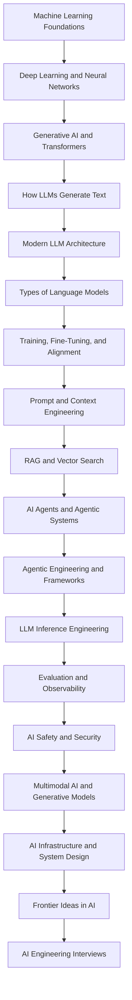

<p align="center">
    
</p>

# AI Engineering Course

**English** | [한국어](README.ko.md)

**AI Engineering Course - A free and complete AI Engineering Course to learn AI Engineering step by step - from Machine Learning, Neural Networks, and Transformers to LLMs, Fine-Tuning, RAG, AI Agents, LLM Inference, Evaluation, AI Safety, and AI System Design. Every lesson comes with a detailed blog, and many lessons come with a video.**

> This AI Engineering Course is helpful for anyone who wants to become:
>
> - AI Engineer
> - Gen AI Engineer
> - LLM Engineer
> - Agentic AI Engineer
> - AI Agent Engineer
> - Forward Deployed Engineer
> - AI Solutions Architect
> - AI Platform Engineer
> - Applied AI Engineer
> - Machine Learning Engineer
> - MLOps Engineer
> - LLMOps Engineer

---

### Prepared and maintained by the **Founder** of [Outcome School](https://outcomeschool.com): Amit Shekhar

### Follow Amit Shekhar

- [X/Twitter](https://twitter.com/amitiitbhu)
- [LinkedIn](https://www.linkedin.com/in/amit-shekhar-iitbhu)
- [GitHub](https://github.com/amitshekhariitbhu)

### Follow Outcome School

- [YouTube](https://youtube.com/@OutcomeSchool)
- [X/Twitter](https://x.com/outcome_school)
- [LinkedIn](https://www.linkedin.com/company/outcomeschool)
- [GitHub](https://github.com/OutcomeSchool)

## I teach at Outcome School

- [AI and Machine Learning](https://outcomeschool.com/program/ai-and-machine-learning)

---

> **Note: This AI Engineering Course will continue to grow as I write more blogs and create more videos on new topics. Keep learning.**

---

## Table of Contents

- [About This AI Engineering Course](#about-this-ai-engineering-course)
- [What is AI Engineering?](#what-is-ai-engineering)
- [Who is This AI Engineering Course For?](#who-is-this-ai-engineering-course-for)
- [What Will We Learn in This AI Engineering Course?](#what-will-we-learn-in-this-ai-engineering-course)
- [Prerequisites for This AI Engineering Course](#prerequisites-for-this-ai-engineering-course)
- [How to Use This AI Engineering Course](#how-to-use-this-ai-engineering-course)
- [AI Engineering Course Curriculum at a Glance](#ai-engineering-course-curriculum-at-a-glance)
- [AI Engineering Learning Path](#ai-engineering-learning-path)
- [Module 0: Must Know](#module-0-must-know)
- [Module 1: Machine Learning Foundations](#module-1-machine-learning-foundations)
- [Module 2: Deep Learning and Neural Networks](#module-2-deep-learning-and-neural-networks)
- [Module 3: Generative AI and the Transformer Architecture](#module-3-generative-ai-and-the-transformer-architecture)
- [Module 4: How LLMs Generate Text](#module-4-how-llms-generate-text)
- [Module 5: Modern LLM Architecture](#module-5-modern-llm-architecture)
- [Module 6: Types of Language Models](#module-6-types-of-language-models)
- [Module 7: Training, Fine-Tuning, and Alignment](#module-7-training-fine-tuning-and-alignment)
- [Module 8: Prompt Engineering and Context Engineering](#module-8-prompt-engineering-and-context-engineering)
- [Module 9: Vector Search and Retrieval-Augmented Generation (RAG)](#module-9-vector-search-and-retrieval-augmented-generation-rag)
- [Module 10: AI Agents and Agentic Systems](#module-10-ai-agents-and-agentic-systems)
- [Module 11: Agentic Engineering and Agent Frameworks](#module-11-agentic-engineering-and-agent-frameworks)
- [Module 12: LLM Inference Engineering](#module-12-llm-inference-engineering)
- [Module 13: Evaluation and Observability](#module-13-evaluation-and-observability)
- [Module 14: AI Safety and Security](#module-14-ai-safety-and-security)
- [Module 15: Multimodal AI and Generative Models](#module-15-multimodal-ai-and-generative-models)
- [Module 16: AI Infrastructure, Deployment, and System Design](#module-16-ai-infrastructure-deployment-and-system-design)
- [Module 17: Frontier Ideas in AI](#module-17-frontier-ideas-in-ai)
- [Module 18: Prepare for AI Engineering Interviews](#module-18-prepare-for-ai-engineering-interviews)
- [AI Engineering Key Concepts Glossary](#ai-engineering-key-concepts-glossary)
- [AI Engineering Course FAQs](#ai-engineering-course-faqs)
- [License](#license)

## About This AI Engineering Course

**This AI Engineering Course is a free, structured, and step-by-step curriculum to learn AI Engineering from scratch. It has 18 modules and 146+ in-depth lessons, and every lesson is a detailed blog that explains one concept in simple words with examples, diagrams, and math wherever it is needed.**

In simple words, this is the course that I wish I had when I started learning AI Engineering. We start with the basics of Machine Learning, and slowly move to how a Transformer works from the inside, how an LLM generates text, how we fine-tune and align an LLM, how we build RAG systems and AI Agents, how we serve an LLM fast and cheap in production, how we evaluate and secure it, and finally how we design a complete AI system end to end.

Every lesson in this AI Engineering Course is:

- **Free to read.** No sign-up. No paywall.
- **Written for beginners.** No jargon. No assumptions.
- **Detailed.** We go from "why do we need it" to "how does it work step by step" to "where is it used in the real world".
- **In order.** Each lesson builds on top of the previous one.

## What is AI Engineering?

**AI Engineering is the discipline of building real-world applications and systems on top of AI models, especially Large Language Models (LLMs).**

An AI Engineer does not always train a model from scratch. Instead, an AI Engineer knows how these models work from the inside, picks the right model, gives it the right context, connects it to tools and data, makes it fast and cheap to run, measures if it is doing a good job, keeps it safe, and ships it to real users.

In simple words:

**AI Engineering = Understanding the model + Building on top of the model + Running the model in production.**

This is exactly what we will learn in this AI Engineering Course.

## Who is This AI Engineering Course For?

This AI Engineering Course is for:

- **Software Engineers** who want to move into AI Engineering.
- **Backend, Mobile, and Frontend Developers** who want to build AI-powered products.
- **Machine Learning Engineers and Data Scientists** who want to go deep into LLMs, RAG, and AI Agents.
- **Students and freshers** who want to start a career in AI.
- **Engineering Managers and Tech Leads** who want to understand how modern AI systems are built.
- **Anyone preparing for AI Engineer interviews.**

## What Will We Learn in This AI Engineering Course?

In this AI Engineering Course, we will learn:

- **Machine Learning foundations:** supervised, unsupervised, and reinforcement learning, loss functions, regularization, precision and recall.
- **Deep Learning:** gradient descent, backpropagation, cross-entropy, dropout, normalization, RNNs, PyTorch, and TensorFlow.
- **The Transformer architecture:** tokenization, BPE, embeddings, self attention, the math behind Q, K, and V, multi-head attention, causal masking, RoPE, and the feed-forward network.
- **How LLMs generate text:** temperature, top-k and top-p sampling, token streaming, and the lost in the middle problem.
- **Modern LLM architecture:** Mixture of Experts (MoE), Grouped Query Attention (GQA), sliding window attention, attention sinks, Flash Attention, and DeepSeek-V4.
- **Types of language models:** SLMs, Large Reasoning Models, Recursive Language Models, Diffusion Language Models, and System One Models.
- **Fine-tuning and alignment:** fine-tuning, LoRA, prefix tuning, knowledge distillation, continual learning, RLHF, InstructGPT, PPO, DPO, and GRPO.
- **Prompt Engineering and Context Engineering:** chain-of-thought, prompt chaining, prompt caching, and context compaction.
- **RAG and Vector Search:** vector databases, ANN search, semantic search, hybrid search, rerankers, ColBERT, chunking, HyDE, caching, Agentic RAG, GraphRAG, and Vectorless RAG.
- **AI Agents:** function calling, the agent loop, ReAct, Plan-and-Execute, Reflection, memory, MCP, Agent Skills, multi-agent systems, SubAgents, orchestration, and computer-use agents.
- **Agentic Engineering:** harness engineering, loop engineering, graph engineering, LangChain, LangGraph, Claude Code, and Cursor.
- **LLM Inference Engineering:** prefill vs decode, KV cache, paged attention, continuous batching, speculative decoding, Medusa, EAGLE, quantization, GGUF, llama.cpp, vLLM, SGLang, and TensorRT-LLM.
- **Evaluation and Observability:** LLM evaluation, LLM as a judge, AI agent evaluation, and agent observability.
- **AI Safety and Security:** guardrails, prompt injection, and watermarking.
- **Multimodal AI and Generative Models:** Vision Transformers, image embeddings, diffusion models, GANs, and VAEs.
- **AI Infrastructure and System Design:** GPUs, TPUs, LPUs, cloud vs on-device deployment, LLM routing, and designing a real-time voice AI agent.
- **Frontier Ideas in AI:** JEPA, world models, and recursive self-improvement.
- **AI Engineering interview preparation.**

## Prerequisites for This AI Engineering Course

- **Basic programming knowledge**, preferably Python. Most code examples in the lessons are in Python.
- **High-school level math.** We explain the linear algebra, calculus, and probability we need right inside the lessons, step by step.
- **Curiosity.** That's all.

No prior background in AI or Machine Learning is required.

## How to Use This AI Engineering Course

This AI Engineering Course is designed so that anyone can follow it in the given order, even without any prior background in AI.

- Follow the modules in order. Each module builds on top of the previous one.
- Inside each module, read the lessons in the given order. Every lesson explains one concept in simple words with examples.
- Do not skip Module 1 and Module 2, even if you are in a hurry. Everything else in AI Engineering is built on top of them.
- If you already know a topic, read the "We will cover the following" list of that lesson. If you can explain every point, move to the next one.
- After every module, try to explain the concepts to a friend in your own words. If you can explain it, you have learned it.

Let's get started.

## AI Engineering Course Curriculum at a Glance

| Module | Topic                                                                                                                    | Lessons |
| ------ | ------------------------------------------------------------------------------------------------------------------------ | ------- |
| 0      | [Must Know](#module-0-must-know)                                                                                         | 1       |
| 1      | [Machine Learning Foundations](#module-1-machine-learning-foundations)                                                   | 9       |
| 2      | [Deep Learning and Neural Networks](#module-2-deep-learning-and-neural-networks)                                         | 10      |
| 3      | [Generative AI and the Transformer Architecture](#module-3-generative-ai-and-the-transformer-architecture)               | 15      |
| 4      | [How LLMs Generate Text](#module-4-how-llms-generate-text)                                                               | 4       |
| 5      | [Modern LLM Architecture](#module-5-modern-llm-architecture)                                                             | 7       |
| 6      | [Types of Language Models](#module-6-types-of-language-models)                                                           | 5       |
| 7      | [Training, Fine-Tuning, and Alignment](#module-7-training-fine-tuning-and-alignment)                                     | 11      |
| 8      | [Prompt Engineering and Context Engineering](#module-8-prompt-engineering-and-context-engineering)                       | 5       |
| 9      | [Vector Search and Retrieval-Augmented Generation (RAG)](#module-9-vector-search-and-retrieval-augmented-generation-rag) | 13      |
| 10     | [AI Agents and Agentic Systems](#module-10-ai-agents-and-agentic-systems)                                                | 16      |
| 11     | [Agentic Engineering and Agent Frameworks](#module-11-agentic-engineering-and-agent-frameworks)                          | 8       |
| 12     | [LLM Inference Engineering](#module-12-llm-inference-engineering)                                                        | 17      |
| 13     | [Evaluation and Observability](#module-13-evaluation-and-observability)                                                  | 4       |
| 14     | [AI Safety and Security](#module-14-ai-safety-and-security)                                                              | 3       |
| 15     | [Multimodal AI and Generative Models](#module-15-multimodal-ai-and-generative-models)                                    | 6       |
| 16     | [AI Infrastructure, Deployment, and System Design](#module-16-ai-infrastructure-deployment-and-system-design)            | 10      |
| 17     | [Frontier Ideas in AI](#module-17-frontier-ideas-in-ai)                                                                  | 3       |
| 18     | [Prepare for AI Engineering Interviews](#module-18-prepare-for-ai-engineering-interviews)                                | 1       |

## AI Engineering Learning Path



---

## Module 0: Must Know

Before jumping into the details, we must know the six words that come up in every AI Engineering conversation:

- **LLM**
- **RAG**
- **MCP**
- **Agent**
- **Fine-tuning**
- **Quantization**

Learn about all six in one video: [AI Engineering Explained: LLM, RAG, MCP, Agent, Fine-Tuning, Quantization](https://www.youtube.com/watch?v=lnfWvX66FUk)

Now, we know the big picture. In the next modules, we will learn each of these in depth, one concept at a time.

---

## Module 1: Machine Learning Foundations

In this module, we will learn what Machine Learning is, the different ways a machine can learn, and the basic terms we will keep using in every later module of this AI Engineering Course.

By the end of this module, we will know how a model learns from data, how we measure it, and how we stop it from overfitting.

**Lessons in this module:**

1. [What is Machine Learning?](https://outcomeschool.com/blog/machine-learning)
2. [Supervised vs Unsupervised Learning](https://outcomeschool.com/blog/supervised-vs-unsupervised-learning)
3. [Linear Regression vs Logistic Regression](https://outcomeschool.com/blog/linear-regression-vs-logistic-regression)
4. [What is Feature Engineering in Machine Learning?](https://outcomeschool.com/blog/feature-engineering)
5. [Precision vs Recall](https://outcomeschool.com/blog/precision-vs-recall)
6. [What Are L1 and L2 Loss Functions?](https://outcomeschool.com/blog/l1-and-l2-loss-functions)
7. [What is Regularization in Machine Learning? L1 vs L2 Explained](https://outcomeschool.com/blog/regularization-in-machine-learning)
8. [What is Reinforcement Learning?](https://outcomeschool.com/blog/reinforcement-learning)
9. [What is Contrastive Learning? How It Works Step by Step](https://outcomeschool.com/blog/contrastive-learning)

---

### 1.1 What is Machine Learning?

In this blog, we will learn what is Machine Learning.

Let's get started: [What is Machine Learning?](https://outcomeschool.com/blog/machine-learning)

### 1.2 Supervised vs Unsupervised Learning

In this blog, we will learn about Supervised vs Unsupervised Learning in Machine Learning.

We will cover the following:

- Supervised Learning
- Unsupervised Learning
- Differences Between Supervised and Unsupervised Learning

Let's get started: [Supervised vs Unsupervised Learning](https://outcomeschool.com/blog/supervised-vs-unsupervised-learning)

### 1.3 Linear Regression vs Logistic Regression

In this blog, we will learn about Linear Regression vs Logistic Regression in Machine Learning.

We will cover the following:

- Linear Regression
- Logistic Regression
- Differences Between Linear Regression and Logistic Regression

Let's get started: [Linear Regression vs Logistic Regression](https://outcomeschool.com/blog/linear-regression-vs-logistic-regression)

### 1.4 What is Feature Engineering in Machine Learning?

In this blog, we will learn about the Feature Engineering for Machine Learning.

Let's get started: [What is Feature Engineering in Machine Learning?](https://outcomeschool.com/blog/feature-engineering)

Watch the video: [Feature Engineering in Machine Learning](https://www.youtube.com/watch?v=QLlywrWuXag)

Watch the video: [One-hot Encoding in Machine Learning](https://www.youtube.com/watch?v=6AmedU5i9go)

### 1.5 Precision vs Recall

In this blog, we will learn about Precision vs Recall, the two numbers we use to measure how good a system is at making yes-or-no decisions. We will also see how Precision and Recall differ from each other and when to use which one, what the four possible outcomes of any such decision are, why these two numbers pull against each other, and how the cost of a mistake decides which one we must care about more.

We will cover the following:

- The problem we are trying to solve
- The four possible outcomes
- What is Precision?
- What is Recall?
- Precision vs Recall
- When to use which one?
- A quick recap of the formulas
- Summary

Let's get started: [Precision vs Recall](https://outcomeschool.com/blog/precision-vs-recall)

### 1.6 What Are L1 and L2 Loss Functions?

In this blog, we will learn about the L1 and L2 Loss functions.

We will cover the following:

- L1 Loss Function
- L2 Loss Function
- How to decide between L1 and L2 Loss Function?

Let's get started: [What Are L1 and L2 Loss Functions?](https://outcomeschool.com/blog/l1-and-l2-loss-functions)

### 1.7 What is Regularization in Machine Learning? L1 vs L2 Explained

In this blog, we will learn about the Regularization In Machine Learning.

We will cover the following:

- What is overfitting?
- L1 Regularization or Lasso Regularization
- L2 Regularization or Ridge Regularization

Let's get started: [What is Regularization in Machine Learning? L1 vs L2 Explained](https://outcomeschool.com/blog/regularization-in-machine-learning)

### 1.8 What is Reinforcement Learning?

In this blog, we will learn about Reinforcement Learning, the branch of machine learning where an agent learns to make decisions by interacting with an environment and getting rewards or penalties for its actions.

We will cover the following:

- The Big Picture
- What is Reinforcement Learning?
- A Simple Real-World Analogy
- The Building Blocks of RL
- The Reinforcement Learning Loop
- Reinforcement Learning vs Supervised vs Unsupervised Learning
- Episode, Return, and Discount Factor
- Exploration vs Exploitation
- Common Families of RL Algorithms
- Where Is Reinforcement Learning Used?
- Why Reinforcement Learning Is Hard
- Quick Summary

Let's get started: [What is Reinforcement Learning?](https://outcomeschool.com/blog/reinforcement-learning)

### 1.9 What is Contrastive Learning? How It Works Step by Step

In this blog, we will learn about Contrastive Learning. We will also see how it works step-by-step and where it is used in the real world.

We will cover the following:

- What is Contrastive Learning?
- Why do we need Contrastive Learning?
- The key idea behind Contrastive Learning.
- Positive pairs and Negative pairs.
- How does Contrastive Learning work step-by-step?
- Loss functions used in Contrastive Learning.
- Popular Contrastive Learning methods.
- Real-world use cases of Contrastive Learning.

Let's get started: [What is Contrastive Learning? How It Works Step by Step](https://outcomeschool.com/blog/contrastive-learning)

**Videos and more resources for Module 1:**

- [Feature Engineering in Machine Learning](https://www.youtube.com/watch?v=QLlywrWuXag) (Video)
- [One-hot Encoding in Machine Learning](https://www.youtube.com/watch?v=6AmedU5i9go) (Video)

---

## Module 2: Deep Learning and Neural Networks

In this module, we will learn how a neural network actually learns. We will understand the math behind gradient descent and backpropagation step by step, and the techniques that make training stable.

By the end of this module, we will be able to explain how a neural network trains, from the forward pass to the weight update, and why normalization and dropout matter.

**Lessons in this module:**

1. [What is Bias In Artificial Neural Network?](https://outcomeschool.com/blog/bias-in-artificial-neural-network)
2. [How Does Gradient Descent Work?](https://outcomeschool.com/blog/math-behind-gradient-descent)
3. [How Does Backpropagation Work? The Math Explained Step by Step](https://outcomeschool.com/blog/math-behind-backpropagation)
4. [What is Cross-Entropy Loss?](https://outcomeschool.com/blog/math-behind-cross-entropy-loss)
5. [What is Dropout in Neural Networks and How Does It Work?](https://outcomeschool.com/blog/dropout-in-neural-networks)
6. [Batch Normalization vs Layer Normalization](https://outcomeschool.com/blog/batch-normalization-vs-layer-normalization)
7. [What is RMSNorm? Root Mean Square Layer Normalization Explained](https://outcomeschool.com/blog/rmsnorm-root-mean-square-layer-normalization)
8. [What is a Recurrent Neural Network (RNN)?](https://outcomeschool.com/blog/recurrent-neural-network)
9. [How does PyTorch work?](https://outcomeschool.com/blog/how-does-pytorch-work)
10. [How Does The Machine Learning Library TensorFlow Work?](https://outcomeschool.com/blog/how-does-the-machine-learning-library-tensorflow-work)

---

### 2.1 What is Bias In Artificial Neural Network?

In this blog, we will learn what is Bias In Artificial Neural Network.

Let's get started: [What is Bias In Artificial Neural Network?](https://outcomeschool.com/blog/bias-in-artificial-neural-network)

### 2.2 How Does Gradient Descent Work?

In this blog, we will learn about the math behind gradient descent with a step-by-step numeric example.

We will cover the following:

- The Big Picture
- What is a Loss Function
- What is Gradient Descent
- The Intuition Behind Gradient Descent
- The Math Behind Gradient Descent
- Step-by-Step Numeric Example
- Gradient Descent with Multiple Parameters
- The Role of Learning Rate
- Types of Gradient Descent
- Gradient Descent in Python
- Putting It All Together

Let's get started: [How Does Gradient Descent Work?](https://outcomeschool.com/blog/math-behind-gradient-descent)

Watch the video: [Epoch, Batch, Batch Size, Iteration](https://www.youtube.com/watch?v=NFLlXE-6vno)

### 2.3 How Does Backpropagation Work? The Math Explained Step by Step

In this blog, we will learn about the math behind backpropagation in neural networks.

We will cover the following:

- What is Backpropagation?
- The Chain Rule of Calculus
- Forward Pass
- Loss Calculation
- Backward Pass (Backpropagation)
- Step-by-Step Numeric Example
- Weight Update Using Gradient Descent
- Backpropagation in Python

Let's get started: [How Does Backpropagation Work? The Math Explained Step by Step](https://outcomeschool.com/blog/math-behind-backpropagation)

### 2.4 What is Cross-Entropy Loss?

In this blog, we will learn about the math behind Cross-Entropy Loss with a step-by-step numeric example.

We will cover the following:

- The Big Picture
- What is Cross-Entropy
- The Cross-Entropy Loss Formula
- Why We Take the Negative Log
- Binary Cross-Entropy Loss
- Categorical Cross-Entropy Loss
- Step-by-Step Numeric Example
- Cross-Entropy Loss for Language Models
- The Gradient of Cross-Entropy Loss
- Quick Summary

Let's get started: [What is Cross-Entropy Loss?](https://outcomeschool.com/blog/math-behind-cross-entropy-loss)

Watch the video: [Softmax Activation Function in Machine Learning](https://www.youtube.com/watch?v=2Zx6x01WwWM)

### 2.5 What is Dropout in Neural Networks and How Does It Work?

In this blog, we will learn about Dropout in Neural Networks. We will understand what it is, the problem it solves, how it works step by step with a simple example, and where it is used.

We will cover the following:

- What is Dropout?
- The problem of Overfitting
- Why do we need Dropout?
- How does Dropout work?
- A step-by-step example
- Dropout during training vs testing
- Dropout in code
- Variants of Dropout
- Advantages of Dropout
- Where Dropout is used

Let's get started: [What is Dropout in Neural Networks and How Does It Work?](https://outcomeschool.com/blog/dropout-in-neural-networks)

### 2.6 Batch Normalization vs Layer Normalization

In this blog, we are going to learn about Batch Normalization vs Layer Normalization. We will also see how Batch Normalization and Layer Normalization differ from each other and when to use which one.

We will cover the following:

- What is Normalization?
- Why do we need Normalization?
- What is Batch Normalization?
- What is Layer Normalization?
- Batch Normalization vs Layer Normalization
- When to use which one?

Let's get started: [Batch Normalization vs Layer Normalization](https://outcomeschool.com/blog/batch-normalization-vs-layer-normalization)

### 2.7 What is RMSNorm? Root Mean Square Layer Normalization Explained

In this blog, we will learn about RMSNorm, a faster and simpler alternative to [Layer Normalization](https://outcomeschool.com/blog/batch-normalization-vs-layer-normalization) that powers most modern Large Language Models like Llama, Mistral, Gemma, Qwen, PaLM, and DeepSeek.

We will cover the following:

- Why normalization is needed in deep networks
- A quick recap of Layer Normalization (LayerNorm)
- What RMSNorm is and how it works
- The math behind RMSNorm with a concrete numeric example
- LayerNorm vs RMSNorm - the key differences
- Why modern LLMs prefer RMSNorm
- A code example
- Where RMSNorm fits in a Transformer
- Quick Summary

Let's get started: [What is RMSNorm? Root Mean Square Layer Normalization Explained](https://outcomeschool.com/blog/rmsnorm-root-mean-square-layer-normalization)

### 2.8 What is a Recurrent Neural Network (RNN)?

In this blog, we will learn about the Recurrent Neural Network.

Let's get started: [What is a Recurrent Neural Network (RNN)?](https://outcomeschool.com/blog/recurrent-neural-network)

### 2.9 How does PyTorch work?

In this blog, we will learn about how PyTorch works. We will also see what a tensor is, how the computation graph and autograd work together to train a model, and why PyTorch uses the GPU to become one of the most popular tools in the real world.

We will cover the following:

- What is PyTorch?
- What is a Tensor?
- The problem PyTorch solves
- What is a Computation Graph?
- What is Autograd?
- A complete training example
- What is the GPU and why does PyTorch use it?
- Why is PyTorch so popular?

Let's get started: [How does PyTorch work?](https://outcomeschool.com/blog/how-does-pytorch-work)

### 2.10 How Does The Machine Learning Library TensorFlow Work?

In this blog, we will learn how the Machine Learning library TensorFlow works.

Let's get started: [How Does The Machine Learning Library TensorFlow Work?](https://outcomeschool.com/blog/how-does-the-machine-learning-library-tensorflow-work)

**Videos and more resources for Module 2:**

- [Epoch, Batch, Batch Size, Iteration](https://www.youtube.com/watch?v=NFLlXE-6vno) (Video)

---

## Module 3: Generative AI and the Transformer Architecture

In this module, we will learn what Generative AI is and how the Transformer, the architecture behind every modern LLM, works from the inside. We will go from tokens to embeddings to attention, one piece at a time.

By the end of this module, we will be able to draw the Transformer from memory and explain every block inside it, including the math behind Q, K, and V.

**Lessons in this module:**

1. [What is Generative AI?](https://outcomeschool.com/blog/what-is-generative-ai)
2. [What are Autoregressive Models?](https://outcomeschool.com/blog/autoregressive-models)
3. [What is Byte Pair Encoding (BPE) in LLMs?](https://outcomeschool.com/blog/bpe-in-llms)
4. [What are Embeddings?](https://outcomeschool.com/blog/what-are-embeddings)
5. [How do RNNs and Transformers differ?](https://outcomeschool.com/blog/how-do-rnns-and-transformers-differ)
6. [How Does the Transformer Architecture Work?](https://outcomeschool.com/blog/decoding-transformer-architecture)
7. [Encoder vs Decoder in Transformers](https://outcomeschool.com/blog/encoder-vs-decoder-in-transformers)
8. [What is Self Attention in Transformers and How Does It Work?](https://outcomeschool.com/blog/self-attention-in-transformers)
9. [How Does Attention Work? The Math Behind Q, K, and V Step by Step](https://outcomeschool.com/blog/math-behind-attention-qkv)
10. [Why Do We Scale Attention by √dₖ? The Math Behind the Scaling Factor](https://outcomeschool.com/blog/scaling-dot-product-attention)
11. [What is Causal Masking in Attention and Why Do LLMs Need It?](https://outcomeschool.com/blog/causal-masking-in-attention)
12. [What is Multi-Head Attention in Transformers and How Does It Work?](https://outcomeschool.com/blog/multi-head-attention-in-transformers)
13. [What is Cross Attention in Transformers and How Does It Work?](https://outcomeschool.com/blog/cross-attention-in-transformers)
14. [What is RoPE (Rotary Position Embedding)? The Math Behind It](https://outcomeschool.com/blog/math-behind-rope-rotary-position-embedding)
15. [What is the Feed-Forward Network in LLMs and What Does It Do?](https://outcomeschool.com/blog/feed-forward-networks-in-llms)

---

### 3.1 What is Generative AI?

In this blog, we will learn about what Generative AI is. We will understand what the word "generate" actually means, how Generative AI is different from the older AI, how it learns from a huge amount of examples, how it creates something completely new, where we use it every day, and the limitations we must know.

We will cover the following:

- What is Generative AI?
- Generative AI = Generative + AI
- What does "generate" mean here?
- How is Generative AI different from the old AI?
- How does Generative AI learn?
- How does Generative AI actually create something new?
- What can Generative AI create?
- What is a model in Generative AI?
- The complete flow of Generative AI
- Where do we use Generative AI every day?
- The limitations we must know
- Summary

Let's get started: [What is Generative AI?](https://outcomeschool.com/blog/what-is-generative-ai)

### 3.2 What are Autoregressive Models?

In this blog, we will learn about Autoregressive Models, the family of models that generate one piece at a time by predicting the next step from the past.

We will cover the following:

- What is an Autoregressive Model?
- The Chain Rule of Probability
- The Generation Loop
- Step-by-Step Numeric Example
- Why GPT-style Models are Autoregressive
- Why Autoregressive Models Need Causal Masking
- The Connection with KV Cache
- Autoregressive vs Non-Autoregressive Generation
- Popular Autoregressive Models we should know
- Pros and Cons of Autoregressive Models
- Quick Summary

Let's get started: [What are Autoregressive Models?](https://outcomeschool.com/blog/autoregressive-models)

### 3.3 What is Byte Pair Encoding (BPE) in LLMs?

In this blog, we will learn about **BPE (Byte Pair Encoding)** - the tokenization algorithm used by most modern Large Language Models (LLMs) to break text into smaller pieces before processing it.

We will cover the following:

- What is Tokenization?
- The Problem: How to Break Text into Tokens?
- What is BPE (Byte Pair Encoding)?
- How BPE Works: Step by Step
- How BPE Tokenizes New Text
- Why BPE is Used in Modern LLMs

Let's get started: [What is Byte Pair Encoding (BPE) in LLMs?](https://outcomeschool.com/blog/bpe-in-llms)

Watch the video: [Tokenization in Large Language Models (LLMs)](https://www.youtube.com/watch?v=sK2s9I84EVI)

### 3.4 What are Embeddings?

In this blog, we will learn about Embeddings, one of the most important ideas behind modern AI like search engines, recommendations, and chatbots. We will also see why a computer cannot compare meaning on its own, how an embedding turns meaning into numbers so that similar things sit close together, how we measure that closeness, and where we use embeddings in the real world.

We will cover the following:

- The problem: computers cannot compare meaning
- What are Embeddings?
- A simple example with two numbers
- Why we need many more than two numbers
- How do we measure closeness?
- Where do embeddings come from?
- The famous word math example
- Embeddings are not only for words
- What we use embeddings for
- Things we must be careful about
- Summary

Let's get started: [What are Embeddings?](https://outcomeschool.com/blog/what-are-embeddings)

Watch the video: [Embeddings in Machine Learning](https://www.youtube.com/watch?v=LedXW6xl21s)

### 3.5 How do RNNs and Transformers differ?

In this blog, we will learn about how RNNs and Transformers differ. These are the two main ways a computer reads a sequence like a sentence, and we will learn why one of them reads word by word, why the other reads everything at once, and when to use which one.

We will cover the following:

- What both of them are for
- What is an RNN?
- The problem with an RNN
- What is a Transformer?
- The key difference in one line
- RNN vs Transformer side by side
- Let's tabulate the difference
- When to use which one?
- Summary

Let's get started: [How do RNNs and Transformers differ?](https://outcomeschool.com/blog/how-do-rnns-and-transformers-differ)

### 3.6 How Does the Transformer Architecture Work?

In this blog, we will learn about the Transformer architecture by decoding it piece by piece - understanding what each component does, how they work together, and why this architecture powers every modern Large Language Model (LLM).

We will cover the following:

- Why the Transformer was needed
- The two halves of the architecture
- Tokenization, Embedding, and Positional Encoding
- The Attention Mechanism and Multi-Head Attention
- Feed-Forward Networks, Residual Connections, and Layer Normalization
- How the Encoder and Decoder work
- How data flows through the entire architecture
- The three variants of the Transformer
- Why the Transformer is so powerful

Let's get started: [How Does the Transformer Architecture Work?](https://outcomeschool.com/blog/decoding-transformer-architecture)

### 3.7 Encoder vs Decoder in Transformers

In this blog, we will learn about Encoder vs Decoder in Transformers, the two building blocks behind almost every modern AI model that works with language. We will also see how the Encoder and the Decoder differ from each other, how each one works with simple examples, why one of them reads in both directions while the other one looks only backward, what the three types of Transformers are, and when to use which one.

We will cover the following:

- What is a Transformer?
- A word about tokens
- What is an Encoder?
- What is a Decoder?
- The one big difference
- The three types of Transformers
- Let's tabulate the difference
- When to use which one?
- Summary

Let's get started: [Encoder vs Decoder in Transformers](https://outcomeschool.com/blog/encoder-vs-decoder-in-transformers)

### 3.8 What is Self Attention in Transformers and How Does It Work?

In this blog, we will learn about Self Attention in Transformers. We will understand what it is, how it works step by step, and why it is the heart of modern Large Language Models like BERT and GPT.

We will cover the following:

- What is Self Attention?
- Why do we need Self Attention?
- Query, Key, and Value vectors
- Step-by-step working of Self Attention
- A simple example walk-through
- Why Self Attention works so well
- Multi-Head Self Attention
- Where Self Attention is used

Let's get started: [What is Self Attention in Transformers and How Does It Work?](https://outcomeschool.com/blog/self-attention-in-transformers)

### 3.9 How Does Attention Work? The Math Behind Q, K, and V Step by Step

In this blog, we will learn about the math behind Attention: Query(Q), Key(K), and Value(V) with a step-by-step numeric example.

We will cover the following:

- The Attention Formula
- Setting Up: From Words to Vectors
- Creating Q, K, and V Matrices
- Computing Attention Scores (Q x K^T)
- Scaling the Scores
- Applying Softmax
- Computing the Final Output (Attention Weights x V)
- Putting It All Together

Let's get started: [How Does Attention Work? The Math Behind Q, K, and V Step by Step](https://outcomeschool.com/blog/math-behind-attention-qkv)

Watch the video: [Softmax Activation Function in Machine Learning](https://www.youtube.com/watch?v=2Zx6x01WwWM)

### 3.10 Why Do We Scale Attention by √dₖ? The Math Behind the Scaling Factor

In this blog, we will learn about why we scale the dot product attention by √dₖ in the Transformer architecture with a step-by-step numeric example.

We will cover the following:

- The Attention Formula (Quick Recap)
- What Happens Without Scaling?
- Why Do Dot Products Grow with dₖ?
- Understanding Variance of the Dot Product
- Proving It Step by Step: Variance of the Dot Product is dₖ
- What Large Dot Products Do to Softmax
- Why √dₖ is the Right Scaling Factor
- Seeing It with Real Numbers
- Putting It All Together

Let's get started: [Why Do We Scale Attention by √dₖ? The Math Behind the Scaling Factor](https://outcomeschool.com/blog/scaling-dot-product-attention)

### 3.11 What is Causal Masking in Attention and Why Do LLMs Need It?

In this blog, we will learn about **causal masking in attention**.

We will cover the following:

- Without Causal Masking
- With Causal Masking
- Implementation of Causal Masking
- The Causal Mask Matrix

Let's get started: [What is Causal Masking in Attention and Why Do LLMs Need It?](https://outcomeschool.com/blog/causal-masking-in-attention)

### 3.12 What is Multi-Head Attention in Transformers and How Does It Work?

In this blog, we will learn about Multi-Head Attention in Transformers. We will understand what it is, how it works step by step, and why it gives Transformers their power to understand language so well.

We will cover the following:

- What is Multi-Head Attention?
- A quick recap of Self Attention
- Why do we need Multi-Head Attention?
- Step-by-step working of Multi-Head Attention
- A simple example walk-through
- Where Multi-Head Attention is used
- Advantages of Multi-Head Attention

Let's get started: [What is Multi-Head Attention in Transformers and How Does It Work?](https://outcomeschool.com/blog/multi-head-attention-in-transformers)

### 3.13 What is Cross Attention in Transformers and How Does It Work?

In this blog, we will learn about Cross Attention in Transformers. We will understand what it is, how it works step by step, how it is different from Self Attention, and where it is used.

We will cover the following:

- What is Cross Attention?
- Why do we need Cross Attention?
- Query, Key, and Value in Cross Attention
- Self Attention vs Cross Attention
- Step-by-step working of Cross Attention
- A simple example walk-through
- Where Cross Attention is used
- Importance of Cross Attention

Let's get started: [What is Cross Attention in Transformers and How Does It Work?](https://outcomeschool.com/blog/cross-attention-in-transformers)

### 3.14 What is RoPE (Rotary Position Embedding)? The Math Behind It

In this blog, we will learn about the math behind Rotary Position Embedding (RoPE) and why it is used in modern Large Language Models.

We will cover the following:

- The Big Picture
- Why a Transformer Needs Position Information
- Older Approaches and Their Problems
- The Core Idea Behind RoPE
- The 2D Rotation Math
- How RoPE Is Applied to Q and K
- Why the Dot Product Captures Relative Position
- A Small Numeric Example
- Real-World Use Cases
- Quick Summary

Let's get started: [What is RoPE (Rotary Position Embedding)? The Math Behind It](https://outcomeschool.com/blog/math-behind-rope-rotary-position-embedding)

### 3.15 What is the Feed-Forward Network in LLMs and What Does It Do?

In this blog, we will learn about Feed-Forward Networks in LLMs - understanding what they are, how they work inside the Transformer architecture, why every Transformer layer needs one, and what role they play in making Large Language Models so powerful.

We will cover the following:

- What is a Feed-Forward Network?
- Understanding Feed-Forward Networks with a Real-World Analogy
- Where Does the Feed-Forward Network Sit in a Transformer?
- How Does a Feed-Forward Network Work - Step by Step
- The Expand-then-Contract Pattern
- Why Does the FFN Expand and Then Contract?
- ReLU and Activation Functions
- What Does the Feed-Forward Network Actually Learn?
- How Much of the Model is the Feed-Forward Network?
- Feed-Forward Networks in Mixture of Experts
- Why Feed-Forward Networks Are So Important

Let's get started: [What is the Feed-Forward Network in LLMs and What Does It Do?](https://outcomeschool.com/blog/feed-forward-networks-in-llms)

**Videos and more resources for Module 3:**

- [Softmax Activation Function in Machine Learning](https://www.youtube.com/watch?v=2Zx6x01WwWM) (Video)
- [Inside ChatGPT: What Happens After You Hit Enter](https://outcomeschool.substack.com/p/inside-chatgpt-what-happens-after) (Read)
- [Tokenization in Large Language Models (LLMs)](https://www.youtube.com/watch?v=sK2s9I84EVI) (Video)
- [Embeddings in Machine Learning](https://www.youtube.com/watch?v=LedXW6xl21s) (Video)
- [Positional Embeddings in LLMs](https://outcomeschool.substack.com/p/positional-embeddings-in-llms) (Read)

---

## Module 4: How LLMs Generate Text

In this module, we will learn how an LLM picks the next token, how we control its creativity, how the output reaches the user token by token, and where the context window fails.

By the end of this module, we will know exactly what happens between the prompt and the final answer, and which knobs change the output.

**Lessons in this module:**

1. [How does Temperature control LLM output?](https://outcomeschool.com/blog/how-does-temperature-control-llm-output)
2. [How do Top-k and Top-p Sampling work?](https://outcomeschool.com/blog/how-do-top-k-and-top-p-sampling-work)
3. [How does Token Streaming work?](https://outcomeschool.com/blog/how-does-token-streaming-work)
4. [What is the Lost in the Middle Problem in LLMs and How to Fix It?](https://outcomeschool.com/blog/lost-in-the-middle-problem-in-llms)

---

### 4.1 How does Temperature control LLM output?

In this blog, we will learn about how Temperature controls LLM output, the single number that decides whether an AI model gives us a safe and predictable answer or a creative and surprising one. We will also see how an LLM picks one token at a time, how it gives a score to every possible next token, how those scores become probabilities, how Temperature quietly changes those probabilities before the pick happens, what happens at low, high, and zero Temperature, why it is called Temperature, and when to use which value based on our use case.

We will cover the following:

- What is Temperature in LLMs?
- How does an LLM pick the next token?
- From scores to probabilities
- Where does Temperature come into the picture?
- Step-by-step example with numbers
- Low Temperature
- High Temperature
- Temperature = 1 and Temperature = 0
- Why is it called Temperature?
- When to use which Temperature?
- Common mistakes while using Temperature

Let's get started: [How does Temperature control LLM output?](https://outcomeschool.com/blog/how-does-temperature-control-llm-output)

### 4.2 How do Top-k and Top-p Sampling work?

In this blog, we will learn about how Top-k and Top-p Sampling work, the two most common ways an LLM decides which word to write next when it is replying to us. We will also see how an LLM picks one token at a time, why always picking the best token gives boring text, why picking from every token gives silly text, how Top-k keeps a fixed number of tokens, how Top-p keeps tokens based on their total probability, how both of them work with temperature, and when to use which one.

We will cover the following:

- How an LLM picks the next token
- The problem with always picking the best token
- The problem with picking from every token
- What is Top-k Sampling?
- Step-by-step example of Top-k Sampling
- The problem with Top-k Sampling
- What is Top-p Sampling?
- Step-by-step example of Top-p Sampling
- Top-k vs Top-p Sampling
- How Top-k and Top-p work with Temperature
- When to use which one

Let's get started: [How do Top-k and Top-p Sampling work?](https://outcomeschool.com/blog/how-do-top-k-and-top-p-sampling-work)

### 4.3 How does Token Streaming work?

In this blog, we will learn about how Token Streaming works. We will also see why we need it, how the server and the browser talk to each other to make it happen, and where it is used in real systems like ChatGPT and Claude.

We will cover the following:

- What is token streaming
- A quick recap of how an LLM generates text
- Why we need streaming at all
- What is SSE
- How the HTTP connection stays open
- The format of a streamed message
- A full walkthrough from server to screen
- The [DONE] marker that ends the stream
- SSE vs WebSockets
- Token streaming in the real world

Let's get started: [How does Token Streaming work?](https://outcomeschool.com/blog/how-does-token-streaming-work)

### 4.4 What is the Lost in the Middle Problem in LLMs and How to Fix It?

In this blog, we will learn about the Lost in the Middle problem in LLMs, the strange behaviour where a model reads a very long text, uses the beginning and the end very well, and quietly ignores whatever is sitting in the middle. We will also see what a context window really means, how the accuracy forms a U-shaped curve, why the middle gets forgotten, how this silently breaks RAG systems and long conversations, how we can test our own model for it, and what we can do to fix it.

We will cover the following:

- What is a context window
- What is the Lost in the Middle problem
- Let's understand it with an example
- The U-shaped curve
- Why does this happen
- Where this hurts us in real life
- How to test for the Lost in the Middle problem
- How to solve the Lost in the Middle problem
- Key points to remember

Let's get started: [What is the Lost in the Middle Problem in LLMs and How to Fix It?](https://outcomeschool.com/blog/lost-in-the-middle-problem-in-llms)

Watch the video: [Why is the context window limited in LLMs?](https://www.youtube.com/watch?v=CGIhxIaOg3M)

**Videos and more resources for Module 4:**

- [Why is the context window limited in LLMs?](https://www.youtube.com/watch?v=CGIhxIaOg3M) (Video)

---

## Module 5: Modern LLM Architecture

In this module, we will learn the improvements that modern LLMs add on top of the basic Transformer to become bigger, faster, and able to handle longer inputs. At the end, we will see all of these ideas together inside a real model.

By the end of this module, we will be able to read the architecture section of any new open-weight model and understand every design choice in it.

**Lessons in this module:**

1. [Evolution of LLM Architecture](https://outcomeschool.com/blog/evolution-of-llm-architecture)
2. [What is Mixture of Experts (MoE) and How Does It Work?](https://outcomeschool.com/blog/mixture-of-experts)
3. [What is Grouped Query Attention (GQA) and Why Do LLMs Use It?](https://outcomeschool.com/blog/grouped-query-attention)
4. [How does Sliding Window Attention work?](https://outcomeschool.com/blog/how-does-sliding-window-attention-work)
5. [How do Attention Sinks work?](https://outcomeschool.com/blog/how-do-attention-sinks-work)
6. [What is Flash Attention and Why Is It So Fast?](https://outcomeschool.com/blog/decoding-flash-attention)
7. [What is DeepSeek-V4 and How Does It Work? Architecture Explained](https://outcomeschool.com/blog/decoding-deepseek-v4)

---

### 5.1 Evolution of LLM Architecture

In this blog, we will learn about the Evolution of LLM Architecture, the step-by-step journey of how the design of large language models changed from simple word-by-word readers to the massive AI models we use today. We will also see why the early models kept forgetting, how attention solved that problem, how the Transformer removed the slow parts, how making models bigger made them smarter, how Mixture of Experts made big models cheaper to run, what problems still remain, and what is coming next.

We will cover the following:

- What is an LLM Architecture?
- Stage 1: Reading one word at a time (RNN)
- Stage 2: Attention
- Stage 3: The Transformer
- Stage 4: Scaling
- Stage 5: Mixture of Experts (MoE)
- Stage 6: New Directions
- Summary of the evolution

Let's get started: [Evolution of LLM Architecture](https://outcomeschool.com/blog/evolution-of-llm-architecture)

### 5.2 What is Mixture of Experts (MoE) and How Does It Work?

In this blog, we will learn about the Mixture of Experts (MoE) architecture - understanding what experts are, how the router picks them, why MoE makes large models faster and cheaper, and why it powers many of today's most powerful Large Language Models (LLMs).

We will cover the following:

- Why Mixture of Experts was needed
- What an "expert" really means
- The router and how it picks experts
- Where MoE sits inside a Transformer
- Sparse activation and why it saves compute
- Load balancing across experts
- Advantages and challenges of MoE
- Why MoE powers many modern LLMs

Let's get started: [What is Mixture of Experts (MoE) and How Does It Work?](https://outcomeschool.com/blog/mixture-of-experts)

### 5.3 What is Grouped Query Attention (GQA) and Why Do LLMs Use It?

In this blog, we will learn about Grouped-Query Attention (GQA) and how it differs from Multi-Head Attention (MHA).

We will cover the following:

- The Big Picture
- Quick Recap: Multi-Head Attention (MHA)
- The Problem with Multi-Head Attention
- What is Multi-Query Attention (MQA)?
- What is Grouped-Query Attention (GQA)?
- How Grouped-Query Attention Works
- GQA is a Generalization of MHA and MQA
- GQA vs MHA vs MQA
- Real-World Use Cases
- A Note on Terminology
- Uptraining: Converting MHA to GQA
- Quick Summary

Let's get started: [What is Grouped Query Attention (GQA) and Why Do LLMs Use It?](https://outcomeschool.com/blog/grouped-query-attention)

### 5.4 How does Sliding Window Attention work?

In this blog, we will learn about how sliding window attention works. We will also see why normal attention becomes slow and expensive for long text, and how sliding window attention comes to the rescue.

We will cover the following:

- What is attention?
- The problem with normal attention
- What is sliding window attention?
- A simple step-by-step walkthrough
- How information still travels far away
- Comparing normal attention and sliding window attention
- Where sliding window attention is used
- Advantages and trade-offs

Let's get started: [How does Sliding Window Attention work?](https://outcomeschool.com/blog/how-does-sliding-window-attention-work)

### 5.5 How do Attention Sinks work?

In this blog, we will learn about how attention sinks work in Large Language Models. We will also see why streaming long conversations becomes a problem, why the first tokens become a sink that the naive fix breaks, and how StreamingLLM uses attention sinks in the real world to keep models running.

We will cover the following:

- What is a Large Language Model
- What is attention
- The problem of streaming with long conversations
- The naive fix and why it fails
- What is an attention sink
- Why the first tokens become a sink
- A step-by-step numeric walkthrough
- The fix in code
- StreamingLLM and modern attention sinks
- Importance of attention sinks

Let's get started: [How do Attention Sinks work?](https://outcomeschool.com/blog/how-do-attention-sinks-work)

### 5.6 What is Flash Attention and Why Is It So Fast?

In this blog, we will learn about Flash Attention by decoding it piece by piece - understanding why standard attention is slow, what makes Flash Attention fast, how it uses GPU memory cleverly, and why it is used in almost every modern Large Language Model (LLM).

We will cover the following:

- A quick recap of standard attention
- Why standard attention is slow
- How GPU memory actually works (HBM vs SRAM)
- The core idea behind Flash Attention
- Tiling: breaking the work into small blocks
- Online softmax: computing softmax without the full matrix
- Recomputation in the backward pass
- Flash Attention 2
- Flash Attention 3
- Advantages and impact of Flash Attention

Let's get started: [What is Flash Attention and Why Is It So Fast?](https://outcomeschool.com/blog/decoding-flash-attention)

### 5.7 What is DeepSeek-V4 and How Does It Work? Architecture Explained

In this blog, we will learn about DeepSeek-V4, the new family of open Mixture-of-Experts language models that natively supports a one-million-token context with dramatically lower inference cost.

We will cover the following:

- The Big Picture
- Two Models: DeepSeek-V4-Pro and DeepSeek-V4-Flash
- Hybrid Attention with CSA and HCA
- Manifold-Constrained Hyper-Connections (mHC)
- Muon Optimizer
- FP4 Quantization-Aware Training
- Pre-Training
- Post-Training: Specialist Training and On-Policy Distillation
- Reasoning Modes
- Putting It All Together
- Quick Summary

Let's get started: [What is DeepSeek-V4 and How Does It Work? Architecture Explained](https://outcomeschool.com/blog/decoding-deepseek-v4)

---

## Module 6: Types of Language Models

In this module, we will learn that not every language model is a large, text-generating LLM. We will see the smaller, reasoning, recursive, diffusion-based, and decision-only models and when to use which one.

By the end of this module, we will know which type of model to pick for a given problem.

**Lessons in this module:**

1. [What are Small Language Models (SLMs) and When Should We Use Them?](https://outcomeschool.com/blog/small-language-models-slms)
2. [What are Large Reasoning Models (LRMs) and How Are They Different from LLMs?](https://outcomeschool.com/blog/large-reasoning-models)
3. [What are Recursive Language Models (RLMs) and How Do They Work?](https://outcomeschool.com/blog/recursive-language-models)
4. [How do Diffusion Language Models (DLMs) work?](https://outcomeschool.com/blog/how-do-diffusion-language-models-dlms-work)
5. [Jev and System One Models Explained](https://outcomeschool.com/blog/jev-and-system-one-models-explained)

---

### 6.1 What are Small Language Models (SLMs) and When Should We Use Them?

In this blog, we will learn about Small Language Models (SLMs), what counts as small, why they matter, where they shine, and the trade-offs we must keep in mind.

We will cover the following:

- SLM = Small + Language Model
- What is a Language Model?
- What Counts as "Small"?
- Popular SLMs we should know
- How SLMs Stay Capable Despite Being Small
- Why SLMs Matter
- SLM vs LLM
- The Size Spectrum
- Where SLMs Shine - Use Cases
- Trade-offs of SLMs
- When to Pick an SLM
- Quick Summary

Let's get started: [What are Small Language Models (SLMs) and When Should We Use Them?](https://outcomeschool.com/blog/small-language-models-slms)

### 6.2 What are Large Reasoning Models (LRMs) and How Are They Different from LLMs?

In this blog, we will learn about Large Reasoning Models (LRMs), how they are different from standard Large Language Models, how they think before they answer, how they are trained, and when we must use them.

We will cover the following:

- The Big Picture
- What is a Large Reasoning Model (LRM)?
- LLM vs LRM
- How does an LRM actually think?
- Test-time compute: thinking longer makes them smarter
- How are LRMs trained?
- Input and Output: training phase vs prediction phase
- When to use an LRM, and when to use a regular LLM
- Popular LRMs we should know
- Common Mistakes when using LRMs
- Quick Summary

Let's get started: [What are Large Reasoning Models (LRMs) and How Are They Different from LLMs?](https://outcomeschool.com/blog/large-reasoning-models)

### 6.3 What are Recursive Language Models (RLMs) and How Do They Work?

In this blog, we will learn about **Recursive Language Models (RLMs)**, a new way of using language models to handle very large inputs that do not fit in the model's context window.

We will cover the following:

- What is a Recursive Language Model (RLM)?
- Why do we need RLMs?
- How an RLM works
- How the model writes and runs code
- Why RLMs work better
- Recursion inside RLMs
- How RLMs differ from simple chunking
- Advantages of RLMs
- Limitations of RLMs
- When to use RLMs
- RLM vs RAG
- A real use case

Let's get started: [What are Recursive Language Models (RLMs) and How Do They Work?](https://outcomeschool.com/blog/recursive-language-models)

### 6.4 How do Diffusion Language Models (DLMs) work?

In this blog, we will learn about Diffusion Language Models (DLMs), a new way to make models write text. They promise to generate words in a different way than the LLMs we use today, and that too much faster in many cases.

We will cover the following:

- What is a Diffusion Language Model?
- How do today's language models write text?
- The problem with the usual approach
- Where the diffusion idea comes from
- What does "noise" mean for text?
- The two phases: forward and reverse
- How a DLM actually generates text, step by step
- A tiny end-to-end example
- A simple code-style walk-through
- DLMs vs the usual language models
- Advantages of DLMs
- Limitations of DLMs
- The current state

Let's get started: [How do Diffusion Language Models (DLMs) work?](https://outcomeschool.com/blog/how-do-diffusion-language-models-dlms-work)

### 6.5 Jev and System One Models Explained

In this blog, we will learn about Jev and System One Models, a new kind of AI model that does not write text at all but only makes fast decisions that our software can use directly. We will also see what System One and System Two thinking mean, why using a normal LLM for small decisions is slow and unreliable, how Jev answers many questions in a single pass instead of one word at a time, what a typed answer is, how the probability attached to every answer is made honest, why Jev cannot hallucinate, and where it works well and where it fails.

We will cover the following:

- What is a System One Model?
- System One vs System Two Thinking
- The Problem with Using an LLM for Decisions
- What is Jev?
- How Jev Works
- Typed Answers: Choice, Score, and Yes/No
- Calibration and RLCD
- Why Jev Cannot Hallucinate
- Jev vs LLM
- Where Jev Works Well and Where It Fails
- When to Use Which One

Let's get started: [Jev and System One Models Explained](https://outcomeschool.com/blog/jev-and-system-one-models-explained)

---

## Module 7: Training, Fine-Tuning, and Alignment

In this module, we will learn how a pre-trained model is adapted to our own task, how it is made smaller, and how it is taught to follow instructions and human preferences.

By the end of this module, we will know when to fine-tune, how LoRA makes it cheap, and how RLHF, PPO, DPO, and GRPO align a model.

**Lessons in this module:**

1. [How does fine-tuning work?](https://outcomeschool.com/blog/how-does-fine-tuning-work)
2. [What is LoRA (Low-Rank Adaptation) and How Does It Fine-Tune LLMs?](https://outcomeschool.com/blog/lora-low-rank-adaptation-of-llms)
3. [How does Prefix Tuning work?](https://outcomeschool.com/blog/how-does-prefix-tuning-work)
4. [How does Knowledge Distillation work?](https://outcomeschool.com/blog/how-does-knowledge-distillation-work)
5. [What is Continual Learning in LLMs? Solving Catastrophic Forgetting](https://outcomeschool.com/blog/continual-learning-in-llms)
6. [What is Deep RL from Human Preferences? The Paper That Started RLHF](https://outcomeschool.com/blog/decoding-deep-rl-from-human-preferences)
7. [What is InstructGPT? How GPT-3 Learned to Follow Instructions](https://outcomeschool.com/blog/decoding-instructgpt)
8. [What is RLHF? Reinforcement Learning from Human Feedback Explained](https://outcomeschool.com/blog/reinforcement-learning-from-human-feedback-rlhf)
9. [What is Proximal Policy Optimization (PPO) and How Does It Work?](https://outcomeschool.com/blog/proximal-policy-optimization-ppo)
10. [What is Direct Preference Optimization (DPO) and How Does It Work?](https://outcomeschool.com/blog/direct-preference-optimization-dpo)
11. [What is Group Relative Policy Optimization (GRPO) and How Does It Work?](https://outcomeschool.com/blog/group-relative-policy-optimization-grpo)

---

### 7.1 How does fine-tuning work?

In this blog, we will learn about how Fine-tuning works. We will also see why we need it, how it works step by step with a simple example, how full fine-tuning and LoRA differ and when to use which one based on our use case.

We will cover the following:

- What is Fine-tuning?
- Why do we need Fine-tuning?
- How does Fine-tuning work step by step?
- A simple worked example with numbers
- Full Fine-tuning vs LoRA
- When to use Fine-tuning
- Tips before we Fine-tune
- Summary

Let's get started: [How does fine-tuning work?](https://outcomeschool.com/blog/how-does-fine-tuning-work)

### 7.2 What is LoRA (Low-Rank Adaptation) and How Does It Fine-Tune LLMs?

In this blog, we will learn about LoRA - Low-Rank Adaptation of Large Language Models.

We will cover the following:

- The Big Picture
- Why Full Fine-Tuning Is Expensive
- The Core Idea Behind LoRA
- How LoRA Works Step by Step
- A Small Numeric Example
- Where LoRA Is Applied in a Transformer
- Merging LoRA Back Into the Model
- Real-World Use Cases
- Quick Summary

Let's get started: [What is LoRA (Low-Rank Adaptation) and How Does It Fine-Tune LLMs?](https://outcomeschool.com/blog/lora-low-rank-adaptation-of-llms)

### 7.3 How does Prefix Tuning work?

In this blog, we will learn about Prefix Tuning, a cheap way to adapt a large language model to a new task without changing the model itself. It saves memory, saves money, and lets one big model serve many different tasks at once. We will also see why full fine-tuning is so expensive, how the prefix is added and trained without changing the model, how Prefix Tuning differs from full fine-tuning and prompt tuning and when to use which one based on our use case, where it falls short and how it compares with LoRA, and where it is used in the real world.

We will cover the following:

- What is a large language model?
- The problem: why full fine-tuning is expensive
- What is Prefix Tuning?
- Prefix Tuning = Prefix + Tuning
- How does Prefix Tuning work?
- The prefix is not real words
- Where the prefix is added
- How the prefix is trained
- How small is the prefix really?
- A simple code example
- Prefix Tuning vs Full Fine-Tuning
- Prefix Tuning vs Prompt Tuning
- Advantages of Prefix Tuning
- Limitations of Prefix Tuning
- Where Prefix Tuning is used

Let's get started: [How does Prefix Tuning work?](https://outcomeschool.com/blog/how-does-prefix-tuning-work)

### 7.4 How does Knowledge Distillation work?

In this blog, we will learn about how Knowledge Distillation works. We will also see why we need it, how a small model learns from a big model, and how this lets us run powerful AI on a phone, on an edge device, and at low cost.

We will cover the following:

- What is Knowledge Distillation?
- Why we need Knowledge Distillation
- Hard labels vs soft labels
- Dark knowledge
- Temperature in the softmax
- The distillation loss
- A step-by-step training walkthrough
- Types of Knowledge Distillation
- Real examples of Knowledge Distillation
- Wrapping up Knowledge Distillation

Let's get started: [How does Knowledge Distillation work?](https://outcomeschool.com/blog/how-does-knowledge-distillation-work)

### 7.5 What is Continual Learning in LLMs? Solving Catastrophic Forgetting

In this blog, we will learn about Continual Learning in LLMs. We will understand what it is, why we need it, the big problem of catastrophic forgetting, the approaches used to solve it, and where it is used in the real world.

We will cover the following:

- What is Continual Learning?
- Why do we need Continual Learning in LLMs?
- The big problem: Catastrophic Forgetting
- Approaches to Continual Learning in LLMs
- Challenges in Continual Learning
- Real-world use cases

Let's get started: [What is Continual Learning in LLMs? Solving Catastrophic Forgetting](https://outcomeschool.com/blog/continual-learning-in-llms)

### 7.6 What is Deep RL from Human Preferences? The Paper That Started RLHF

In this blog, we are going to learn about Deep Reinforcement Learning from Human Preferences, the 2017 paper that started it all. It taught machines what we want by simply asking us to pick which of two behaviors looks better. This is the origin of RLHF, the technique behind ChatGPT.

We will cover the following:

- The building blocks we must know first
- The big picture: what the paper does
- Why it was needed: the reward problem
- Trajectory segments, or clips
- The human comparison
- The reward model and the preference math
- Training the reward model
- Training the agent with reinforcement learning
- The loop and the smart bits
- The results: the backflip and beyond
- The legacy: this is RLHF
- What this looks like today
- Quick Summary

Let's get started: [What is Deep RL from Human Preferences? The Paper That Started RLHF](https://outcomeschool.com/blog/decoding-deep-rl-from-human-preferences)

### 7.7 What is InstructGPT? How GPT-3 Learned to Follow Instructions

In this blog, we are going to learn about InstructGPT, the model that taught GPT-3 to actually follow our instructions, and the work that led directly to ChatGPT.

We will cover the following:

- What is the InstructGPT paper?
- The building blocks we must know first
- The big picture: what InstructGPT does
- Why GPT-3 was not enough
- Helpful, Honest, and Harmless
- The three-step method
- Step 1: Supervised Fine-Tuning
- Step 2: The Reward Model
- Step 3: Reinforcement Learning with PPO
- The alignment tax
- The results
- What alignment looks like today
- Quick Summary

Let's get started: [What is InstructGPT? How GPT-3 Learned to Follow Instructions](https://outcomeschool.com/blog/decoding-instructgpt)

### 7.8 What is RLHF? Reinforcement Learning from Human Feedback Explained

In this blog, we will learn about Reinforcement Learning from Human Feedback (RLHF), the training technique that turns a raw pre-trained LLM into a helpful, honest, and safe assistant by teaching it from human preferences.

We will cover the following:

- What is RLHF
- Why we need RLHF
- The Big Picture
- Stage 1: Supervised Fine-Tuning (SFT)
- Stage 2: Training the Reward Model
- Stage 3: RL Fine-Tuning with PPO
- The KL Penalty
- Putting It All Together
- Reward Hacking
- Common Mistakes
- Best Practices
- Quick Summary

Let's get started: [What is RLHF? Reinforcement Learning from Human Feedback Explained](https://outcomeschool.com/blog/reinforcement-learning-from-human-feedback-rlhf)

### 7.9 What is Proximal Policy Optimization (PPO) and How Does It Work?

In this blog, we are going to learn about Proximal Policy Optimization (PPO). We will also see how PPO works step-by-step and how it is used in training Large Language Models with RLHF.

We will cover the following:

- What is Reinforcement Learning?
- What is a Policy?
- The problem with simple policy updates.
- What is Proximal Policy Optimization (PPO)?
- The key idea behind PPO: Clipping.
- The PPO objective function in simple words.
- How PPO works step-by-step.
- PPO in Large Language Models (RLHF).
- Advantages of PPO.
- Disadvantages of PPO.

Let's get started: [What is Proximal Policy Optimization (PPO) and How Does It Work?](https://outcomeschool.com/blog/proximal-policy-optimization-ppo)

### 7.10 What is Direct Preference Optimization (DPO) and How Does It Work?

In this blog, we are going to learn about Direct Preference Optimization (DPO). We will also see how DPO works step-by-step and how it differs from RLHF (PPO).

We will cover the following:

- What is RLHF and why do we need it?
- The problem with RLHF.
- What is Direct Preference Optimization (DPO)?
- What is preference data?
- The key idea behind DPO.
- The DPO loss function in simple words.
- How DPO works step-by-step.
- DPO vs RLHF (PPO).
- Advantages of DPO.
- Disadvantages of DPO.

Let's get started: [What is Direct Preference Optimization (DPO) and How Does It Work?](https://outcomeschool.com/blog/direct-preference-optimization-dpo)

### 7.11 What is Group Relative Policy Optimization (GRPO) and How Does It Work?

In this blog, we are going to learn about Group Relative Policy Optimization (GRPO). We will also see how GRPO works step-by-step and when to use it based on our use case.

We will cover the following:

- What is GRPO?
- Why do we need GRPO?
- The problem with PPO.
- How does GRPO work?
- Step-by-step example.
- The GRPO objective in simple words.
- Advantages of GRPO.
- Practical things to keep in mind.
- When to use GRPO.
- Conclusion.

Let's get started: [What is Group Relative Policy Optimization (GRPO) and How Does It Work?](https://outcomeschool.com/blog/group-relative-policy-optimization-grpo)

---

## Module 8: Prompt Engineering and Context Engineering

In this module, we will learn how to talk to an LLM so that it gives better answers, and how to manage everything that goes into its context window.

By the end of this module, we will be able to design prompts and contexts that make an LLM reliable, fast, and cheap.

**Lessons in this module:**

1. [How does Chain-of-Thought (CoT) Prompting work?](https://outcomeschool.com/blog/how-does-chain-of-thought-prompting-work)
2. [How does Prompt Chaining work?](https://outcomeschool.com/blog/how-does-prompt-chaining-work)
3. [How does Prompt Caching work?](https://outcomeschool.com/blog/how-does-prompt-caching-work)
4. [What is Context Engineering?](https://outcomeschool.com/blog/context-engineering)
5. [How does context compaction work?](https://outcomeschool.com/blog/how-does-context-compaction-work)

---

### 8.1 How does Chain-of-Thought (CoT) Prompting work?

In this blog, we will learn about how Chain-of-Thought (CoT) Prompting works. We will also see why a model that jumps straight to the answer often gets it wrong, how making it reason step by step fixes this, the difference between zero-shot and few-shot CoT, and where this technique is truly useful.

We will cover the following:

- What is a prompt?
- What is an LLM?
- The problem: when the model jumps straight to the answer
- What is Chain-of-Thought (CoT) Prompting?
- A simple example without CoT and with CoT
- Zero-shot CoT vs Few-shot CoT
- A step-by-step walkthrough of a reasoning chain
- Why does Chain-of-Thought Prompting work?
- Where Chain-of-Thought Prompting is useful
- Things to keep in mind

Let's get started: [How does Chain-of-Thought (CoT) Prompting work?](https://outcomeschool.com/blog/how-does-chain-of-thought-prompting-work)

### 8.2 How does Prompt Chaining work?

In this blog, we will learn about how Prompt Chaining works. We will also see why we need it, how it works step by step by passing the output of one prompt into the next, and where it is used in the real world to solve bigger tasks reliably.

We will cover the following:

- What is a prompt?
- What is Prompt Chaining?
- Why do we need Prompt Chaining?
- How does Prompt Chaining work step by step?
- A real example of Prompt Chaining
- Code example of Prompt Chaining
- Common patterns in Prompt Chaining
- Advantages of Prompt Chaining
- Things to take care of while using Prompt Chaining
- When to use Prompt Chaining

Let's get started: [How does Prompt Chaining work?](https://outcomeschool.com/blog/how-does-prompt-chaining-work)

### 8.3 How does Prompt Caching work?

In this blog, we will learn about how Prompt Caching works. We will also see why we need it, how it actually works inside a large language model, and where it is used in real systems like AI assistants and agents.

We will cover the following:

- What is a prompt
- A quick recap of how an LLM reads a prompt
- What is Prompt Caching
- Why we need Prompt Caching
- The core idea behind Prompt Caching
- The exact-prefix rule
- Cache write vs cache read and TTL
- What we should put in the cache
- The benefits of Prompt Caching
- Prompt Caching in the real world

Let's get started: [How does Prompt Caching work?](https://outcomeschool.com/blog/how-does-prompt-caching-work)

### 8.4 What is Context Engineering?

In this blog, we will learn about Context Engineering - what it is, why it has become the most important skill for building reliable AI applications, how it differs from Prompt Engineering, the components that make up the context, common patterns like RAG, few-shot examples, tools, and memory, and the best practices and common mistakes to keep in mind.

We will cover the following:

- What is Context Engineering?
- The Big Picture
- Why Context Engineering matters
- Prompt Engineering vs Context Engineering
- The components of the context
- Common patterns in Context Engineering
- Common mistakes to avoid
- Best practices
- Quick Summary

Let's get started: [What is Context Engineering?](https://outcomeschool.com/blog/context-engineering)

### 8.5 How does context compaction work?

In this blog, we will learn about how context compaction works in Large Language Models. We will also see why long conversations overflow the context window, how summarization shrinks the older messages without losing the important points, and where compaction is used in real AI agents.

We will cover the following:

- What is a Large Language Model
- What is the context window
- What is context
- The problem of long conversations
- The naive fix and why it fails
- What is context compaction
- How summarization powers compaction
- A step-by-step walkthrough
- Context compaction in code
- Compaction in real AI agents
- Why context compaction is important

Let's get started: [How does context compaction work?](https://outcomeschool.com/blog/how-does-context-compaction-work)

---

## Module 9: Vector Search and Retrieval-Augmented Generation (RAG)

In this module, we will learn how to give an LLM knowledge that it was never trained on. We will start with how vectors are stored and searched, then move to retrieval techniques, and finally to the advanced forms of RAG.

By the end of this module, we will be able to build a production-grade RAG pipeline and pick the right retrieval technique for our data.

**Lessons in this module:**

1. [How does a Vector Database work?](https://outcomeschool.com/blog/how-does-a-vector-database-work)
2. [How does Approximate Nearest Neighbor (ANN) search work?](https://outcomeschool.com/blog/how-does-approximate-nearest-neighbor-ann-search-work)
3. [How does Semantic Search work?](https://outcomeschool.com/blog/how-does-semantic-search-work)
4. [How does Hybrid Search work?](https://outcomeschool.com/blog/how-does-hybrid-search-work)
5. [How does a Reranker work?](https://outcomeschool.com/blog/how-does-a-reranker-work)
6. [What is ColBERT? Late Interaction Retrieval Explained](https://outcomeschool.com/blog/decoding-colbert)
7. [How to Chunk Documents for RAG? Chunking Strategies Explained](https://outcomeschool.com/blog/chunking-strategies-for-rag)
8. [How does HyDE work in RAG?](https://outcomeschool.com/blog/how-does-hyde-work)
9. [How does an Embedding Cache work?](https://outcomeschool.com/blog/how-does-an-embedding-cache-work)
10. [How does Semantic Caching work?](https://outcomeschool.com/blog/how-does-semantic-caching-work)
11. [What is Agentic RAG? How It Works and When to Use It](https://outcomeschool.com/blog/agentic-rag)
12. [What is GraphRAG? How Knowledge Graphs Improve RAG](https://outcomeschool.com/blog/graphrag)
13. [What is Vectorless RAG? RAG Without Embeddings or a Vector Database](https://outcomeschool.com/blog/vectorless-rag)

---

### 9.1 How does a Vector Database work?

In this blog, we will learn about how a Vector Database works. This is one of the most important pieces behind modern AI search, recommendations, and tools like ChatGPT that answer questions from our own documents.

We will cover the following:

- What is a Vector Database?
- A quick recap of embeddings
- Why normal databases fall short
- What a Vector Database actually stores
- How do we measure similarity?
- Cosine similarity
- Dot product
- Euclidean distance
- The nearest neighbour problem
- Why brute force is too slow
- Approximate Nearest Neighbour (ANN) and indexing
- HNSW explained simply
- IVF explained simply
- PQ explained simply
- A small code example
- Real-world applications of Vector Databases

Let's get started: [How does a Vector Database work?](https://outcomeschool.com/blog/how-does-a-vector-database-work)

### 9.2 How does Approximate Nearest Neighbor (ANN) search work?

In this blog, we will learn about Approximate Nearest Neighbor (ANN) Search, the idea that lets apps find "similar" things in a huge collection in the blink of an eye. It powers search engines, recommendation systems, face matching, and the memory behind modern AI chatbots. We will also see why the naive approach fails, how trees, hashing, clustering, and graphs make the search fast, and where ANN search is used in the real world.

We will cover the following:

- What is Nearest Neighbor Search?
- How do we turn things into numbers (vectors)?
- How do we measure "closeness"?
- The naive approach and why it fails
- What is Approximate Nearest Neighbor (ANN) Search?
- The trade-off: speed vs accuracy
- Approach 1: Trees (KD-Tree)
- Approach 2: Hashing (LSH)
- Approach 3: Clustering (IVF)
- Approach 4: Graphs (HNSW)
- A simple code example
- Where ANN Search is used
- Picking the right method

Let's get started: [How does Approximate Nearest Neighbor (ANN) search work?](https://outcomeschool.com/blog/how-does-approximate-nearest-neighbor-ann-search-work)

### 9.3 How does Semantic Search work?

In this blog, we will learn about how Semantic Search works. We will also see why we need it, how it actually works step by step, and where it is used in real systems like search engines, AI assistants, and recommendations.

We will cover the following:

- What is keyword search
- Where keyword search fails
- What is Semantic Search
- What is an embedding
- How similar meanings sit close together
- How we measure closeness with cosine similarity
- What is a vector database
- The full Semantic Search flow
- Approximate nearest neighbor for speed at scale
- Semantic Search in the real world

Let's get started: [How does Semantic Search work?](https://outcomeschool.com/blog/how-does-semantic-search-work)

### 9.4 How does Hybrid Search work?

In this blog, we will learn about how Hybrid Search works. We will also see why we need it, the two kinds of search it combines, how their results are merged together, and where it is used in real systems like RAG.

We will cover the following:

- What is keyword search
- Why keyword search alone is not enough
- What is semantic search
- Why semantic search alone is not enough
- What is Hybrid Search
- How Hybrid Search runs both searches
- How the two result lists are combined
- Reciprocal Rank Fusion (RRF)
- Weighted score combination and normalization
- Hybrid Search in the real world

Let's get started: [How does Hybrid Search work?](https://outcomeschool.com/blog/how-does-hybrid-search-work)

### 9.5 How does a Reranker work?

In this blog, we will learn about how a Reranker works. We will also see where it sits in a search and RAG pipeline, why we need it, and how it makes our answers more accurate.

We will cover the following:

- What is a Reranker
- Where a Reranker sits in a search / RAG pipeline
- The two-stage retrieval idea
- Why first-stage retrieval is fast but not precise
- Bi-encoder vs Cross-encoder
- How a Reranker scores documents step by step
- The accuracy vs latency and cost trade-off
- Late-interaction models like ColBERT
- Real examples of Rerankers
- Why Rerankers matter for RAG

Let's get started: [How does a Reranker work?](https://outcomeschool.com/blog/how-does-a-reranker-work)

### 9.6 What is ColBERT? Late Interaction Retrieval Explained

In this blog, we are going to learn about ColBERT, a retrieval method that keeps the fine-grained, word-by-word matching of a slow BERT reranker but makes it fast enough to search millions of passages, using a clever trick called late interaction.

We will cover the following:

- What is the ColBERT paper?
- The building blocks we must know first
- The big picture: what ColBERT does
- The two old extremes
- Late interaction: the key idea
- Encoding the query and document
- The MaxSim operation
- Why max, not average
- Ranking documents
- Training: positives and negatives
- The loss with small numbers
- Fast retrieval at scale
- The cost of a bigger index
- The Results
- Where ColBERT led
- Quick Summary

Let's get started: [What is ColBERT? Late Interaction Retrieval Explained](https://outcomeschool.com/blog/decoding-colbert)

### 9.7 How to Chunk Documents for RAG? Chunking Strategies Explained

In this blog, we will learn about Chunking Strategies for RAG, the art of cutting a big document into smaller pieces so that an AI system can find the right piece at the right time. We will also see what RAG is, why chunking is needed at all, what happens when we chunk badly, the most useful chunking strategies one by one, how to pick the chunk size and the overlap, and where each strategy works well and where it fails.

We will cover the following:

- What is RAG?
- What is a chunk?
- Why do we need chunking?
- How retrieval actually works
- What happens when we chunk badly
- Fixed-size chunking
- Chunking by sentence
- Recursive chunking
- Document structure based chunking
- Semantic chunking
- Contextual chunking
- Small-to-big chunking
- Agentic chunking
- Chunk overlap
- How to choose the chunk size
- Comparison of all the strategies
- Common mistakes
- Conclusion

Let's get started: [How to Chunk Documents for RAG? Chunking Strategies Explained](https://outcomeschool.com/blog/chunking-strategies-for-rag)

### 9.8 How does HyDE work in RAG?

In this blog, we will learn about how HyDE works in RAG, which is the clever trick of searching with a fake answer. We will also see why searching with the plain question is weak, why a fake answer searches better, how HyDE works step by step with a worked example, and when to use it in the real world.

We will cover the following:

- What is RAG in simple words
- What is the search problem in RAG
- Why searching with the question is weak
- What is HyDE
- Why searching with a fake answer works better
- How HyDE works step by step
- A worked example of HyDE
- A simple code example of HyDE
- Advantages of HyDE
- Disadvantages of HyDE
- When to use HyDE
- Summary

Let's get started: [How does HyDE work in RAG?](https://outcomeschool.com/blog/how-does-hyde-work)

### 9.9 How does an Embedding Cache work?

In this blog, we will learn about how an Embedding Cache works. We will also see what an embedding is, why an Embedding Cache saves us a lot of money and time, how the cache key is built, and where it is used in real systems like RAG and semantic search.

We will cover the following:

- What is an embedding
- A quick recap of how we get an embedding
- What is an Embedding Cache
- Why we need an Embedding Cache
- The core idea behind an Embedding Cache
- The cache key, a hash of the text plus the model
- The request flow, a hit and a miss
- Eviction, LRU and TTL
- Where the cache lives, memory or disk
- The benefits of an Embedding Cache
- An Embedding Cache in the real world

Let's get started: [How does an Embedding Cache work?](https://outcomeschool.com/blog/how-does-an-embedding-cache-work)

### 9.10 How does Semantic Caching work?

In this blog, we will learn about how Semantic Caching works. We will also see why traditional caching falls short for AI apps, how Semantic Caching uses embeddings and similarity to reuse past answers, and how setting the right threshold makes it work in the real world.

We will cover the following:

- What is a cache?
- The problem with traditional caching for AI apps
- What is Semantic Caching?
- What are embeddings?
- What is similarity between embeddings?
- How does Semantic Caching work step by step?
- A numeric walkthrough
- Setting the similarity threshold
- Advantages of Semantic Caching
- Things to keep in mind

Let's get started: [How does Semantic Caching work?](https://outcomeschool.com/blog/how-does-semantic-caching-work)

### 9.11 What is Agentic RAG? How It Works and When to Use It

In this blog, we will learn about Agentic RAG - what it is, why standard RAG falls short, the agentic RAG loop, the three building blocks, the common patterns, when to use it, and the limitations to keep in mind.

We will cover the following:

- The Big Picture
- A Quick Recap of RAG
- A Quick Recap of AI Agent
- Why Standard RAG Falls Short
- What is Agentic RAG
- The Agentic RAG Loop
- The Three Building Blocks
- A Walkthrough with a Real Example
- Common Patterns of Agentic RAG
- Standard RAG vs Agentic RAG
- When to Use Agentic RAG
- Limitations of Agentic RAG
- Quick Summary

Let's get started: [What is Agentic RAG? How It Works and When to Use It](https://outcomeschool.com/blog/agentic-rag)

Watch the video: [Agentic RAG Explained](https://www.youtube.com/watch?v=6nSegpuWJVw)

### 9.12 What is GraphRAG? How Knowledge Graphs Improve RAG

In this blog, we will learn about GraphRAG and how it improves retrieval by using a knowledge graph along with [vector search](https://outcomeschool.com/blog/how-does-a-vector-database-work).

We will cover the following:

- What is GraphRAG?
- Why normal RAG is not enough
- The big picture of GraphRAG
- How GraphRAG builds the knowledge graph
- How GraphRAG answers a question
- Local search vs Global search
- When to use GraphRAG
- Trade-offs of GraphRAG
- Quick Summary

Let's get started: [What is GraphRAG? How Knowledge Graphs Improve RAG](https://outcomeschool.com/blog/graphrag)

### 9.13 What is Vectorless RAG? RAG Without Embeddings or a Vector Database

In this blog, we will learn about Vectorless RAG, a way of answering questions from our own documents without converting those documents into numbers and without using any vector database. We will also see how the normal RAG works, why the vector part creates problems, how a Vectorless RAG system reads a document the way a human reads a book, how the tree structure and the search happen step by step, what the advantages and disadvantages are, and when to use which one.

We will cover the following:

- What is an LLM
- What is RAG
- How the normal Vector RAG works
- Problems with Vector RAG
- What is Vectorless RAG
- How Vectorless RAG works
- An example of Vectorless RAG
- Other Vectorless approaches
- Advantages of Vectorless RAG
- Disadvantages of Vectorless RAG
- Vector RAG vs Vectorless RAG
- When to use which one

Let's get started: [What is Vectorless RAG? RAG Without Embeddings or a Vector Database](https://outcomeschool.com/blog/vectorless-rag)

**Videos and more resources for Module 9:**

- [AI Engineering Explained: LLM, RAG, MCP, Agent, Fine-Tuning, Quantization](https://www.youtube.com/watch?v=lnfWvX66FUk) (Video)
- [Agentic RAG Explained](https://www.youtube.com/watch?v=6nSegpuWJVw) (Video)

---

## Module 10: AI Agents and Agentic Systems

In this module, we will learn how an LLM goes from answering questions to actually doing work. We will start with a single agent, see how it uses tools and memory, and then move to systems where many agents work together.

By the end of this module, we will be able to design a single agent, give it tools and memory, and scale it to a multi-agent system.

**Lessons in this module:**

1. [What is an AI Agent? How It Works](https://outcomeschool.com/blog/ai-agent)
2. [How does Function Calling work in LLMs?](https://outcomeschool.com/blog/how-does-function-calling-work-in-llms)
3. [What is an AI Agent Loop?](https://outcomeschool.com/blog/ai-agent-loop)
4. [What is a ReAct Agent? How It Thinks and Acts, Explained](https://outcomeschool.com/blog/react-agent)
5. [What is a Plan-and-Execute Agent and How Does It Work?](https://outcomeschool.com/blog/plan-and-execute-agent)
6. [What is a Reflection Agent? How It Generates, Critiques, and Revises](https://outcomeschool.com/blog/reflection-agent)
7. [How Does AI Agent Memory Work? The Memory Stack Explained](https://outcomeschool.com/blog/ai-agent-memory)
8. [What is MCP (Model Context Protocol)?](https://outcomeschool.com/blog/what-is-mcp-model-context-protocol)
9. [What are Agent Skills?](https://outcomeschool.com/blog/what-are-agent-skills)
10. [What is OKF (Open Knowledge Format)?](https://outcomeschool.com/blog/what-is-okf-open-knowledge-format)
11. [What are Multi-Agent Systems and When Should We Use Them?](https://outcomeschool.com/blog/multi-agent-systems)
12. [What are AI SubAgents? Why We Need Them and How They Work](https://outcomeschool.com/blog/ai-subagents)
13. [How AI Agents Communicate](https://outcomeschool.com/blog/how-ai-agents-communicate)
14. [What is AI Orchestration? How It Works and the Common Patterns](https://outcomeschool.com/blog/ai-orchestration)
15. [What is Sakana Fugu? The Technical Report Explained](https://outcomeschool.com/blog/decoding-sakana-fugu)
16. [How do Computer-Use Agents work?](https://outcomeschool.com/blog/how-do-computer-use-agents-work)

---

### 10.1 What is an AI Agent? How It Works

In this blog, we will learn about the AI Agent - what it is, how it is different from a plain LLM, its five core parts, how it works end to end, the main types, and when to use one.

We will cover the following:

- The Big Picture
- What is an AI Agent
- AI Agent vs Plain LLM vs Chatbot
- The Five Core Parts
- How an AI Agent Works End to End
- A Concrete Example: Research Agent
- Types of AI Agents
- What AI Agents Can Do Today
- When to Use an AI Agent
- Common Failure Modes
- Quick Summary

Let's get started: [What is an AI Agent? How It Works](https://outcomeschool.com/blog/ai-agent)

Watch the video: [AI Engineering Explained: LLM, RAG, MCP, Agent, Fine-Tuning, Quantization](https://www.youtube.com/watch?v=lnfWvX66FUk)

### 10.2 How does Function Calling work in LLMs?

In this blog, we will learn about how Function Calling works in LLMs. We will see what it is, why we need it, the key insight behind it, and how it powers AI agents and assistants step by step.

We will cover the following:

- What is Function Calling
- Why We Need Function Calling
- The Key Insight: The Model Does Not Run the Function
- How Function Calling Works Step by Step
- A Concrete Example: get_weather(city)
- The Conversation Loop
- Multi-Step and Parallel Function Calling
- Relation to Structured Outputs and JSON Mode
- Real-World Use: The Backbone of AI Agents
- Quick Summary

Let's get started: [How does Function Calling work in LLMs?](https://outcomeschool.com/blog/how-does-function-calling-work-in-llms)

### 10.3 What is an AI Agent Loop?

In this blog, we will learn about the AI Agent Loop - what it is, why an AI Agent needs it, the think-act-observe cycle that powers it, how the loop knows when to stop, and the common ways the loop fails.

We will cover the following:

- The Big Picture
- What is the AI Agent Loop
- Why an AI Agent Needs a Loop
- The Think-Act-Observe Cycle
- The Loop Step by Step
- The Loop in Real Code
- Parallel Tool Calls in One Turn
- How the Loop Knows When to Stop
- Common Loop Failures
- Quick Summary

Let's get started: [What is an AI Agent Loop?](https://outcomeschool.com/blog/ai-agent-loop)

### 10.4 What is a ReAct Agent? How It Thinks and Acts, Explained

In this blog, we will learn about the ReAct Agent - what it is, how it is built, its anatomy, how it thinks and acts, and how to handle its common failure modes.

We will cover the following:

- What is a ReAct Agent
- ReAct Agent vs AI Agent
- Anatomy of a ReAct Agent
- The ReAct Prompt Template
- How a ReAct Agent Thinks and Acts
- A Full Trace Example
- Implementing a ReAct Agent
- Common Failure Modes and How to Fix Them
- Quick Summary

Let's get started: [What is a ReAct Agent? How It Thinks and Acts, Explained](https://outcomeschool.com/blog/react-agent)

### 10.5 What is a Plan-and-Execute Agent and How Does It Work?

In this blog, we will learn about the Plan-and-Execute Agent - what it is, its anatomy, how it plans and runs the steps, how it differs from a ReAct Agent, and how to handle its common failure modes.

We will cover the following:

- What is a Plan-and-Execute Agent
- Plan-and-Execute Agent vs AI Agent
- Anatomy of a Plan-and-Execute Agent
- How a Plan-and-Execute Agent Works
- A Full Trace Example
- Plan-and-Execute Agent vs ReAct Agent
- Common Failure Modes and How to Fix Them
- Quick Summary

Let's get started: [What is a Plan-and-Execute Agent and How Does It Work?](https://outcomeschool.com/blog/plan-and-execute-agent)

### 10.6 What is a Reflection Agent? How It Generates, Critiques, and Revises

In this blog, we will learn about the Reflection Agent - what it is, how it is built, its anatomy, how it generates, critiques, and revises its own work, and how to handle its common failure modes.

We will cover the following:

- What is a Reflection Agent
- Reflection Agent vs AI Agent
- Anatomy of a Reflection Agent
- How a Reflection Agent Works
- A Full Trace Example
- Reflection Agent vs ReAct Agent
- Common Failure Modes and How to Fix Them
- Quick Summary

Let's get started: [What is a Reflection Agent? How It Generates, Critiques, and Revises](https://outcomeschool.com/blog/reflection-agent)

### 10.7 How Does AI Agent Memory Work? The Memory Stack Explained

In this blog, we will learn about AI Agent Memory - why agents need it, the memory stack, the four core operations (write, read, update, forget), how memory flows at runtime, and the common mistakes.

We will cover the following:

- The Big Picture
- Why AI Agents Need Memory
- The Memory Stack
- The Four Core Operations
- How Memory Flows at Runtime
- What to Store and What Not to Store
- Common Mistakes and How to Fix Them
- Quick Summary

Let's get started: [How Does AI Agent Memory Work? The Memory Stack Explained](https://outcomeschool.com/blog/ai-agent-memory)

### 10.8 What is MCP (Model Context Protocol)?

In this blog, we will learn about MCP (Model Context Protocol). We will also see the problem it solves, the pieces it is made of, how a request travels from the AI model all the way to a tool and back, and what we must be careful about while using it.

We will cover the following:

- The problem before MCP
- What is MCP?
- MCP = Model + Context + Protocol
- The USB-C analogy
- How it is different from a normal API
- The three parts of MCP
- How it all works step by step
- How the connection happens
- A real example
- Importance of MCP
- Things we must be careful about
- Summary

Let's get started: [What is MCP (Model Context Protocol)?](https://outcomeschool.com/blog/what-is-mcp-model-context-protocol)

### 10.9 What are Agent Skills?

In this blog, we will learn about Agent Skills. We will also see why we need them, what is inside a Skill, how the description makes an agent pick up the right Skill by itself, how progressive disclosure keeps the context window free, how Agent Skills differ from MCP, and how we can create our own Skill.

We will cover the following:

- The problem before Agent Skills
- What are Agent Skills?
- What is inside a Skill?
- The description is the trigger
- Progressive disclosure, the main idea
- A Skill can carry real code
- Where Skills live
- How do we create our own Skill?
- Agent Skills vs MCP
- A real example
- Importance of Agent Skills
- Things we must be careful about
- Summary

Let's get started: [What are Agent Skills?](https://outcomeschool.com/blog/what-are-agent-skills)

### 10.10 What is OKF (Open Knowledge Format)?

In this blog, we will learn about OKF (Open Knowledge Format). We will also see why the knowledge about our data stays scattered across many places, how OKF writes that knowledge down as a folder of plain markdown files which any AI agent or any tool can read, and where it fits along with [MCP](https://outcomeschool.com/blog/what-is-mcp-model-context-protocol) and [Agent Skills](https://outcomeschool.com/blog/what-are-agent-skills) in the real world.

We will cover the following:

- The problem: our knowledge is scattered
- What is OKF?
- OKF = Open + Knowledge + Format
- What is inside an OKF bundle?
- The frontmatter and the one required field
- Cross-links turn files into a graph
- Why plain markdown files?
- How an agent actually uses it
- OKF, MCP, and Agent Skills
- What ships with OKF today
- Summary

Let's get started: [What is OKF (Open Knowledge Format)?](https://outcomeschool.com/blog/what-is-okf-open-knowledge-format)

### 10.11 What are Multi-Agent Systems and When Should We Use Them?

In this blog, we will learn about Multi-Agent Systems - what they are, the three pillars that hold them together, the common agent roles, how agents communicate and coordinate, the trade-offs, and when to use them.

We will cover the following:

- The Big Picture
- What is a Multi-Agent System
- The Three Pillars
- Common Agent Roles
- How Agents Communicate
- How Agents Coordinate
- Multi-Agent vs Single Agent - The Trade-offs
- Common Mistakes
- When to Use a Multi-Agent System
- Quick Summary

Let's get started: [What are Multi-Agent Systems and When Should We Use Them?](https://outcomeschool.com/blog/multi-agent-systems)

### 10.12 What are AI SubAgents? Why We Need Them and How They Work

In this blog, we will learn about AI SubAgents. We will understand what they are, why we need them, how they work, and how to use them to build AI systems that can handle big and complex tasks.

We will cover the following:

- What is an AI Agent?
- What are AI SubAgents?
- Why do we need SubAgents?
- How do SubAgents work?
- Example use case
- Benefits of using SubAgents
- Challenges with SubAgents
- Best practices

Let's get started: [What are AI SubAgents? Why We Need Them and How They Work](https://outcomeschool.com/blog/ai-subagents)

### 10.13 How AI Agents Communicate

In this blog, we will learn about how AI agents communicate. We will understand why agents need to communicate, the main ways they talk to each other, the message format, and the protocols that make agents work together to finish complex tasks.

We will cover the following:

- What is agent communication?
- Why do agents need to communicate?
- What agents need in order to communicate
- How a message flows between agents
- The ways AI agents communicate
- Direct Communication
- Centralized Communication
- Broadcast Communication
- Shared Memory Communication
- What a message looks like
- The rules agents follow to talk
- Challenges when agents communicate
- Best Practices

Let's get started: [How AI Agents Communicate](https://outcomeschool.com/blog/how-ai-agents-communicate)

### 10.14 What is AI Orchestration? How It Works and the Common Patterns

In this blog, we will learn about AI Orchestration. We will understand what it is, why we need it, how it is different from [AI Agents](https://outcomeschool.com/blog/ai-agent), and the common patterns we use to coordinate multiple LLMs, tools, and steps together to build real AI products.

We will cover the following:

- What is AI Orchestration?
- Why do we need AI Orchestration?
- AI Orchestration vs AI Agents
- Components of AI Orchestration
- How AI Orchestration works
- Patterns of AI Orchestration
- Sequential Pattern
- Parallel Pattern
- Conditional Pattern
- Loop Pattern
- Orchestrator-Worker Pattern
- Tools for AI Orchestration
- Challenges in AI Orchestration
- Best Practices

Let's get started: [What is AI Orchestration? How It Works and the Common Patterns](https://outcomeschool.com/blog/ai-orchestration)

### 10.15 What is Sakana Fugu? The Technical Report Explained

In this blog, we are going to learn about Sakana Fugu, a family of AI models that work like a conductor for a team of other AI models.

We will cover the following:

- What is Sakana Fugu?
- Why Fugu was needed
- The big picture: what Fugu does
- Collective Intelligence
- The two Fugus - Fugu and Fugu-Ultra
- How Fugu picks the right model - the lightweight selection head
- Teaching Fugu who is best - supervised fine-tuning
- Polishing Fugu on real tasks - evolutionary strategies
- How Fugu-Ultra conducts an orchestra - the Conductor
- Teaching Fugu-Ultra to conduct - GRPO
- Stopping the agents from copying each other
- How well does Fugu perform?
- The clever strategies Fugu discovered on its own
- Quick Summary

Let's get started: [What is Sakana Fugu? The Technical Report Explained](https://outcomeschool.com/blog/decoding-sakana-fugu)

### 10.16 How do Computer-Use Agents work?

In this blog, we will learn about how computer-use agents work.

We will cover the following:

- What is a computer-use agent?
- Why do we need a computer-use agent?
- The perceive, think, act loop
- How does the agent see the screen?
- How does the agent decide what to do?
- How does the agent take actions?
- A step-by-step walkthrough with an example
- The system prompt and tools
- Safety and guardrails
- Limitations of computer-use agents
- Conclusion

Let's get started: [How do Computer-Use Agents work?](https://outcomeschool.com/blog/how-do-computer-use-agents-work)

---

## Module 11: Agentic Engineering and Agent Frameworks

In this module, we will learn the engineering practices for building reliable agents, and then see how the popular frameworks and coding agents are built.

By the end of this module, we will know how to engineer the harness, the loop, and the graph around an agent, and how real coding agents work under the hood.

**Lessons in this module:**

1. [What is Harness Engineering?](https://outcomeschool.com/blog/harness-engineering-in-ai)
2. [What is Loop Engineering?](https://outcomeschool.com/blog/what-is-loop-engineering)
3. [What is Graph Engineering?](https://outcomeschool.com/blog/what-is-graph-engineering)
4. [AI Is Only as Good as Our Definition of Done](https://outcomeschool.com/blog/ai-is-only-as-good-as-our-definition-of-done)
5. [How does LangChain work?](https://outcomeschool.com/blog/how-does-langchain-work)
6. [How does LangGraph work?](https://outcomeschool.com/blog/how-does-langgraph-work)
7. [How does Claude Code work?](https://outcomeschool.com/blog/how-does-claude-code-work)
8. [How does Cursor work?](https://outcomeschool.com/blog/how-does-cursor-work)

---

### 11.1 What is Harness Engineering?

In this blog, we will learn about Harness Engineering in AI. We will understand what a harness is, why we need it, and how it is used in AI Agents and evaluation systems.

We will cover the following:

- What is a Harness in AI?
- Why do we need Harness Engineering?
- Components of an AI Harness
- Harness Engineering for AI Agents
- Harness Engineering for Evaluation
- Best Practices in Harness Engineering
- Putting It All Together

Let's get started: [What is Harness Engineering?](https://outcomeschool.com/blog/harness-engineering-in-ai)

### 11.2 What is Loop Engineering?

In this blog, we will learn about Loop Engineering, the practice of designing the repeating cycle that an AI agent runs again and again until a task is actually finished. We will also see why we need it, what one turn of the loop looks like, the parts of the loop that we must control, how it is different from prompt engineering and context engineering, the common ways a loop breaks, the techniques that fix those breaks, and where it works well and where it fails.

We will cover the following:

- What is Loop Engineering?
- Loop Engineering = Loop + Engineering
- Why do we need Loop Engineering?
- What is a loop in an AI agent?
- The simplest loop and its problems
- The parts of the loop that we must engineer
- Prompt Engineering vs Context Engineering vs Loop Engineering
- Common ways a loop breaks
- Techniques of Loop Engineering
- A complete example
- Where it works well and where it fails

Let's get started: [What is Loop Engineering?](https://outcomeschool.com/blog/what-is-loop-engineering)

### 11.3 What is Graph Engineering?

In this blog, we will learn about Graph Engineering, the practice of building an AI system as a graph of small steps connected by clear paths instead of one giant prompt or one endless loop. We will also see why we need it, what nodes and edges actually mean, how the state travels through the graph, how conditional edges take decisions, how cycles let the system do the work again, how parallel branches save time, how checkpoints let us pause and resume, and where it works well and where it fails.

We will cover the following:

- What is Graph Engineering?
- Graph = Nodes + Edges
- Why do we need Graph Engineering?
- The three building blocks: Node, Edge, and State
- Let's build our first graph
- Conditional edges: taking decisions inside the graph
- Cycles: doing the work again when needed
- One full run, step by step
- Parallel branches: doing many things at the same time
- Checkpoints: pause and resume the graph
- Human in the loop
- Handling errors inside a graph
- Graph Engineering vs Loop Engineering
- Where Graph Engineering works well
- Where Graph Engineering fails
- Best practices in Graph Engineering
- Conclusion

Let's get started: [What is Graph Engineering?](https://outcomeschool.com/blog/what-is-graph-engineering)

### 11.4 AI Is Only as Good as Our Definition of Done

In this blog, we will learn about one simple idea, AI is only as good as our definition of done, which means the clear line we draw between a task that is finished and a task that is not. We will also see what a definition of done really is, why AI feels magical on the tasks that a machine can check, why it feels unreliable on the tasks that only a human can judge, how the loop that AI runs behind the scenes creates this exact gap, and how we can write a definition of done that turns a vague task into a checkable one.

We will cover the following:

- What is a definition of done
- Tasks where the definition of done is exact
- Tasks where the definition of done is fuzzy
- Why AI is so strong exactly where we can measure
- How to write a better definition of done

Let's get started: [AI Is Only as Good as Our Definition of Done](https://outcomeschool.com/blog/ai-is-only-as-good-as-our-definition-of-done)

### 11.5 How does LangChain work?

In this blog, we will learn about how LangChain works. We will also see why we need it, what chains, prompts, memory, and output parsers are, how retrieval and agents fit in, and how the full flow works together in the real world.

We will cover the following:

- What is LangChain?
- Why do we need LangChain?
- The core idea behind LangChain
- LLM and Prompt Template
- What is a Chain?
- Output Parser
- Memory
- Retrieval and RAG
- Tools and Agents
- A complete flow of how LangChain works

Let's get started: [How does LangChain work?](https://outcomeschool.com/blog/how-does-langchain-work)

### 11.6 How does LangGraph work?

In this blog, we will learn about how LangGraph works. We will also see why we need it, what graphs, state, nodes, and edges are, how tools work and who actually calls them, how memory and human-in-the-loop fit in through a complete example, and when to use it in the real world.

We will cover the following:

- What is LangGraph?
- Why do we need LangGraph?
- What is a Graph in LangGraph?
- What is State in LangGraph?
- Nodes and Edges
- Conditional Edges
- A complete example
- Tools and who calls them
- Memory and persistence
- Human-in-the-loop
- When to use LangGraph

Let's get started: [How does LangGraph work?](https://outcomeschool.com/blog/how-does-langgraph-work)

### 11.7 How does Claude Code work?

In this blog, we will learn about how Claude Code works. We will also see what Claude Code is, why a normal AI chatbot is not enough, how the agent loop drives it, what tools give it its eyes and hands, how it searches a big project and verifies its own work, and how CLAUDE.md, permissions, plan mode, subagents, and hooks fit together.

We will cover the following:

- What is Claude Code?
- The problem with a normal AI chatbot
- The agent loop
- The tools of Claude Code
- Example: Claude Code fixing a bug
- How does Claude Code search a big project?
- How does Claude Code verify its own work?
- CLAUDE.md: The project memory
- Permissions: How we stay in control
- Plan mode, subagents, and hooks
- Putting it all together

Let's get started: [How does Claude Code work?](https://outcomeschool.com/blog/how-does-claude-code-work)

### 11.8 How does Cursor work?

In this blog, we will learn about how Cursor works. We will also see what Cursor is, why it is a code editor with an AI brain on top, how it indexes our codebase into embeddings and searches it by meaning, how Tab autocomplete, Chat, and Agent mode work, how Cursor applies changes through a diff, why it uses different models for different jobs, and how it tries to keep our code private.

We will cover the following:

- What is Cursor?
- Cursor = Code Editor + AI
- The big idea behind Cursor
- How does Cursor understand our code?
- How does Cursor index our codebase?
- How does Tab autocomplete work?
- How does the Chat work?
- How does the Agent mode work?
- How does Cursor apply the changes?
- Why does Cursor use different models?
- How does Cursor keep our code private?
- The complete flow of Cursor

Let's get started: [How does Cursor work?](https://outcomeschool.com/blog/how-does-cursor-work)

---

## Module 12: LLM Inference Engineering

In this module, we will learn how to make LLMs faster and cheaper to run. We will start with what happens during inference, then learn the caching, batching, and speculation techniques, then quantization, and finally the serving engines that put it all together.

By the end of this module, we will understand TTFT, TPOT, and throughput, and know which optimization fixes which bottleneck.

**Lessons in this module:**

1. [LLM Inference Optimization](https://outcomeschool.com/blog/llm-inference-optimization)
2. [Prefill vs Decode: LLM Inference Optimization](https://outcomeschool.com/blog/prefill-vs-decode-llm-inference-optimization)
3. [What is Prefill-Decode Disaggregation in LLM Inference?](https://outcomeschool.com/blog/prefill-decode-disaggregation)
4. [KV Cache in LLMs](https://outcomeschool.com/blog/kv-cache-in-llms)
5. [What is KV Cache Compression?](https://outcomeschool.com/blog/kv-cache-compression)
6. [What is Paged Attention in LLMs and How Does It Work?](https://outcomeschool.com/blog/paged-attention-in-llms)
7. [What is Continuous Batching in LLMs and How Does It Work?](https://outcomeschool.com/blog/continuous-batching-in-llms)
8. [What is Speculative Decoding and How Does It Make LLMs Faster?](https://outcomeschool.com/blog/speculative-decoding)
9. [What is N-gram Speculation in LLMs and How Does It Speed Up Generation?](https://outcomeschool.com/blog/n-gram-speculation-in-llms)
10. [What is Medusa? Multi-Head Speculative Decoding Explained](https://outcomeschool.com/blog/decoding-medusa)
11. [What is EAGLE? Feature-Level Speculative Decoding Explained](https://outcomeschool.com/blog/decoding-eagle)
12. [How does Model Quantization work?](https://outcomeschool.com/blog/how-does-model-quantization-work)
13. [How does GGUF work?](https://outcomeschool.com/blog/how-does-gguf-work)
14. [How does llama.cpp run LLMs on everyday hardware?](https://outcomeschool.com/blog/how-does-llama-cpp-run-llms-on-everyday-hardware)
15. [How does vLLM work?](https://outcomeschool.com/blog/how-does-vllm-work)
16. [How does SGLang work?](https://outcomeschool.com/blog/how-does-sglang-work)
17. [How does TensorRT-LLM work?](https://outcomeschool.com/blog/how-does-tensorrt-llm-work)

---

### 12.1 LLM Inference Optimization

In this blog, we will learn about **KV Cache** - where **K** stands for **Key** and **V** stands for **Value** - and why it is used in Large Language Models (LLMs) to speed up text generation.

We will cover the following:

- What is an LLM and how it writes text
- What is Attention
- What is the KV Cache
- Why the KV Cache becomes huge
- What is KV Cache Compression
- Approach 1: Quantization
- Approach 2: Token Eviction
- Approach 3: Sharing Keys and Values across Heads
- Approach 4: Low-Rank Compression
- Comparison of the approaches
- When to use which one

Let's get started: [LLM Inference Optimization](https://outcomeschool.com/blog/llm-inference-optimization)

Watch the video: [LLM Inference Optimization](https://www.youtube.com/watch?v=jV2sCj4lHYk)

### 12.2 Prefill vs Decode: LLM Inference Optimization

In this blog, we will learn about Prefill vs Decode, the two phases of LLM inference, and how understanding them helps us optimize the speed of an LLM. We will also see how the prefill and decode phases work, how the KV cache connects them, how they differ and when to use which one based on our use case, and how we optimize each phase to make an LLM faster.

We will cover the following:

- What is LLM inference
- The two phases: Prefill and Decode
- Prefill explained in simple words
- Decode explained in simple words
- A diagram of the two phases and the KV cache flow
- The KV cache as the bridge between the two phases
- A step-by-step walkthrough of a few decode steps
- Prefill vs Decode comparison table
- Why this split matters: compute-bound vs memory-bound
- The key metrics: TTFT, TPOT, throughput, and end-to-end latency
- Optimization techniques mapped to each phase
- Conclusion

Let's get started: [Prefill vs Decode: LLM Inference Optimization](https://outcomeschool.com/blog/prefill-vs-decode-llm-inference-optimization)

Watch the video: [The First-Token Latency Problem in LLMs](https://www.youtube.com/watch?v=XD8DD4cEHu0)

### 12.3 What is Prefill-Decode Disaggregation in LLM Inference?

In this blog, we will learn about Prefill-Decode Disaggregation, a way of running a large language model where the reading of the prompt and the writing of the answer happen on separate machines. We will also see how an LLM answers a request in two phases, what the KV Cache is, why the two phases need different things from the hardware, what goes wrong when both run on the same machine, how disaggregation solves it step by step, its advantages and disadvantages, and where it works well and where it is overkill.

We will cover the following:

- How an LLM answers a request
- What is the KV Cache?
- Prefill is compute-heavy, Decode is memory-heavy
- The problem when both run on the same GPU
- TTFT vs TPOT
- The naive approaches and their issues
- What is Prefill-Decode Disaggregation?
- How Prefill-Decode Disaggregation works
- Walkthrough of one request
- Advantages of Prefill-Decode Disaggregation
- Disadvantages of Prefill-Decode Disaggregation
- Where it works well and where it is overkill
- Co-located vs Disaggregated serving

Let's get started: [What is Prefill-Decode Disaggregation in LLM Inference?](https://outcomeschool.com/blog/prefill-decode-disaggregation)

### 12.4 KV Cache in LLMs

In this blog, we will learn about **KV Cache** - where K stands for Key and V stands for Value - and why it is used in Large Language Models (LLMs) to speed up text generation.

We will cover the following:

- How LLMs Generate Text
- What Happens Inside the Model
- The Problem: Repeated Computation
- The Solution: KV Cache
- Why Only Key and Value Are Cached, Not Query
- How Much Faster Does It Get
- The Trade-Off: Speed vs Memory

Let's get started: [KV Cache in LLMs](https://outcomeschool.com/blog/kv-cache-in-llms)

### 12.5 What is KV Cache Compression?

In this blog, we will learn about KV Cache Compression, the set of techniques that shrink the memory an AI model uses to remember the conversation while it is writing its reply. We will also see how an LLM writes one token at a time, what the KV Cache is and why we need it, why this cache becomes so huge, how quantization stores the same memory in fewer bits, how we can throw away the tokens that do not matter, how sharing across attention heads reduces the cache, how the cache can be squeezed into a small hidden vector, and when to use which one.

We will cover the following:

- What is an LLM and how it writes text
- What is Attention
- What is the KV Cache
- Why the KV Cache becomes huge
- What is KV Cache Compression
- Approach 1: Quantization
- Approach 2: Token Eviction
- Approach 3: Sharing Keys and Values across Heads
- Approach 4: Low-Rank Compression
- Comparison of the approaches
- When to use which one

Let's get started: [What is KV Cache Compression?](https://outcomeschool.com/blog/kv-cache-compression)

### 12.6 What is Paged Attention in LLMs and How Does It Work?

In this blog, we will learn about **Paged Attention**, a technique that solves the memory waste problem of KV Cache, allowing LLMs to serve many more users at the same time.

We will cover the following:

- Quick Recap: KV Cache
- The Problem: Memory Waste in KV Cache
- What is Paged Attention?
- How Paged Attention Works
- Why Paged Attention Is So Effective
- Memory Sharing Across Requests

Let's get started: [What is Paged Attention in LLMs and How Does It Work?](https://outcomeschool.com/blog/paged-attention-in-llms)

### 12.7 What is Continuous Batching in LLMs and How Does It Work?

In this blog, we will learn about Continuous Batching, a technique that lets LLM servers handle many more users at the same time by keeping the GPU busy at every single step of generation.

We will cover the following:

- The Big Picture
- Quick Recap: How an LLM Generates Tokens
- Why Batching Matters for LLMs
- The Old Way: Static Batching
- The Problem with Static Batching
- What is Continuous Batching?
- The Ride-Share Analogy
- How Continuous Batching Works Step by Step
- A Numeric Example
- Real Numbers and Speedup
- Benefits of Continuous Batching
- A Few Important Notes
- Quick Summary

Let's get started: [What is Continuous Batching in LLMs and How Does It Work?](https://outcomeschool.com/blog/continuous-batching-in-llms)

### 12.8 What is Speculative Decoding and How Does It Make LLMs Faster?

In this blog, we will learn about Speculative Decoding - what it is, why LLM generation is slow without it, how a small draft model and a big target model work together to produce tokens faster, the rejection sampling math that guarantees no quality loss, real numbers showing the 2x to 3x speedup, where it is used in production, and the trade-offs to watch out for.

We will cover the following:

- What problem does Speculative Decoding solve?
- The Big Picture
- Why is LLM generation slow?
- The core idea behind Speculative Decoding
- Step-by-step walkthrough
- The verification step
- Real numbers and speedup
- Where it is used
- Trade-offs
- Quick Summary

Let's get started: [What is Speculative Decoding and How Does It Make LLMs Faster?](https://outcomeschool.com/blog/speculative-decoding)

### 12.9 What is N-gram Speculation in LLMs and How Does It Speed Up Generation?

In this blog, we will learn about N-gram Speculation in LLMs, a simple trick that makes a language model write its answer faster by guessing the next few words from the text it has already seen. We will also see how an LLM writes one token at a time, why that is slow, what Speculative Decoding is, what an n-gram is, how N-gram Speculation guesses the next tokens by looking up the prompt, how the model verifies those guesses without changing the final answer, and where it works well and where it fails.

We will cover the following:

- How an LLM generates text
- Why generating text is slow
- What is Speculative Decoding
- The cost of a draft model
- What is an N-gram
- What is N-gram Speculation
- N-gram Speculation step by step
- Why the output stays exactly the same
- Where it works well and where it fails
- N-gram Speculation vs Draft Model Speculative Decoding

Let's get started: [What is N-gram Speculation in LLMs and How Does It Speed Up Generation?](https://outcomeschool.com/blog/n-gram-speculation-in-llms)

### 12.10 What is Medusa? Multi-Head Speculative Decoding Explained

In this blog, we will learn about Medusa, a simple way to make a language model generate text 2 to 3 times faster by giving it several extra heads that guess multiple future tokens at once.

We will cover the following:

- What is Medusa
- Why text generation is slow
- A quick recap of speculative decoding
- The problem with needing a draft model
- The big idea: many heads on one model
- How tree attention checks many guesses at once
- The math behind the speedup with small numbers
- The results
- How Medusa lives on today
- Quick Summary

Let's get started: [What is Medusa? Multi-Head Speculative Decoding Explained](https://outcomeschool.com/blog/decoding-medusa)

### 12.11 What is EAGLE? Feature-Level Speculative Decoding Explained

In this blog, we will learn about EAGLE, a state-of-the-art way to speed up language model generation by drafting tokens at the feature level instead of the token level.

We will cover the following:

- What is EAGLE
- A quick recap of speculative decoding
- The problem with token-level drafting
- The big idea: draft at the feature level
- Resolving the uncertainty by feeding back the token
- The math behind the speedup with small numbers
- EAGLE-2 and dynamic draft trees
- How EAGLE lives on today
- Quick Summary

Let's get started: [What is EAGLE? Feature-Level Speculative Decoding Explained](https://outcomeschool.com/blog/decoding-eagle)

### 12.12 How does Model Quantization work?

In this blog, we will learn about how Model Quantization works. We will also see why we need it, how it shrinks big AI models, and how it lets us run them on a laptop, a phone, or a single GPU.

We will cover the following:

- What is Model Quantization?
- How numbers use bits (FP32, INT8, INT4)
- Why fewer bits means less memory and faster speed
- The core mechanic: scale and zero-point
- Symmetric vs Asymmetric Quantization
- Per-tensor vs Per-channel Quantization
- Post-Training Quantization (PTQ) vs Quantization-Aware Training (QAT)
- Weight-only vs Weight-and-activation Quantization
- The outlier problem in LLMs
- Popular methods: GPTQ, AWQ, bitsandbytes, GGUF / llama.cpp
- The accuracy trade-off and running LLMs locally
- Wrapping up Model Quantization

Let's get started: [How does Model Quantization work?](https://outcomeschool.com/blog/how-does-model-quantization-work)

### 12.13 How does GGUF work?

In this blog, we will learn about how GGUF works. We will also see what problem it solves, what is stored inside a GGUF file, how quantization makes big models fit on a normal laptop, and where it is used in real tools.

We will cover the following:

- What is a model and what are weights
- What is local inference
- The problem before GGUF
- What is GGUF
- What is stored inside a GGUF file
- What is quantization
- Understanding quantization names like Q4_K_M
- How GGUF loads fast with memory mapping
- Why GGUF is cross-platform and extensible
- GGUF in the real world

Let's get started: [How does GGUF work?](https://outcomeschool.com/blog/how-does-gguf-work)

### 12.14 How does llama.cpp run LLMs on everyday hardware?

In this blog, we will learn about how llama.cpp runs large language models on everyday hardware. We will also see what llama.cpp is, why it was created, how it shrinks huge models with quantization, how it loads them quickly, and how it shares work between the CPU and the GPU.

We will cover the following:

- What is llama.cpp
- Why we needed llama.cpp
- A quick refresher on what an LLM is
- The real problem: models are too big to fit
- The first big idea: quantization
- Understanding names like Q4_K_M
- The GGUF file: everything packed in one box
- Memory mapping: loading the model the smart way
- Squeezing speed out of the CPU
- Sharing the work with the GPU
- The full journey of running a prompt
- Where llama.cpp is used

Let's get started: [How does llama.cpp run LLMs on everyday hardware?](https://outcomeschool.com/blog/how-does-llama-cpp-run-llms-on-everyday-hardware)

### 12.15 How does vLLM work?

In this blog, we will learn about how vLLM works. We will also see why we need it, how it manages memory so cleverly, and where it is used in the real world to serve large language models to many users at once.

We will cover the following:

- What is serving an LLM
- A quick recap of prefill, decode, and the KV cache
- The problem: the KV cache eats GPU memory
- Why naive serving wastes memory
- What is vLLM
- PagedAttention, the core idea
- How PagedAttention shares memory
- Continuous batching
- The OpenAI-compatible API server
- The benefits of vLLM
- vLLM in the real world

Let's get started: [How does vLLM work?](https://outcomeschool.com/blog/how-does-vllm-work)

### 12.16 How does SGLang work?

In this blog, we will learn about how SGLang works. We will also see what problem it solves, how it makes serving large language models faster, and the clever ideas that make it special.

We will cover the following:

- What is SGLang
- A quick recap of how an LLM generates text
- The problem SGLang solves
- RadixAttention: the heart of SGLang
- How RadixAttention reuses past work
- The frontend language of SGLang
- How the runtime and the frontend work together
- Continuous batching in SGLang
- Structured output and faster decoding
- A simple end-to-end picture
- More powerful features of SGLang
- How SGLang compares to vLLM

Let's get started: [How does SGLang work?](https://outcomeschool.com/blog/how-does-sglang-work)

### 12.17 How does TensorRT-LLM work?

In this blog, we will learn about how TensorRT-LLM works, NVIDIA's own engine that squeezes the highest possible speed out of an NVIDIA GPU when it runs a large language model. We will also see what inference means, what a GPU kernel is, why a normal model run wastes a lot of the GPU's time, how TensorRT-LLM prepares the model ahead of time instead of figuring things out on the fly, how kernel fusion, quantization, the paged KV cache, in-flight batching, CUDA graphs, and speculative decoding each add speed, how one model is spread across many GPUs, and where it works well and where it fails.

We will cover the following:

- What is inference
- What is a GPU and what is a kernel
- The problem: the GPU spends its time on the wrong things
- What is TensorRT-LLM
- The big idea: prepare the model ahead of time
- The build step: from a model to an engine
- Kernel fusion
- Quantization
- Custom attention kernels
- The paged KV cache
- In-flight batching
- CUDA graphs
- Speculative decoding
- Running one model across many GPUs
- How we actually serve the model
- The PyTorch backend, the newer and easier path
- The full journey of one request
- TensorRT-LLM vs vLLM
- Where it works well and where it fails

Let's get started: [How does TensorRT-LLM work?](https://outcomeschool.com/blog/how-does-tensorrt-llm-work)

**Videos and more resources for Module 12:**

- [LLM Inference Optimization](https://www.youtube.com/watch?v=jV2sCj4lHYk) (Video)
- [The First-Token Latency Problem in LLMs](https://www.youtube.com/watch?v=XD8DD4cEHu0) (Video)
- [LLM Inference Engineering (complete series)](https://github.com/amitshekhariitbhu/llm-inference-engineering) (Series)

---

## Module 13: Evaluation and Observability

In this module, we will learn how to measure whether our LLM and our agent are actually doing a good job, and how to see what they are doing in production.

By the end of this module, we will be able to build an evaluation suite and trace every step of an agent in production.

**Lessons in this module:**

1. [What is LLM Evaluation? Metrics, Benchmarks, and Methods Explained](https://outcomeschool.com/blog/llm-evaluation)
2. [What is LLM as a Judge? How to Use an LLM to Evaluate LLM Outputs](https://outcomeschool.com/blog/llm-as-a-judge)
3. [How to Evaluate AI Agents? Metrics, Methods, and Best Practices](https://outcomeschool.com/blog/ai-agent-evaluation)
4. [What is AI Agent Observability? Traces, Spans, and Metrics Explained](https://outcomeschool.com/blog/ai-agent-observability)

---

### 13.1 What is LLM Evaluation? Metrics, Benchmarks, and Methods Explained

In this blog, we will learn about LLM Evaluation. We will understand what it is, why we need it, the main types of evaluation, the automatic metrics and benchmarks we can use, human evaluation, LLM as a Judge, task-specific and safety evaluation, the common challenges, and the best practices to follow.

We will cover the following:

- What is LLM Evaluation?
- Why do we need LLM Evaluation?
- Types of LLM Evaluation
- Automatic Metrics
- Benchmarks
- Human Evaluation
- LLM as a Judge
- Task-Specific Evaluation
- Safety and Red-Teaming Evaluation
- Challenges in LLM Evaluation
- Best Practices
- When to use which method

Let's get started: [What is LLM Evaluation? Metrics, Benchmarks, and Methods Explained](https://outcomeschool.com/blog/llm-evaluation)

### 13.2 What is LLM as a Judge? How to Use an LLM to Evaluate LLM Outputs

In this blog, we will learn about LLM as a Judge. We will also see how it works, why we need it, and how we can use it to evaluate the output of other LLMs.

We will cover the following:

- What is LLM as a Judge?
- Why do we need LLM as a Judge?
- How does LLM as a Judge work?
- Types of LLM as a Judge.
- Steps to build an LLM Judge.
- A prompt template for LLM as a Judge.
- Chain-of-thought judging (G-Eval).
- Biases in LLM as a Judge.
- Best practices for LLM as a Judge.
- Real-world use cases of LLM as a Judge.

Let's get started: [What is LLM as a Judge? How to Use an LLM to Evaluate LLM Outputs](https://outcomeschool.com/blog/llm-as-a-judge)

### 13.3 How to Evaluate AI Agents? Metrics, Methods, and Best Practices

In this blog, we will learn about AI Agent Evaluation. We will also see why it is different from LLM Evaluation, the types of evaluation we can do, the key metrics we must track, the methods we can use, and the best practices to follow.

We will cover the following:

- What is an AI Agent?
- What is AI Agent Evaluation?
- Why do we need AI Agent Evaluation?
- How is AI Agent Evaluation different from LLM Evaluation?
- Types of AI Agent Evaluation
- Outcome Evaluation
- Trajectory Evaluation
- Tool Use Evaluation
- Planning Evaluation
- Key Metrics for AI Agents
- Agent Benchmarks
- Methods to Evaluate AI Agents
- Frameworks and Tools for AI Agent Evaluation
- Challenges in AI Agent Evaluation
- Best Practices

Let's get started: [How to Evaluate AI Agents? Metrics, Methods, and Best Practices](https://outcomeschool.com/blog/ai-agent-evaluation)

### 13.4 What is AI Agent Observability? Traces, Spans, and Metrics Explained

In this blog, we will learn about AI Agent Observability. We will also see why we need it, how it is different from normal software monitoring, what we must observe inside an agent, the key concepts like traces and spans, the metrics we must track, the tools we can use, and the best practices to follow.

We will cover the following:

- What is an AI Agent?
- What is Observability?
- What is AI Agent Observability?
- Why do we need AI Agent Observability?
- How is AI Agent Observability different from traditional Observability?
- The Three Pillars of Observability
- Traces and Spans
- What should we observe inside an AI Agent?
- Key Metrics for AI Agent Observability
- How AI Agent Observability works
- Tools and Frameworks for AI Agent Observability
- Observability vs Evaluation
- Challenges in AI Agent Observability
- Best Practices

Let's get started: [What is AI Agent Observability? Traces, Spans, and Metrics Explained](https://outcomeschool.com/blog/ai-agent-observability)

---

## Module 14: AI Safety and Security

In this module, we will learn how to keep an LLM application safe, how attackers try to break it, and how AI-generated text can be identified.

By the end of this module, we will be able to defend an LLM application against the most common attacks.

**Lessons in this module:**

1. [How do LLM guardrails work?](https://outcomeschool.com/blog/how-do-llm-guardrails-work)
2. [What is Prompt Injection in LLMs and How Do We Defend Against It?](https://outcomeschool.com/blog/prompt-injection-in-llms)
3. [How Does LLM Watermarking Work?](https://outcomeschool.com/blog/how-does-llm-watermarking-work)

---

### 14.1 How do LLM guardrails work?

In this blog, we will learn about how LLM guardrails work. We will also see why we need guardrails, where they sit on the input and output of a model, how they work through code, and the best practices we follow when using them in the real world.

We will cover the following:

- What is an LLM
- What are LLM guardrails
- Why do we need guardrails
- Where guardrails sit: input and output
- Types of guardrails
- A simple input guardrail with code
- A simple output guardrail with code
- Using another model as a guardrail
- A step-by-step walkthrough of a request
- Limitations of guardrails
- Best practices for guardrails

Let's get started: [How do LLM guardrails work?](https://outcomeschool.com/blog/how-do-llm-guardrails-work)

### 14.2 What is Prompt Injection in LLMs and How Do We Defend Against It?

In this blog, we will learn about Prompt Injection in Large Language Models. We will also see why it happens, how an attacker uses it, why the obvious fixes fail, and how we can defend our AI applications against it in the real world.

We will cover the following:

- What is a Large Language Model
- What is a prompt
- The system prompt and the user prompt
- What is Prompt Injection
- The root cause of Prompt Injection
- A simple example of Prompt Injection
- Direct Prompt Injection
- Indirect Prompt Injection
- A step-by-step walkthrough of a real attack
- A code example of how the attack sneaks in
- Prompt Injection vs Jailbreaking
- Why Prompt Injection is not like SQL Injection
- What an attacker can achieve
- The defenses, one approach at a time
- A defense checklist
- How to test our own application
- Why this problem is still not solved

Let's get started: [What is Prompt Injection in LLMs and How Do We Defend Against It?](https://outcomeschool.com/blog/prompt-injection-in-llms)

### 14.3 How Does LLM Watermarking Work?

In this blog, we will learn about how LLM watermarking works, the hidden signal that a model quietly leaves inside the text it writes. We will also see why we need it, how an LLM picks one token at a time, how a secret key silently changes those choices without touching the meaning, how a detector finds that hidden pattern later, why the quality of the text does not break, how it is different from an AI text detector, and where it works well and where it fails.

We will cover the following:

- What is a watermark?
- Why do we need a watermark in LLM-generated text?
- How does an LLM write text?
- How does an LLM choose the next word?
- The hidden freedom that makes watermarking possible
- Here comes the secret key into the picture
- Preferred tokens and other tokens
- Slightly changing the probabilities
- Why the preferred set keeps changing
- One token vs thousands of tokens
- How does the detection work?
- How is this different from an AI text detector?
- Why the quality of the text does not break
- What happens when someone edits the text?
- Where is LLM watermarking used in the real world?
- Advantages and disadvantages of LLM watermarking

Let's get started: [How Does LLM Watermarking Work?](https://outcomeschool.com/blog/how-does-llm-watermarking-work)

---

## Module 15: Multimodal AI and Generative Models

In this module, we will learn how AI works with images and other types of data, and the generative models that create images from noise.

By the end of this module, we will know how models see images and how they generate new ones.

**Lessons in this module:**

1. [What is Multimodal AI? How It Works and Where It Is Used](https://outcomeschool.com/blog/multimodal-ai)
2. [What is a Vision Transformer (ViT) and How Does It Work?](https://outcomeschool.com/blog/decoding-vision-transformer-vit)
3. [How do Image Embeddings work?](https://outcomeschool.com/blog/how-do-image-embeddings-work)
4. [What are Diffusion Models and How Do They Generate Images?](https://outcomeschool.com/blog/diffusion-models)
5. [What are Generative Adversarial Networks (GANs) and How Do They Work?](https://outcomeschool.com/blog/generative-adversarial-networks)
6. [What are Variational Autoencoders (VAEs) and How Do They Work?](https://outcomeschool.com/blog/variational-autoencoders)

---

### 15.1 What is Multimodal AI? How It Works and Where It Is Used

In this blog, we will learn about Multimodal AI, what it means, why it matters, how it works, and where we use it in the real world.

We will cover the following:

- The Big Picture
- What is a Modality?
- Unimodal AI vs Multimodal AI
- Why Multimodal AI?
- How Multimodal AI Works
- Three Common Types of Multimodal AI
- Real Examples of Multimodal AI
- Use Cases of Multimodal AI
- Common Mistakes to Avoid
- Quick Summary

Let's get started: [What is Multimodal AI? How It Works and Where It Is Used](https://outcomeschool.com/blog/multimodal-ai)

### 15.2 What is a Vision Transformer (ViT) and How Does It Work?

In this blog, we will learn about the Vision Transformer (ViT) by decoding how it splits an image into patches, turns those patches into tokens, and processes them with a transformer to classify the image.

We will cover the following:

- The Big Picture
- Decoding Step 1: Splitting the Image into Patches
- Decoding Step 2: Patch Embedding
- Decoding Step 3: The CLS Token
- Decoding Step 4: Position Embeddings
- Decoding Step 5: The Transformer Encoder
- Decoding Step 6: The Classification Head
- Putting It All Together
- ViT vs CNN
- Quick Summary

Let's get started: [What is a Vision Transformer (ViT) and How Does It Work?](https://outcomeschool.com/blog/decoding-vision-transformer-vit)

### 15.3 How do Image Embeddings work?

In this blog, we will learn about how image embeddings work. We will also see why we need image embeddings, how a computer turns a picture into numbers, how we measure the similarity between two of them, and where they are used in the real world.

We will cover the following:

- What is an embedding?
- What is an image embedding?
- Why do we need image embeddings?
- How does a computer see an image?
- How are image embeddings created?
- A simple numeric walkthrough
- How do we measure similarity between two embeddings?
- A code example
- Where are image embeddings used?
- Summary

Let's get started: [How do Image Embeddings work?](https://outcomeschool.com/blog/how-do-image-embeddings-work)

### 15.4 What are Diffusion Models and How Do They Generate Images?

In this blog, we will learn about Diffusion Models. We will understand what they are, why we need them, how they work step by step, and how they generate amazing images like the ones we see in tools such as DALL-E, Stable Diffusion, and Midjourney.

We will cover the following:

- What is a Diffusion Model?
- Why do we need Diffusion Models?
- The two processes: Forward and Reverse
- The Forward Process (adding noise)
- The Reverse Process (removing noise)
- A step-by-step example walk-through
- How the model is trained
- A simple code example
- Conditional Diffusion (text to image)
- Advantages of Diffusion Models
- Where Diffusion Models are used

Let's get started: [What are Diffusion Models and How Do They Generate Images?](https://outcomeschool.com/blog/diffusion-models)

### 15.5 What are Generative Adversarial Networks (GANs) and How Do They Work?

In this blog, we will learn about Generative Adversarial Networks (GANs), one of the most fascinating ideas in Machine Learning that can create brand new images, faces, and art that never existed before.

We will cover the following:

- What is a Generative Adversarial Network (GAN)?
- The two players: Generator vs Discriminator
- The counterfeiter vs police analogy
- The adversarial training loop
- The loss function and the minimax game in simple words
- A tiny PyTorch-style code sketch
- The mode collapse problem
- Training stability
- Types of GANs (DCGAN, Conditional GAN, StyleGAN, CycleGAN)
- Real-world applications of GANs

Let's get started: [What are Generative Adversarial Networks (GANs) and How Do They Work?](https://outcomeschool.com/blog/generative-adversarial-networks)

### 15.6 What are Variational Autoencoders (VAEs) and How Do They Work?

In this blog, we will learn about Variational Autoencoders. We will understand what they are, why we need them, how they work step by step, and how they are able to generate brand new data like images that never existed before.

We will cover the following:

- What is an Autoencoder?
- The problem with a normal Autoencoder
- What is a Variational Autoencoder?
- The encoder, the latent space, and the decoder
- The reparameterization trick
- The loss function of a Variational Autoencoder
- A simple example walk-through
- A simple code example
- Advantages of Variational Autoencoders
- Where Variational Autoencoders are used

Let's get started: [What are Variational Autoencoders (VAEs) and How Do They Work?](https://outcomeschool.com/blog/variational-autoencoders)

---

## Module 16: AI Infrastructure, Deployment, and System Design

In this module, we will learn the hardware that runs AI models, where to deploy a model, how to send each request to the right model, and how to design a complete AI system end to end.

By the end of this module, we will be able to design an AI system end to end, from the hardware to the user.

**Lessons in this module:**

1. [How does a GPU work for Deep Learning?](https://outcomeschool.com/blog/how-does-a-gpu-work-for-deep-learning)
2. [How does a Google TPU work?](https://outcomeschool.com/blog/how-does-a-google-tpu-work)
3. [How does an LPU work?](https://outcomeschool.com/blog/how-does-an-lpu-work)
4. [Cloud vs On-device Model Deployment](https://outcomeschool.com/blog/cloud-vs-on-device-model-deployment)
5. [Android TensorFlow Lite Machine Learning Example](https://outcomeschool.com/blog/android-tensorflow-lite-machine-learning-example)
6. [What is LLM Routing? How to Send Each Query to the Right LLM](https://outcomeschool.com/blog/llm-routing)
7. [Design a Real-Time Voice AI Agent](https://outcomeschool.com/blog/design-a-real-time-voice-ai-agent)
8. [What is System Design?](https://outcomeschool.com/blog/system-design)
9. [HTTP Request vs HTTP Long-Polling vs WebSocket vs Server-Sent Events](https://outcomeschool.com/blog/http-request-long-polling-websocket-sse)
10. [How do Voice And Video Call Work?](https://outcomeschool.com/blog/voice-and-video-call)

---

### 16.1 How does a GPU work for Deep Learning?

In this blog, we will learn about how a GPU works for Deep Learning. We will also see why the GPU is perfect for deep learning, how they do so much math at the same time, and why companies like NVIDIA power almost all of modern AI.

We will cover the following:

- What is a GPU?
- Why is the GPU perfect for deep learning?
- CPU vs GPU
- The math professor and the thousands of students
- Why deep learning is mostly matrix multiplication
- Serial work vs parallel work
- GPU memory (VRAM) and memory bandwidth
- Why the model must fit in VRAM
- Tensor Cores and lower precision (FP16, BF16, INT8)
- CUDA and the software stack (cuDNN)
- Training vs inference on GPUs
- Multiple GPUs working together
- Why NVIDIA GPUs power modern AI

Let's get started: [How does a GPU work for Deep Learning?](https://outcomeschool.com/blog/how-does-a-gpu-work-for-deep-learning)

### 16.2 How does a Google TPU work?

In this blog, we will learn about how a Google TPU works. We will also see what a TPU is, why Google built it, how it is different from a CPU and a GPU, and how it makes machine learning fast.

We will cover the following:

- What is a TPU
- Why Google built the TPU
- A quick refresher: CPU and GPU
- The one operation that matters most
- The big idea: Systolic Array
- How data flows through a TPU
- The full journey of a TPU computation
- Why a TPU is so fast and power efficient
- Where TPUs are used
- Limitations of a TPU

Let's get started: [How does a Google TPU work?](https://outcomeschool.com/blog/how-does-a-google-tpu-work)

### 16.3 How does an LPU work?

In this blog, we will learn about how an LPU works, the chip that was built for one single job, running a large language model and printing words on our screen as fast as possible. We will also see what an LPU actually is, how a language model writes text one token at a time, why memory and not math is the real bottleneck, how an LPU keeps the model right next to the compute, how the compiler plans every single cycle in advance, how hundreds of chips work together like an assembly line, and where it works well and where it fails.

We will cover the following:

- What is an LPU?
- How an LLM writes text, one token at a time
- The real bottleneck is memory, not math
- Why a GPU struggles here
- Idea 1: Keep the model on the chip
- The problem with on-chip memory
- Idea 2: Remove all the guesswork
- Idea 3: A network that never waits
- The assembly line
- What happens when we send a prompt
- Why an LPU is fast, all in one place
- Where an LPU works well
- Where an LPU does not work well
- LPU vs GPU
- When to use which one

Let's get started: [How does an LPU work?](https://outcomeschool.com/blog/how-does-an-lpu-work)

### 16.4 Cloud vs On-device Model Deployment

In this blog, we will learn about Cloud vs On-device Model Deployment, the two places where an AI model can actually run and do its work. We will also see how Cloud Deployment and On-device Deployment differ from each other, how each one works with simple examples, why one of them is very powerful but far away while the other one is very close but limited, what the hybrid approach is, and when to use which one.

We will cover the following:

- What is deployment?
- Training and inference
- What is Cloud Deployment?
- What is On-device Deployment?
- The one big difference
- The round trip problem
- Where does our data go?
- How big can the model be?
- Who pays the bill?
- The shipping problem
- What happens when the network is gone?
- The hybrid approach
- Some real examples
- Let's tabulate the difference
- When to use which one?
- Summary

Let's get started: [Cloud vs On-device Model Deployment](https://outcomeschool.com/blog/cloud-vs-on-device-model-deployment)

### 16.5 Android TensorFlow Lite Machine Learning Example

In this blog, we will see Android TensorFlow Lite Machine Learning example.

Let's get started: [Android TensorFlow Lite Machine Learning Example](https://outcomeschool.com/blog/android-tensorflow-lite-machine-learning-example)

### 16.6 What is LLM Routing? How to Send Each Query to the Right LLM

In this blog, we will learn about LLM Routing, why it matters, and how to send each user query to the right LLM based on cost, latency, and quality.

We will cover the following:

- The Big Picture
- What is LLM Routing
- Why we need LLM Routing
- Anatomy of an LLM Router
- Routing Strategies
- A Full Trace Example
- LLM Routing vs Mixture of Experts
- When LLM Routing is Worth It
- Common Mistakes and How to Fix Them
- Quick Summary

Let's get started: [What is LLM Routing? How to Send Each Query to the Right LLM](https://outcomeschool.com/blog/llm-routing)

### 16.7 Design a Real-Time Voice AI Agent

In this blog, we will learn about how to design a Real-Time Voice AI Agent, a system that listens to a person speaking, understands what they said, thinks about it, takes actions if needed, and talks back in a natural human-like voice, all within a fraction of a second. We will also see why voice is much harder than a text chatbot, the two big ways to build it (the cascaded pipeline of Speech-to-Text, LLM, and Text-to-Speech versus the end-to-end Speech-to-Speech model), how the agent knows when the user has stopped talking, how we handle interruptions, how tools and memory fit in, how we scale it to thousands of calls, the edge cases that break a voice agent in production, the pros and cons of every approach, and when to use which one.

We will cover the following:

- What is a Voice AI Agent?
- Why is Real-Time Voice hard?
- Requirements
- Back-of-the-envelope estimation
- High-Level Architecture
- Component 1: Audio Transport
- Component 2: Voice Activity Detection and Turn Detection
- Component 3: Speech-to-Text (STT)
- Component 4: The Brain - LLM with Tools
- Component 5: Text-to-Speech (TTS)
- Approach 1: Cascaded Pipeline (STT -> LLM -> TTS)
- Approach 2: Speech-to-Speech Model
- Approach 3: Hybrid Approach
- Cascaded vs Speech-to-Speech: Comparison
- Latency Budget: Where every millisecond goes
- Handling Interruptions (Barge-in)
- Tool Calling in a Voice Agent
- Memory and Context
- Telephony: Connecting to real phone calls
- Scaling the system
- Edge Cases and how to handle them
- Observability and Evaluation
- Safety, Security, and Privacy
- Cost
- How to present this design in an interview

Let's get started: [Design a Real-Time Voice AI Agent](https://outcomeschool.com/blog/design-a-real-time-voice-ai-agent)

**Supporting lessons for AI System Design:**

### 16.8 What is System Design?

In this blog, we will learn what is System Design.

We will cover the following:

- What is System Design?
- Why do we need it?
- What are the required concepts?

Let's get started: [What is System Design?](https://outcomeschool.com/blog/system-design)

### 16.9 HTTP Request vs HTTP Long-Polling vs WebSocket vs Server-Sent Events

In this blog, we are going to learn the **HTTP Request** vs **Http Long-Polling** vs **WebSocket** vs **Server-Sent Events(SSE)**.

We will cover the following:

- HTTP request
- HTTP Polling
- HTTP Long Polling
- WebSocket
- Server-Send Events(SSE)

Let's get started: [HTTP Request vs HTTP Long-Polling vs WebSocket vs Server-Sent Events](https://outcomeschool.com/blog/http-request-long-polling-websocket-sse)

### 16.10 How do Voice And Video Call Work?

This blog is all about how voice and video call works on a high level.

We will cover the following:

- Signaling
- Peer-to-Peer Connection
- STUN Server
- TURN Server

Let's get started: [How do Voice And Video Call Work?](https://outcomeschool.com/blog/voice-and-video-call)

---

## Module 17: Frontier Ideas in AI

In this module, we will learn the ideas that are shaping the future of AI, from models that learn an internal picture of the world to systems that improve themselves.

By the end of this module, we will understand where AI research is heading next.

**Lessons in this module:**

1. [What is Joint Embedding Predictive Architecture (JEPA) and How Does It Work?](https://outcomeschool.com/blog/joint-embedding-predictive-architecture-jepa)
2. [How do World Models work?](https://outcomeschool.com/blog/how-do-world-models-work)
3. [What is Recursive Self-Improvement (RSI)?](https://outcomeschool.com/blog/what-is-recursive-self-improvement-rsi)

---

### 17.1 What is Joint Embedding Predictive Architecture (JEPA) and How Does It Work?

In this blog, we will learn about Joint Embedding Predictive Architecture (JEPA).

We will cover the following:

- How humans and animals learn by observing the world
- Yann LeCun's vision of autonomous machine intelligence
- A simple everyday analogy to build the intuition
- What does JEPA mean
- What is an embedding or representation space
- The problem with predicting raw pixels
- The problem with contrastive methods
- The core idea of JEPA
- The building blocks of JEPA
- The energy-based view in simple words
- How I-JEPA works (for images)
- V-JEPA and the world-model vision
- When and why JEPA matters

Let's get started: [What is Joint Embedding Predictive Architecture (JEPA) and How Does It Work?](https://outcomeschool.com/blog/joint-embedding-predictive-architecture-jepa)

### 17.2 How do World Models work?

In this blog, we will learn about how World Models work. We will also see why we need them, how they actually learn an internal picture of an environment, and where they are used in real systems like robotics, game-playing, and video generation.

We will cover the following:

- What is an environment, a state, and an action
- What is a World Model
- The human analogy: imagining a move before making it
- Why we need a World Model
- How a World Model learns: predicting the next state
- The latent state: compressing what we see
- Imagining the future: rolling out without touching the real world
- Dreamer-style agents that plan inside the model
- World Models and predicting the future
- World Models in the real world

Let's get started: [How do World Models work?](https://outcomeschool.com/blog/how-do-world-models-work)

### 17.3 What is Recursive Self-Improvement (RSI)?

In this blog, we will learn about Recursive Self-Improvement (RSI), the idea of an AI system that makes itself smarter, and then uses that new smartness to make itself even smarter, again and again. We will also see why it matters, how an AI gets better today, how the self-improvement loop works step by step, a simple example with numbers, what already exists in the real world today, why people talk about an intelligence explosion, where it works well and where it fails, and why keeping humans in the loop is very important.

We will cover the following:

- What is Recursive Self-Improvement?
- Why does Recursive Self-Improvement matter?
- How does an AI get better today?
- How does Recursive Self-Improvement work?
- A simple example with numbers
- Two kinds of improvement
- What exists in the real world today?
- Intelligence explosion
- Where it works well and where it fails
- Keeping humans in the loop
- Recursive Self-Improvement vs Normal Training

Let's get started: [What is Recursive Self-Improvement (RSI)?](https://outcomeschool.com/blog/what-is-recursive-self-improvement-rsi)

---

## Module 18: Prepare for AI Engineering Interviews

Now that we have learned everything from Machine Learning foundations to AI Agents in production, it's time to prepare for the interviews.

- [AI Engineering Interview Questions and Answers](https://github.com/amitshekhariitbhu/ai-engineering-interview-questions)

Join the [AI and Machine Learning](https://outcomeschool.com/program/ai-and-machine-learning) program at Outcome School to learn all of these.

---

## AI Engineering Key Concepts Glossary

Quick definitions of the most important AI Engineering terms, taken from the lessons of this AI Engineering Course. Click on any term to learn it in depth.

- **[Generative AI](https://outcomeschool.com/blog/what-is-generative-ai):** Generative AI is a type of artificial intelligence that can create new things, like text, images, audio, video, and code.
- **[Language Model](https://outcomeschool.com/blog/small-language-models-slms):** A Language Model is a neural network trained to predict the next token (i.e. the next small chunk of text) based on the previous tokens.
- **[LLM Architecture](https://outcomeschool.com/blog/evolution-of-llm-architecture):** An LLM Architecture is the blueprint of a large language model. It describes how the model reads text, how it remembers what it has read, and how it produces the next word.
- **[Tokenization](https://outcomeschool.com/blog/bpe-in-llms):** The first step is to break the text into small pieces called tokens. Each token is then converted into a number. This process of breaking text into tokens is called tokenization.
- **[BPE (Byte Pair Encoding)](https://outcomeschool.com/blog/bpe-in-llms):** BPE (Byte Pair Encoding) is a tokenization algorithm that breaks text into pieces that are somewhere between characters and words.
- **[Embedding](https://outcomeschool.com/blog/what-are-embeddings):** An embedding is a list of numbers that represents the meaning of something, arranged so that things with similar meaning get similar numbers.
- **[Transformer](https://outcomeschool.com/blog/encoder-vs-decoder-in-transformers):** A Transformer is the architecture behind most modern AI models that work with language.
- **[Self Attention](https://outcomeschool.com/blog/self-attention-in-transformers):** Self Attention is a mechanism that allows every token in a sequence to look at every other token in the same sequence, including itself, to understand the context.
- **[Multi-Head Attention](https://outcomeschool.com/blog/multi-head-attention-in-transformers):** Multi-Head Attention is a mechanism that runs many Self Attention operations in parallel, each with its own set of Q, K, and V projections, and then combines their outputs into a single richer representation.
- **[Grouped-Query Attention (GQA)](https://outcomeschool.com/blog/grouped-query-attention):** Grouped-Query Attention (GQA) is a strategy where heads are divided into groups, and all heads within a group share the same Key and Value, while each head still has its own Query.
- **[Gradient Descent](https://outcomeschool.com/blog/math-behind-gradient-descent):** Gradient Descent means going downward in the direction of the steepest slope.
- **[Backpropagation](https://outcomeschool.com/blog/math-behind-backpropagation):** Backpropagation is a method used to calculate how much each weight in a neural network contributed to the error, so that we can adjust those weights to reduce the error.
- **[Reinforcement Learning](https://outcomeschool.com/blog/reinforcement-learning):** Reinforcement Learning, often called RL, is a type of machine learning where an Agent learns to make a sequence of decisions by interacting with an Environment, with the goal of maximizing a Reward over time.
- **[Contrastive Learning](https://outcomeschool.com/blog/contrastive-learning):** Contrastive Learning is a way of teaching a model to learn good representations of data by comparing things. The model learns to pull similar things close to each other and push dissimilar things far apart in a representation space.
- **[Top-p Sampling](https://outcomeschool.com/blog/how-do-top-k-and-top-p-sampling-work):** Top-p Sampling is a decoding strategy in which we keep the smallest group of top tokens whose probabilities add up to at least p, throw away all the others, and then pick randomly from that group.
- **[Token Streaming](https://outcomeschool.com/blog/how-does-token-streaming-work):** Token streaming is a technique where the server sends the model's reply to us piece by piece, as each piece is produced, instead of waiting for the whole reply to be ready.
- **[Lost in the Middle](https://outcomeschool.com/blog/lost-in-the-middle-problem-in-llms):** The Lost in the Middle problem is the behaviour where an LLM pays strong attention to the information placed at the beginning and at the end of a long input, and pays very less attention to the information placed in the middle.
- **[Large Reasoning Model (LRM)](https://outcomeschool.com/blog/large-reasoning-models):** Large Reasoning Model = A Large Language Model that is trained to think first, and answer later.
- **[Diffusion Language Model](https://outcomeschool.com/blog/how-do-diffusion-language-models-dlms-work):** A Diffusion Language Model is a type of AI model that writes text by starting from a piece of pure gibberish and slowly cleaning it up into a clear, meaningful sentence.
- **[Fine-tuning](https://outcomeschool.com/blog/how-does-fine-tuning-work):** Fine-tuning is the process of taking a model that is already trained and training it a little more on our own specific data so that it becomes good at our specific task.
- **[LoRA](https://outcomeschool.com/blog/lora-low-rank-adaptation-of-llms):** LoRA is a way to fine-tune a large model without updating all of its weights. Instead of changing the original weight matrix, we keep it frozen and learn a tiny pair of extra matrices on the side.
- **[Knowledge Distillation](https://outcomeschool.com/blog/how-does-knowledge-distillation-work):** Knowledge Distillation is a technique where we train a small model to copy the behavior of a large model.
- **[Continual Learning](https://outcomeschool.com/blog/continual-learning-in-llms):** Continual Learning is the ability of a model to keep learning new information over time, without forgetting what it has already learned.
- **[RLHF](https://outcomeschool.com/blog/reinforcement-learning-from-human-feedback-rlhf):** RLHF (Reinforcement Learning from Human Feedback) is a training technique where we teach a Large Language Model (LLM) to produce responses that humans prefer, by collecting human preferences and converting them into a reward signal that guides further training.
- **[Chain-of-Thought (CoT) Prompting](https://outcomeschool.com/blog/how-does-chain-of-thought-prompting-work):** Chain-of-Thought (CoT) Prompting is a technique where we ask the model to write out its reasoning steps before giving the final answer.
- **[Prompt Chaining](https://outcomeschool.com/blog/how-does-prompt-chaining-work):** Prompt Chaining is a way of breaking one big task into smaller prompts, where the output of one prompt becomes the input of the next prompt.
- **[Prompt Caching](https://outcomeschool.com/blog/how-does-prompt-caching-work):** Prompt Caching is a technique where the model saves the work it already did for a repeated part of a prompt, so that next time it can reuse that saved work instead of doing it all over again.
- **[Context Engineering](https://outcomeschool.com/blog/context-engineering):** Context Engineering is the practice of designing, organizing, and managing everything that goes into an LLM's context window so that the model can do its task reliably.
- **[Context Compaction](https://outcomeschool.com/blog/how-does-context-compaction-work):** Context compaction is the technique of shrinking the old conversation into a short summary, so the important facts stay while the box gets free space again.
- **[RAG (Retrieval-Augmented Generation)](https://outcomeschool.com/blog/how-does-hyde-work):** RAG stands for Retrieval-Augmented Generation. It is a way to make an AI model answer using our own documents instead of only using what it already knows.
- **[Chunk](https://outcomeschool.com/blog/chunking-strategies-for-rag):** A chunk is a small piece of text that we cut out from a bigger document.
- **[Hybrid Search](https://outcomeschool.com/blog/how-does-hybrid-search-work):** Hybrid Search is a technique that combines keyword search and semantic search, and merges their results into one final ranked list.
- **[Reranker](https://outcomeschool.com/blog/how-does-a-reranker-work):** A Reranker is a model that takes a list of documents and reorders them, putting the most relevant ones at the top for a given question.
- **[Semantic Caching](https://outcomeschool.com/blog/how-does-semantic-caching-work):** Semantic Caching is a cache that matches questions by their meaning instead of their exact words.
- **[Agentic RAG](https://outcomeschool.com/blog/agentic-rag):** Agentic RAG is a system where an AI Agent drives the retrieval process.
- **[AI Agent](https://outcomeschool.com/blog/ai-agent):** AI Agent = An LLM + Instructions + Tools + Memory + A loop that runs until the goal is achieved.
- **[Function Calling](https://outcomeschool.com/blog/how-does-function-calling-work-in-llms):** Function Calling is a way to let an LLM use external tools, APIs, and functions to get things done. It is also called tool calling, and both names mean the same thing.
- **[ReAct Agent](https://outcomeschool.com/blog/react-agent):** A ReAct Agent is an AI Agent built using the ReAct (Reasoning + Acting) pattern - the most common pattern for building AI Agents.
- **[MCP (Model Context Protocol)](https://outcomeschool.com/blog/what-is-mcp-model-context-protocol):** MCP, which stands for Model Context Protocol, is an open standard that defines one common way for AI applications to connect to outside tools and data.
- **[Agent Skill](https://outcomeschool.com/blog/what-are-agent-skills):** An Agent Skill is a folder of instructions, and optionally scripts and reference files, that an AI agent loads by itself only when the task actually needs it.
- **[OKF (Open Knowledge Format)](https://outcomeschool.com/blog/what-is-okf-open-knowledge-format):** OKF, which stands for Open Knowledge Format, is an open standard for writing down what an organization knows about its data and systems, as a folder of plain markdown files, so that any AI agent or any tool can read that knowledge without custom work.
- **[AI SubAgent](https://outcomeschool.com/blog/ai-subagents):** An AI SubAgent is a smaller, specialized agent that works under a main agent to handle a specific part of a larger task.
- **[AI Orchestration](https://outcomeschool.com/blog/ai-orchestration):** AI Orchestration is the process of coordinating multiple AI components, such as LLMs, tools, data sources, and agents, to work together to finish a complex task.
- **[Loop Engineering](https://outcomeschool.com/blog/what-is-loop-engineering):** Loop Engineering is the practice of designing the repeating cycle that an AI agent runs, so that the agent keeps making real progress on a task and stops at the right moment with the right result.
- **[Graph Engineering](https://outcomeschool.com/blog/what-is-graph-engineering):** Graph Engineering is the practice of designing an AI system as a graph, where every step of the work is a node and every path from one step to another step is an edge.
- **[LangChain](https://outcomeschool.com/blog/how-does-langchain-work):** LangChain is a framework that helps us build applications powered by Large Language Models.
- **[LangGraph](https://outcomeschool.com/blog/how-does-langgraph-work):** LangGraph is a framework that helps us build applications powered by an LLM, where the work is organized as a graph of steps.
- **[Claude Code](https://outcomeschool.com/blog/how-does-claude-code-work):** Claude Code is a coding agent from Anthropic that runs in the terminal. We give it a task in plain English, and it completes the task by reading our code, editing files, running commands, and checking its own work.
- **[Prefill](https://outcomeschool.com/blog/prefill-vs-decode-llm-inference-optimization):** Prefill is the phase where the model reads and processes your entire input prompt in one single pass and produces the very first output token.
- **[KV Cache Compression](https://outcomeschool.com/blog/kv-cache-compression):** KV Cache Compression is the set of techniques that make the KV Cache smaller while keeping the quality of the model output almost the same.
- **[Paged Attention](https://outcomeschool.com/blog/paged-attention-in-llms):** Paged Attention is a technique that manages KV Cache memory more efficiently by breaking it into small, fixed-size blocks called pages.
- **[Continuous Batching](https://outcomeschool.com/blog/continuous-batching-in-llms):** Continuous Batching is a way of running batches where the server does not wait for the whole batch to finish. The moment any request in the batch finishes, the server immediately replaces it with a new request that is waiting in the queue.
- **[Speculative Decoding](https://outcomeschool.com/blog/n-gram-speculation-in-llms):** Speculative Decoding is a technique where we first guess the next few tokens quickly, and then ask the big model to verify all those guesses in one single run.
- **[Model Quantization](https://outcomeschool.com/blog/how-does-model-quantization-work):** Model Quantization is the process of storing and computing a model's numbers at lower precision, so the model takes less memory and runs faster.
- **[GGUF](https://outcomeschool.com/blog/how-does-gguf-work):** GGUF is a single file format that stores everything needed to run a large language model for local inference, all in one self-contained file.
- **[vLLM](https://outcomeschool.com/blog/how-does-vllm-work):** vLLM is a high-throughput engine for serving LLMs. It is built to serve as many requests as possible on a GPU by managing the KV cache memory very efficiently.
- **[LLM Evaluation](https://outcomeschool.com/blog/llm-evaluation):** LLM Evaluation is the process of measuring how well a Large Language Model performs on the tasks we expect it to do.
- **[LLM as a Judge](https://outcomeschool.com/blog/llm-as-a-judge):** LLM as a Judge is a technique where we use a large language model to evaluate the output of another large language model.
- **[AI Agent Observability](https://outcomeschool.com/blog/ai-agent-observability):** AI Agent Observability is the practice of recording and understanding everything an AI Agent does internally, step by step, so that we can see why it behaved the way it did.
- **[LLM Guardrails](https://outcomeschool.com/blog/how-do-llm-guardrails-work):** LLM guardrails are safety checks that sit around an LLM to control what goes in and what comes out.
- **[Prompt Injection](https://outcomeschool.com/blog/prompt-injection-in-llms):** Prompt Injection is an attack where someone slips their own instructions into the text that an AI application sends to the model, so that the model follows the attacker's instructions instead of the developer's instructions.
- **[Diffusion Model](https://outcomeschool.com/blog/diffusion-models):** A Diffusion Model is a type of AI model that learns to create new data, such as images, by starting from pure random noise and slowly cleaning it up step by step until a clear image appears.
- **[Variational Autoencoder (VAE)](https://outcomeschool.com/blog/variational-autoencoders):** A Variational Autoencoder, also called a VAE, is a special type of Autoencoder that learns a smooth and organized latent space, so that we can pick any random point from it and generate brand new, meaningful data.
- **[LPU](https://outcomeschool.com/blog/how-does-an-lpu-work):** An LPU is a chip that is built for one single job, running a large language model that is already trained, and producing text as fast as possible.
- **[LLM Routing](https://outcomeschool.com/blog/llm-routing):** LLM Routing is the practice of choosing the right LLM for each user query, instead of sending every query to the same LLM.
- **[Voice AI Agent](https://outcomeschool.com/blog/design-a-real-time-voice-ai-agent):** A Voice AI Agent is a software program that we can talk to using our voice, and it talks back to us, just like a phone call with a human, but the one on the other side is an AI.
- **[World Model](https://outcomeschool.com/blog/how-do-world-models-work):** A World Model is an AI that learns an approximate internal copy of how an environment behaves, so that it can predict what happens next, given the current state and an action.
- **[Recursive Self-Improvement](https://outcomeschool.com/blog/what-is-recursive-self-improvement-rsi):** Recursive Self-Improvement is a process in which an AI system improves its own abilities, and then the improved version improves itself further, and this cycle keeps repeating.

---

## AI Engineering Course FAQs

### What is the best way to learn AI Engineering?

The best way to learn AI Engineering is to follow a structured path in the right order: Machine Learning foundations, then Deep Learning, then the Transformer architecture, then LLMs, then fine-tuning, RAG, AI Agents, LLM Inference, Evaluation, and AI System Design. This AI Engineering Course follows exactly this order, and every lesson has a detailed blog that explains one concept in simple words.

### Is this AI Engineering Course free?

Yes. This AI Engineering Course is completely free. Every lesson is a free blog. No sign-up. No paywall.

### Do I need a Machine Learning background to start this AI Engineering Course?

No. This AI Engineering Course starts from the very basics of Machine Learning. We only need basic programming knowledge, preferably Python, and high-school level math. Everything else is explained inside the lessons.

### How long does it take to complete this AI Engineering Course?

It depends on our pace. If we read one or two lessons every day and make notes, we can complete the full AI Engineering Course in around 3 to 4 months. The most important thing is to understand every concept deeply, not to finish fast.

### What is the difference between an AI Engineer and a Machine Learning Engineer?

A Machine Learning Engineer mostly focuses on training, tuning, and deploying models. An AI Engineer mostly focuses on building real products and systems on top of models, especially LLMs, using techniques like prompt engineering, context engineering, RAG, AI Agents, fine-tuning, and LLM inference optimization. The two roles overlap a lot, and this AI Engineering Course covers the foundations of both.

### What skills does an AI Engineer need?

An AI Engineer needs to understand how LLMs work from the inside (Transformers, attention, tokenization), how to adapt them (prompting, context engineering, fine-tuning, LoRA), how to give them knowledge (RAG, vector search), how to make them take actions (AI Agents, function calling, MCP), how to run them fast and cheap (LLM inference, KV cache, quantization, vLLM), how to measure them (evaluation, observability), and how to keep them safe (guardrails, prompt injection defense). All of these are covered in this AI Engineering Course.

### Does this AI Engineering Course cover AI Agents and Agentic AI?

Yes. Module 10 and Module 11 of this AI Engineering Course cover AI Agents in depth: the agent loop, function calling, ReAct, Plan-and-Execute, Reflection, agent memory, MCP, Agent Skills, multi-agent systems, SubAgents, orchestration, computer-use agents, harness engineering, loop engineering, graph engineering, LangChain, LangGraph, Claude Code, and Cursor.

### Does this AI Engineering Course cover RAG?

Yes. Module 9 of this AI Engineering Course covers RAG from the basics to the advanced: vector databases, ANN search, semantic search, hybrid search, rerankers, ColBERT, chunking strategies, HyDE, embedding cache, semantic caching, Agentic RAG, GraphRAG, and Vectorless RAG.

### Does this AI Engineering Course cover LLM Inference Optimization?

Yes. Module 12 of this AI Engineering Course covers LLM Inference Engineering: prefill vs decode, prefill-decode disaggregation, KV cache, KV cache compression, paged attention, continuous batching, speculative decoding, Medusa, EAGLE, quantization, GGUF, llama.cpp, vLLM, SGLang, and TensorRT-LLM.

### Will this AI Engineering Course help me crack AI Engineer interviews?

Yes. This AI Engineering Course covers the concepts that are asked in AI Engineer, Gen AI Engineer, LLM Engineer, and Machine Learning Engineer interviews. After completing the course, use [AI Engineering Interview Questions and Answers](https://github.com/amitshekhariitbhu/ai-engineering-interview-questions) to practice.

### Is this AI Engineering Course updated regularly?

Yes. AI is moving very fast, and so is this course. We keep adding new lessons, new blogs, and new videos.

### Who created this AI Engineering Course?

This AI Engineering Course is prepared and maintained by Amit Shekhar, Founder of [Outcome School](https://outcomeschool.com). He has taught and mentored many developers, and their efforts landed them high-paying tech jobs, helped many tech companies in solving their unique problems, and created many open-source libraries being used by top companies.

---

If this AI Engineering Course helped you, please give it a star ⭐ and share it with your friends and colleagues who want to learn AI Engineering.

Join the [AI and Machine Learning](https://outcomeschool.com/program/ai-and-machine-learning) program at Outcome School to learn all of these in depth.

## License

```
   Copyright (C) 2026 Outcome School

   Licensed under the Apache License, Version 2.0 (the "License");
   you may not use this file except in compliance with the License.
   You may obtain a copy of the License at

       http://www.apache.org/licenses/LICENSE-2.0

   Unless required by applicable law or agreed to in writing, software
   distributed under the License is distributed on an "AS IS" BASIS,
   WITHOUT WARRANTIES OR CONDITIONS OF ANY KIND, either express or implied.
   See the License for the specific language governing permissions and
   limitations under the License.
```
